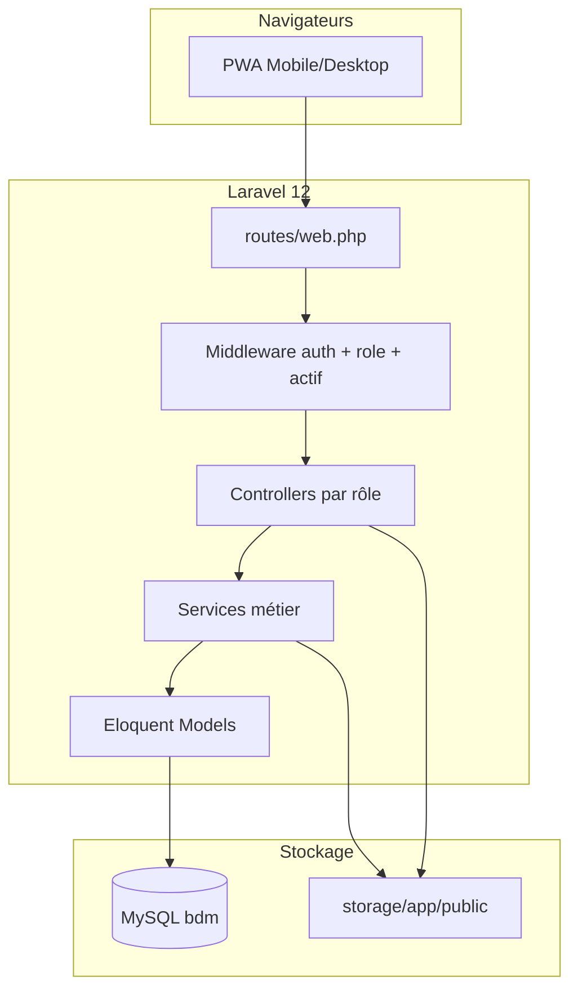
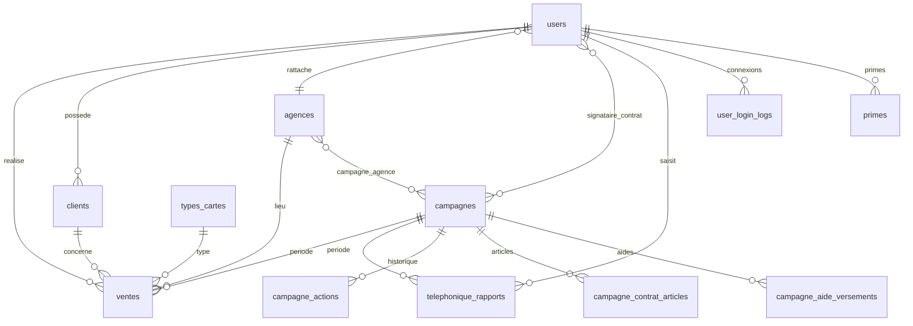

# BDM v1 — Guide complet de développement (Laravel, en production)

> **Document de référence de l'existant** : retrace tout ce qui a été construit pour l'application **Campagne BDM** (Gda Money), de la première ligne de code à la version en production. C'est le **cahier des charges métier** de la réécriture v2.  
> **La v2 (Django · microservices · React) a son propre document : [`bdm_v2.md`](bdm_v2.md)** — cible technique, règles d'architecture, invariants, **roadmap M0 → M10**.  
> **Complément** : [`docu.md`](docu.md) (référence opérationnelle à jour), [`Info.md`](Info.md) (référentiel agences/commerciaux).

**Stack v1 (actuelle, en prod)** : Laravel 12 · PHP 8.2 · MySQL (dev) / PostgreSQL 16 (stack Docker) · Inertia.js + React 18 + Tailwind (ex-Blade/Bootstrap) · Breeze (auth) · DomPDF · PhpSpreadsheet · PhpWord  
**Production** : https://bdm.gdamali.net  
**Dernière mise à jour doc** : 4 août 2026

---

## Comment ce document s'articule avec `bdm_v2.md`

| Document | Rôle | À jour de |
|----------|------|-----------|
| **`bdm_v1.md`** (ici) | Ce que l'app **fait** et **comment elle est faite** aujourd'hui : métier, base de données, backend, frontend, patterns, historique complet des prompts | Août 2026, prod |
| **[`bdm_v2.md`](bdm_v2.md)** | Ce qu'on **construit ensuite** : architecture Django/microservices, invariants à porter, **roadmap et jalons**, reprise de données, bascule | Cadrage (M0) |

| Contenu de ce fichier | Section |
|---------|---------|
| **Partie I — v1 Laravel** : architecture, BDD, backend, frontend, patterns | Sections 1 à 12 |
| **Annexe — Historique prompts (texte intégral, 229 prompts)** | [Section 13](#13-journal-complet-des-prompts) |
| **Partie II — passerelle vers la v2** | [Section 14](#14-ce-que-devient-bdm) → renvoie à `bdm_v2.md` |

> **Comment lire ce doc quand on développe la v2** : les sections 1, 5, 8, 12 décrivent le **métier** (règles, entités, invariants) — c'est la partie qui ne change pas et qu'il faut reporter telle quelle en Django. Les sections 6, 7, 9, 10, 11 décrivent l'**implémentation Laravel** — référence de traduction, pas modèle à copier.

**Chats bruts Cursor** (backup technique) : `C:\Users\cisse\.cursor\projects\c-xampp-htdocs-BDM\agent-transcripts\`  
**Regénérer la section 13** depuis les transcripts : `python scripts/merge_bdm_v1.py`

### Sessions Cursor (5)

| # | ID session | Prompts | Sujet principal |
|---|------------|---------|-----------------|
| 1 | `46793e72…` | 10 | Prototype initial BDM |
| 2 | `8d2973fb…` | 6 | CRUD minimal sans auth |
| 3 | `94a5723d…` | 196 | Développement principal (mars–juin 2026) |
| 4 | `d71f5dcf…` | 15 | Campagne Juin + pilotage admin |
| 5 | `b42f5a3d…` | 2+ | Documentation bdm_v1 |

---

## Table des matières

### Partie I — BDM v1 (Laravel, en production)

1. [Résumé du produit](#1-résumé-du-produit)
2. [Chronologie du développement](#2-chronologie-du-développement)
3. [Recette rapide — créer une app similaire](#3-recette-rapide--créer-une-app-similaire)
4. [Architecture globale](#4-architecture-globale)
5. [Base de données](#5-base-de-données)
6. [Migrations — historique complet](#6-migrations--historique-complet)
7. [Modèles Eloquent](#7-modèles-eloquent)
8. [Backend — contrôleurs, middleware, services](#8-backend--contrôleurs-middleware-services)
9. [Routes et sécurité](#9-routes-et-sécurité)
10. [Frontend — Inertia/React, thème, PWA](#10-frontend--inertiareact-thème-pwa)
11. [Seeders et commandes artisan](#11-seeders-et-commandes-artisan)
12. [Patterns réutilisables](#12-patterns-réutilisables)

### Annexe — Historique

13. [Journal complet des prompts — texte intégral](#13-journal-complet-des-prompts)

### Partie II — Passerelle vers la v2

14. [Ce que devient BDM](#14-ce-que-devient-bdm) — puis tout le détail dans [`bdm_v2.md`](bdm_v2.md) (architecture, invariants, **roadmap M0 → M10**, extraction des microservices, reprise de données, bascule)

---

# Partie I — BDM v1 (Laravel, en production)

## 1. Résumé du produit

**Campagne BDM** est une application web de pilotage des campagnes de vente de cartes bancaires / prépayées pour le Groupe GDA (Mali).

| Domaine | Description |
|---------|-------------|
| **Ventes terrain** | Saisie mobile-friendly par les commerciaux ; client + type de carte + pièce d'identité |
| **Campagnes** | Périodes, agences cibles, remises, prime meilleur vendeur, contrats, aides hebdo |
| **Reporting téléphonique** | Fiches journalières des téléopératrices (appels, joignabilité, cartes proposées) |
| **Performances** | Classements commerciaux / agences / types de cartes, graphiques Chart.js |
| **Rapports** | Synthèse par campagne, cumul multi-campagnes, exports Excel/Word structurés |
| **Contrats** | Contrat de prestation par campagne, acceptation/refus commercial, versements d'aide |
| **Direction** | Lecture seule — dashboards, rapports, exports, pas de CRUD |
| **Admin** | Référentiels, campagnes, utilisateurs, journal connexions |

### Rôles actuels (`users.role`)

| Rôle | Code | Périmètre |
|------|------|-----------|
| Administrateur | `admin` | Tout le back-office |
| Direction | `direction` | Lecture + exports globaux |
| Commercial terrain | `commercial` | Ventes, clients, contrat, performances (vue restreinte) |
| Commercial téléphonique | `commercial_telephonique` | Reporting téléphonique, contrat, performances agence |

> **Évolution importante** : le rôle `chef_agence` a existé au début puis a été **supprimé** au profit du rôle `direction` (lecture seule globale). Le module **stocks** a été entièrement retiré en avril 2026.

---

## 2. Chronologie du développement

### Phase 0 — Prototypes (sessions Cursor antérieures)

| Session | Ce qui a été tenté |
|---------|-------------------|
| `46793e72` | MVP minimal : User + Client, rôles admin/commercial/chef_agence, sans auth d'abord |
| `8d2973fb` | CRUD simple sans auth ni seeders, vues par type d'utilisateur, fichier `bmd.md` |

Ces prototypes ont servi de base conceptuelle avant la vraie implémentation.

---

### Phase 1 — Fondations Laravel (mars 2025)

**Prompt déclencheur** :
> *« Aide moi à faire cet app avec laravel, voici le mld et les fonctionnalités… »*

**Réalisé** :
- Installation Laravel 12 + Breeze
- Migrations socle : `users`, `agences`, `clients`, `ventes`, `stocks`, `mouvements_stock`, `reclamations`, `primes`, `campagnes`
- Modèles Eloquent de base
- Connexion MySQL (`DB_DATABASE=bdm`)
- Seeders de données fictives (`BdmSeeder`, `FakeDataSeeder`)
- Middleware `CheckRole` + `EnsureCompteActif`

**Décisions métier posées** :
- Admin crée agences, commerciaux, campagnes
- Chef d'agence = dashboard lecture seule (plus tard remplacé par Direction)
- Seuls les commerciaux font des ventes

---

### Phase 2 — Auth, dashboards, UX login (mars 2025)

**Réalisé** :
- Redirection `/dashboard` → login si non connecté
- Refonte design login (charte GDA)
- Dashboards par rôle : `admin`, `commercial`, `telephonique`, `direction`
- Login flexible : email, téléphone ou nom (admins)

---

### Phase 3 — Module campagnes (mars–avril 2025)

**Réalisé** :
- Statuts campagne : `programmee`, `en_cours`, `arretee`, `annulee`, `terminee`
- Actions : arrêter, annuler, reprogrammer (avec justification obligatoire)
- Sélection agences ou « toutes agences »
- Activation automatique à la date de début (`Campagne::syncStatuts()` — scheduler 01:00)
- Remise % configurable par type de carte
- Aide hebdomadaire 5000 FCFA (carburant + crédit tel)
- Statut `users.actif` — activation/désactivation commerciaux
- Page détail campagne admin (reporting interne)
- `campagne_id` sur les ventes — vente impossible sans campagne active

---

### Phase 4 — Types de cartes flexibles + performances (mars 2025)

**Réalisé** :
- Table `types_cartes` (admin CRUD, plus d'ENUM figé ADAN/LAFIA/ELITE)
- Suppression champs `libelle` et `ordre`
- Performances : afficher **tous** les commerciaux (même à 0 vente)
- Classements avec parts % volume
- Prime meilleur vendeur paramétrée par campagne (plus de prime top 2)

---

### Phase 5 — Ventes, clients, exports (mars–avril 2025)

**Réalisé** :
- Formulaire vente mobile : pas de prix saisi (prix carte auto, puis prix retirés entièrement)
- Upload pièce d'identité (image/PDF) → `storage/app/public/cartes-identite`
- Modification client commercial (délai 48h)
- Suppression vente/client (grisé après 48h)
- Fiche client admin/direction + exports PDF/Excel/Word (`ClientExportService`)
- Rapports par campagne : ventes, clients, synthèse

---

### Phase 6 — Design GDA + PWA (mars 2025)

**Réalisé** :
- Thème `public/css/gda-theme.css`
- Couleurs : `#381419`, `#303030`, `#b26440`, `#FF6A3A`, `#ffffff`
- Logo `public/logo/gdamoney.png`, icône PWA `public/logo/iconesgda.png`
- Titre app : **Campagne BDM** (login garde « Gda Money »)
- PWA : `site.webmanifest`, service worker, responsive global
- Police Futura sur toute l'app
- Traduction française complète (validation, erreurs)

---

### Phase 7 — Rôle Direction + suppression chef_agence (mars 2026)

**Réalisé** :
- Migration `users_role_direction_replace_chef.php`
- Compte Direction : dashboard global, rapports, performances, clients — **aucune action CRUD**
- Suppression références chef_agence dans l'UI
- Vues direction : campagnes (lecture), types de cartes (lecture)

---

### Phase 8 — Contrats de prestation (mars–avril 2026)

**Réalisé** :
- Tables : `campagne_commercial_contrat`, `contrat_prestation_reponses`, `campagne_contrat_articles`, `campagne_aide_versements`
- Admin : articles de contrat éditables, signataires, republication
- Commercial : accepter/rejeter contrat, accusé versements aide
- Verrouillage contrat après 5 jours
- Désactivation auto commerciaux fin de campagne
- Vues `contrats/prestation.blade.php`, `commercial/contrat/show.blade.php`

---

### Phase 9 — Commercial téléphonique (avril 2026)

**Réalisé** :
- Rôle `commercial_telephonique`
- Table `telephonique_rapports` + `campagne_id`
- Fiche journalière : appels, joignabilité auto, cartes proposées (JSON)
- Contraintes : total non-joignables ≤ non-joignables, modification/suppression 48h
- Admin : liste globale reporting + export
- Intégration dans rapports campagne et performances

---

### Phase 10 — Reporting manager + exports Excel (avril 2026)

**Réalisé** :
- `CampagneRapportService`, `SpreadsheetExportService`, `GraphiquesDashboardExportService`
- Synthèse campagne : KPI, graphiques Chart.js (top 5, parts agences, mix types)
- Performances : filtres campagne/dates/agence, comparaison période précédente
- Exports Excel structurés (bordures, couleurs, UTF-8)
- Exports graphiques modifiables Excel/Word (pas d'images)
- Cumul multi-campagnes (`/rapports/cumul`)
- Export complet campagne (`section=all`)

---

### Phase 11 — Multi-campagnes parallèles + transferts (avril 2026)

**Réalisé** :
- Campagne Avril 2026 + Avril 2e vague en parallèle
- Pivot `campagne_agence` (fin de `toutes_agences = 1` global)
- Table `commercial_agence_transferts` + UI admin transfert agence
- `TransfertVentesAgenceService` — réattribution ventes historiques
- Suppression totale module stocks
- Retrait prix/montants/chiffre d'affaire de toute l'app

---

### Phase 12 — Production + données réelles (avril–juin 2026)

**Réalisé** :
- Commande `php artisan db:merge-prod` (`MergeProdSqlIntoLocal`)
- Seeders métier : `AgencesGdaSeeder`, `CommerciauxReferentielGdaSeeder`, `CampagneAvril2eVagueSeeder`, `CampagneJuin2026Seeder`
- Référentiel `Info.md` (29 agences Bamako + 10 intérieur)
- Mise en prod https://bdm.gdamali.net

---

### Phase 13 — Pilotage campagne sans SQL (juin 2026)

**Réalisé** :
- `CampagneStatsScope` — stats limitées aux campagnes en cours (fallback dernière campagne)
- Filtrage commerciaux/agences par campagne active dans synthèse et performances
- Page détail campagne admin réorganisée (partials : pilotage, commerciaux, contrat, aide, performances, historique)
- Bouton « Resynchroniser les comptes » — réactive commerciaux signataires quand dates campagne modifiées
- Modification dates campagne depuis l'UI admin
- Campagne Juin 2026 (15–17/06/2026)

---

### Phase 14 — Refonte Inertia/React + enrôlement + Docker prod (juillet–août 2026)

**Réalisé** :
- **Sortie de Blade** : toutes les vues métier passées en **Inertia.js + React 18 + Tailwind** (`resources/js/Pages/`), design system maison (`Components/ui/` : Button, Card, Badge, StatCard), Sidebar unique
- Suppression des 90 vues Blade et des composants `App\View\Components\*`
- **Enrôlement app mobile** : modèle `EnrolementClient` + `EnrolementService`, campagnes typées (`campagnes.type`) — une campagne « enrôlement » ne saisit pas de vente carte mais un enrôlement client (nom, prénom, tél, adresse), délai 48 h identique
- `CampagneCommerciauxImportService` — import en masse des commerciaux d'une campagne
- **PostgreSQL** : migration `2026_07_30_000000_pgsql_consolidated_schema.php` — schéma final consolidé pour le driver `pgsql` (no-op sur MySQL), ENUM MySQL → string + `Rule::in`, JSON → `jsonb`
- **Stack Docker de production** (`docker-compose.prod.yml`, `docker/nginx`, `docker/php`), isolée des autres projets du VPS
- `TrustProxies` sur `X-Forwarded-Proto` (fix contenu mixte derrière nginx)

> **Ce que cette phase prouve pour la v2** : la couche métier (services + modèles) a survécu telle quelle au changement complet de couche de présentation. C'est exactement la frontière à respecter en Django : `services.py` / `selectors.py` indépendants du transport.

---

## 3. Recette rapide — créer une app similaire

### Étape 1 — Initialisation (30 min)

```bash
composer create-project laravel/laravel mon-app
cd mon-app
composer require laravel/breeze barryvdh/laravel-dompdf phpoffice/phpspreadsheet phpoffice/phpword
php artisan breeze:install blade
npm install && npm run build
```

Configurer `.env` :
```env
DB_CONNECTION=mysql
DB_HOST=127.0.0.1
DB_PORT=3306
DB_DATABASE=mon_app
DB_USERNAME=root
DB_PASSWORD=
APP_LOCALE=fr
APP_FALLBACK_LOCALE=fr
```

### Étape 2 — Schéma métier (ordre recommandé)

1. `agences` — référentiel sites
2. `users` — avec `role`, `agence_id`, `actif`, `prenom`, `telephone`
3. `types_*` — référentiels flexibles (pas d'ENUM figé en prod)
4. Entité centrale « période/opération » (`campagnes`) — dates, statut, config
5. Entité transaction (`ventes`) — toujours liée à la période active
6. Pivots M:N (`campagne_agence`, `campagne_commercial_contrat`)
7. Tables annexes (logs, rapports, primes…)

### Étape 3 — Couches applicatives

```
app/
├── Http/
│   ├── Controllers/
│   │   ├── Admin/          # CRUD référentiels + config
│   │   ├── Commercial/     # Saisie métier terrain
│   │   ├── Direction/      # Lecture seule
│   │   └── Api/            # Endpoints JSON (ventes AJAX)
│   ├── Middleware/
│   │   ├── CheckRole.php
│   │   └── EnsureCompteActif.php
│   └── Requests/           # Validation formulaires
├── Models/                 # Eloquent + méthodes isAdmin(), isCommercial()…
├── Services/               # Logique métier lourde (exports, stats, règles vente)
└── View/Components/        # Layouts Breeze
```

### Étape 4 — Frontend

- **Layout** : `resources/views/layouts/app.blade.php` — menu conditionné par rôle
- **Thème** : un seul fichier CSS public (`public/css/gda-theme.css` equivalent)
- **Pages métier** : dossiers par rôle (`admin/`, `commercial/`, `direction/`, `rapports/`)
- **Graphiques** : Chart.js CDN + `@push('scripts')`
- **PWA** : route manifest + icône + meta theme-color

### Étape 5 — Sécurité

```php
// bootstrap/app.php
$middleware->alias(['role' => CheckRole::class]);
$middleware->web(append: [EnsureCompteActif::class]);

// routes/web.php
Route::middleware(['auth', 'role:admin'])->prefix('admin')...
```

### Étape 6 — Reporting

1. Créer un **Service de scope** (`CampagneStatsScope`) pour centraliser le filtre « campagne active »
2. Créer un **Service d'export** (`SpreadsheetExportService`) réutilisable
3. Une route `export-excel` par liste importante
4. Graphiques page + export Office natif séparé

---

## 4. Architecture globale



### Arborescence clés du dépôt

```
BDM/
├── app/
│   ├── Console/Commands/MergeProdSqlIntoLocal.php
│   ├── Http/Controllers/
│   │   ├── Admin/          (11 controllers)
│   │   ├── Commercial/     (4 controllers)
│   │   ├── Direction/      (2 controllers)
│   │   ├── Clients/        (1 controller)
│   │   ├── Api/VenteController.php
│   │   ├── DashboardController.php
│   │   └── PerformanceController.php
│   ├── Http/Middleware/CheckRole.php, EnsureCompteActif.php
│   ├── Models/             (16 modèles)
│   └── Services/           (12 services)
├── database/migrations/    (36 fichiers, dont le schéma consolidé pgsql)
├── database/seeders/       (12 seeders)
├── resources/js/           (Pages + Layouts + Components React — Inertia)
├── resources/css/app.css   (Tailwind + tokens charte GDA)
├── docker/, docker-compose.yml, docker-compose.prod.yml
├── public/logo/
├── routes/web.php, api.php, auth.php
├── docu.md                 (doc opérationnelle)
├── Info.md                 (référentiel GDA)
└── bdm_v1.md               (ce fichier)
```

---

## 5. Base de données

### Schéma relationnel (état juin 2026)



### Tables principales

| Table | Rôle |
|-------|------|
| `users` | Comptes — role ENUM, agence_id, actif, prenom, telephone, adresse_contrat |
| `agences` | Sites de déploiement — nom, ordre (numérotation), adresse nullable |
| `clients` | Fiches clients — prenom, nom, tel, ville, quartier, carte_identite, user_id |
| `types_cartes` | Référentiel cartes — code, actif (prix retirés) |
| `ventes` | Transactions — client_id, user_id, agence_id, campagne_id, type_carte_id, statut_activation |
| `campagnes` | Périodes commerciales — dates, statut, remises, aides, contrat, prime |
| `campagne_agence` | Pivot campagne ↔ agences participantes |
| `campagne_commercial_contrat` | Pivot signataires contrat |
| `campagne_actions` | Journal actions (arrêt, annulation, reprogrammation) |
| `campagne_contrat_articles` | Articles éditables du contrat |
| `campagne_aide_versements` | Versements aide hebdo par commercial |
| `contrat_prestation_reponses` | Acceptation/refus contrat par commercial |
| `telephonique_rapports` | Fiches reporting téléphonique journalières |
| `commercial_agence_transferts` | Historique transferts agence commerciaux |
| `enrolement_clients` | Enrôlements app mobile (campagnes de type `enrolement`) |
| `primes` | Primes calculées |
| `reclamations` | Module legacy (non utilisé UI) |
| `user_login_logs` | Journal connexions réussies |

### Tables supprimées

| Table | Raison |
|-------|--------|
| `stocks` | Module stocks retiré avril 2026 |
| `mouvements_stock` | Idem |

---

## 6. Migrations — historique complet

| Fichier | Action |
|---------|--------|
| `0001_01_01_000000_create_users_table.php` | Socle Laravel users + sessions |
| `0001_01_01_000001_create_cache_table.php` | Cache |
| `0001_01_01_000002_create_jobs_table.php` | Jobs |
| `2025_03_23_000001_create_agences_table.php` | Agences (+ chef_id, retiré plus tard) |
| `2025_03_23_000002_add_bdm_columns_to_users_table.php` | role, agence_id, telephone sur users |
| `2025_03_23_000003_create_clients_table.php` | Clients |
| `2025_03_23_000004_create_stocks_table.php` | Stocks (→ supprimé) |
| `2025_03_23_000005_create_ventes_table.php` | Ventes |
| `2025_03_23_000006_create_mouvements_stock_table.php` | Mouvements stock (→ supprimé) |
| `2025_03_23_000007_create_reclamations_table.php` | Réclamations |
| `2025_03_23_000008_create_primes_table.php` | Primes |
| `2025_03_23_000009_create_campagnes_table.php` | Campagnes |
| `2025_03_23_100000_add_prenom_and_nullable_email_to_users.php` | prenom, email nullable |
| `2025_03_23_110000_enhance_campagnes_table.php` | statut, toutes_agences, campagne_agence, campagne_actions |
| `2025_03_24_000000_create_types_cartes_and_migrate.php` | types_cartes + migration ENUM → FK |
| `2025_03_24_120000_drop_libelle_ordre_from_types_cartes.php` | Simplification types cartes |
| `2026_02_10_000001_add_remise_aide_campagne_and_users_actif.php` | Remise %, aide hebdo, users.actif |
| `2026_03_25_000000_add_remise_types_cartes_to_campagnes.php` | Remise par type carte (JSON/personalisation) |
| `2026_03_27_120000_add_campagne_id_to_ventes_table.php` | Lien vente → campagne |
| `2026_03_30_120000_add_ordre_to_agences_and_fix_campagne_avril_2026.php` | Numérotation agences |
| `2026_03_30_120000_campagne_prime_meilleur_vendeur_only.php` | prime_meilleur_vendeur (remplace top1/top2) |
| `2026_03_31_100000_users_role_direction_replace_chef.php` | role direction remplace chef_agence |
| `2026_03_31_110000_clear_agences_chef_id.php` | Suppression chef_id agences |
| `2026_03_31_200000_add_commercial_telephonique_and_logs.php` | Role téléphonique + user_login_logs + telephonique_rapports |
| `2026_03_31_200000_contrats_prestation_aides_versements.php` | Contrats + aides + réponses |
| `2026_03_31_210000_campagne_contrat_articles.php` | Articles contrat éditables |
| `2026_04_01_000000_remove_prix_and_montant_ventes.php` | Suppression prix/montants |
| `2026_04_01_120000_create_commercial_agence_transferts_table.php` | Transferts agence |
| `2026_04_02_100000_reassign_agence_boulkassoulbougu_to_senou.php` | Migration données Senou |
| `2026_04_02_110000_merge_duplicate_youssouf_traore_kabala.php` | Fix doublon commercial |
| `2026_04_03_100000_add_cartes_proposees_to_telephonique_rapports.php` | JSON cartes proposées |
| `2026_04_04_100000_add_campagne_id_to_telephonique_rapports.php` | Lien reporting → campagne |
| `2026_04_30_000000_drop_stocks_and_mouvements_stock_tables.php` | Suppression stocks |
| `2026_07_30_000000_pgsql_consolidated_schema.php` | Schéma final consolidé PostgreSQL (no-op sur MySQL) |
| `2026_08_03_100000_add_type_to_campagnes_table.php` | `campagnes.type` (vente cartes / enrôlement) |
| `2026_08_03_100001_create_enrolement_clients_table.php` | Enrôlements app mobile |

```bash
php artisan migrate:status   # état actuel
php artisan migrate          # appliquer
php artisan migrate:fresh --seed  # reset complet (attention prod!)
```

---

## 7. Modèles Eloquent

| Modèle | Fichier | Relations / méthodes clés |
|--------|---------|---------------------------|
| `User` | `app/Models/User.php` | `isAdmin()`, `isDirection()`, `isCommercial()`, `isCommercialTelephonique()` |
| `Agence` | `app/Models/Agence.php` | `users()`, `ventes()`, `campagnes()` |
| `Client` | `app/Models/Client.php` | `user()`, `ventes()`, délai modification 48h |
| `Vente` | `app/Models/Vente.php` | `client()`, `user()`, `agence()`, `campagne()`, `typeCarte()` |
| `TypeCarte` | `app/Models/TypeCarte.php` | `ventes()` |
| `Campagne` | `app/Models/Campagne.php` | `syncStatuts()`, `estOuverteAuxVentes()`, `idsCampagnesPourStats()`, signataires, agences |
| `CampagneAction` | `app/Models/CampagneAction.php` | Journal actions campagne |
| `CampagneContratArticle` | `app/Models/CampagneContratArticle.php` | Articles contrat |
| `CampagneAideVersement` | `app/Models/CampagneAideVersement.php` | Versements aide |
| `ContratPrestationReponse` | `app/Models/ContratPrestationReponse.php` | Acceptation/refus |
| `TelephoniqueRapport` | `app/Models/TelephoniqueRapport.php` | Fiche journalière, cartes_proposees JSON |
| `CommercialAgenceTransfert` | `app/Models/CommercialAgenceTransfert.php` | Historique transferts |
| `Prime` | `app/Models/Prime.php` | Primes calculées |
| `Reclamation` | `app/Models/Reclamation.php` | Legacy |
| `UserLoginLog` | `app/Models/UserLoginLog.php` | Logs connexion |
| `EnrolementClient` | `app/Models/EnrolementClient.php` | Enrôlement mobile, `peutEtreModifieOuSupprimeParCommercial()` (48 h) |

---

## 8. Backend — contrôleurs, middleware, services

### Contrôleurs

| Contrôleur | Namespace | Responsabilité |
|------------|-----------|----------------|
| `DashboardController` | root | Vue dashboard selon rôle + KPI campagne active |
| `PerformanceController` | root | Classements, graphiques, exports, détail commercial |
| `VenteController` | Api | POST JSON création vente (AJAX mobile) |
| `VenteController` | Commercial | Liste, create, destroy, export Excel |
| `ClientController` | Commercial | Edit/update/destroy mes clients |
| `ClientController` | Clients | Index/show/export admin+direction |
| `ContratPrestationController` | Commercial | Mon contrat, accepter/rejeter, accusés |
| `TelephoniqueRapportController` | Commercial | Saisie reporting téléphonique |
| `AgenceController` | Admin | CRUD agences |
| `UserController` | Admin | CRUD users + transfert agence |
| `TypeCarteController` | Admin | CRUD types cartes |
| `CampagneController` | Admin | CRUD campagnes + actions + sync commerciaux |
| `CampagneAideVersementController` | Admin | Versements aide |
| `CampagneContratArticleController` | Admin | Articles contrat |
| `RapportController` | Admin | Rapports, synthèse, cumul, exports |
| `TelephoniqueRapportController` | Admin | Reporting global admin |
| `UserLoginLogController` | Admin | Journal connexions |
| `CampagneController` | Direction | Lecture campagnes |
| `ReferentielController` | Direction | Types cartes lecture |

### Services métier

| Service | Rôle |
|---------|------|
| `VenteService` | Règles création vente (campagne active, client, cohérence) |
| `PrimeService` | Classements avec ex-aequo, filtre agence optionnel |
| `CampagneRapportService` | Requêtes rapports, agrégations semaine/mois, téléphonique |
| `CampagneDetailService` | Assemblage page détail campagne admin |
| `CampagneStatsScope` | Filtre stats → campagnes en cours (fallback dernière) |
| `SpreadsheetExportService` | Classeurs Excel multi-feuilles structurés |
| `GraphiquesDashboardExportService` | Graphiques Office modifiables Excel/Word |
| `ClientExportService` | Exports client PDF/Excel/Word |
| `ContratPrestationService` | Logique contrat, verrouillage 5 jours |
| `TransfertVentesAgenceService` | Réattribution ventes lors transfert agence |
| `EnrolementService` | Règles enrôlement mobile (campagne de type `enrolement`, délai 48 h) |
| `CampagneCommerciauxImportService` | Import en masse des commerciaux d'une campagne |

### Middleware

| Middleware | Fichier | Rôle |
|------------|---------|------|
| `CheckRole` | `app/Http/Middleware/CheckRole.php` | Vérifie `role:admin,direction,...` sur routes |
| `EnsureCompteActif` | `app/Http/Middleware/EnsureCompteActif.php` | Bloque comptes inactifs |

### Scheduler

```php
// bootstrap/app.php
$schedule->call(fn () => Campagne::syncStatuts())->dailyAt('01:00');
```

---

## 9. Routes et sécurité

Voir [`routes/web.php`](routes/web.php) — 160 lignes, routes groupées par middleware `role`.

### Routes essentielles

| URL | Rôle | Action |
|-----|------|--------|
| `/dashboard` | auth | Dashboard par rôle |
| `/ventes/create` | commercial | Saisie vente |
| `/performances` | auth | Classements + graphiques |
| `/rapports` | admin,direction | Liste campagnes + cumul |
| `/rapports/campagnes/{id}/synthese` | admin,direction | Synthèse campagne |
| `/admin/campagnes` | admin | CRUD campagnes |
| `/admin/users` | admin | CRUD utilisateurs |
| `/reporting-telephonique` | commercial_telephonique | Saisie fiches |
| `/direction/campagnes` | direction | Lecture campagnes |
| `/mon-contrat` | commercial,* | Contrat prestation |

### Principes sécurité

- CSRF sur tous les formulaires
- `$this->authorize()` / vérifs métier dans contrôleurs
- Commerciaux : accès uniquement à leurs ventes/clients
- Direction : lecture seule stricte (pas de POST/PUT/DELETE)
- Mots de passe hashés (Breeze)
- Journal connexions réussies

---

## 10. Frontend — Inertia/React, thème, PWA

> **État actuel (août 2026)** : Blade a été entièrement retiré (phase 14). Les vues sont des composants React servis par Inertia. Cette section décrit l'état post-refonte ; l'ancienne organisation Blade est conservée plus bas à titre historique — c'est elle qu'on retrouve dans le journal des prompts (section 13).

### Structure des pages React

```
resources/js/
├── app.jsx                    # Point d'entrée Inertia (createInertiaApp)
├── Layouts/
│   ├── AuthenticatedLayout.jsx  # Sidebar + header, nav par rôle
│   └── AuthCard.jsx             # Écran login
├── Components/
│   ├── Sidebar.jsx
│   └── ui/                      # Design system : Button, Card, Badge, StatCard…
├── lib/                       # helpers (cn/clsx, formatage FR, hooks)
└── Pages/
    ├── Dashboard.jsx
    ├── Auth/                  # Login
    ├── Admin/                 # campagnes, users, agences, types de cartes, logs
    ├── Commercial/            # ventes, clients, contrat, téléphonique
    ├── Direction/             # lecture seule
    ├── Ventes/, Clients/, Enrolements/
    ├── Performances/          # Index, Show
    ├── Rapports/              # Index, CampagneSynthese, CampagneVentes, CampagneClients
    └── Profile/
```

### Stack front

| Couche | Techno |
|--------|--------|
| Rendu | Inertia.js 2 + React 18 (`@inertiajs/react`) |
| CSS | Tailwind 3 + `resources/css/app.css` (tokens charte GDA) + `clsx`/`tailwind-merge` |
| Icônes | `lucide-react` |
| Graphiques | `chart.js` + `react-chartjs-2` |
| Routes JS | `ziggy-js` (helper `route()` côté React) |
| Typo | `@fontsource/inter` |
| Build | Vite 7 + `@vitejs/plugin-react` |
| PWA | `site.webmanifest` route + service worker |

**Pourquoi Inertia et pas une SPA + API dès v1** : Inertia garde les contrôleurs Laravel comme source de vérité (props sérialisées côté serveur), donc la refonte n'a touché que la présentation. **En v2 cette béquille disparaît** : Django expose du JSON via DRF, React devient une vraie SPA autonome (section 18).

### Historique — organisation Blade (jusqu'en juin 2026)

90 fichiers `resources/views/` : `layouts/` (app, guest, navigation), `dashboard/` (une vue par rôle), `admin/` (campagnes + 7 partials `show-*`, users, agences, types_cartes, login-logs, telephonique-rapports), `commercial/` (ventes, clients, contrat, telephonique), `direction/`, `rapports/`, `performance/`, `clients/`, `contrats/`, `exports/`, `auth/login`.
CSS : Bootstrap 5 CDN + `public/css/gda-theme.css`, JS vanilla + Chart.js CDN.

---

## 11. Seeders et commandes artisan

### Seeders disponibles

| Seeder | Usage |
|--------|-------|
| `DatabaseSeeder` | Point d'entrée |
| `BdmSeeder` / `FakeDataSeeder` | Données fictives dev |
| `FreshMinimalSeeder` | Reset minimal (admin seul) |
| `SoloAdminSeeder` | Admin unique |
| `AgencesGdaSeeder` | 29 agences Bamako + 10 intérieur |
| `CommerciauxReferentielGdaSeeder` | Commerciaux depuis Info.md |
| `CampagneAvril2eVagueSeeder` | Campagne Avril 2e vague |
| `CampagneJuin2026Seeder` | Campagne Juin 2026 |
| `PromoteTelephoniqueUsersSeeder` | Conversion rôle téléphonique |
| `PurgeVentesEtClientsSeeder` | Purge ventes/clients |
| `ResetBusinessDataSeeder` | Reset données métier |

### Commandes utiles

```bash
# Dev
composer install && npm install && npm run build
php artisan serve
composer dev   # serve + queue + pail + vite concurrently

# BDD
php artisan migrate
php artisan migrate:status
php artisan db:seed --class=AgencesGdaSeeder
php artisan db:merge-prod          # Import prod_bdm.sql → local
php artisan db:merge-prod --yes

# Debug
php artisan route:list
php artisan schedule:list
php artisan test
php artisan tinker
```

---

## 12. Patterns réutilisables

### Pattern 1 — Entité « période » centrale

Toute transaction métier (`vente`, `rapport`) porte un `campagne_id`.  
La vente est refusée si aucune campagne active pour l'agence.

```php
// VenteService — pseudo-code
if (!$campagne->estOuverteAuxVentes($agenceId)) {
    throw ValidationException::withMessages(['campagne' => 'Aucune campagne active.']);
}
```

### Pattern 2 — Scope stats centralisé

Évite de dupliquer la logique « campagne en cours vs dernière » dans 15 contrôleurs.

```php
CampagneStatsScope::appliquerSurVentes($query, $agenceId);
CampagneStatsScope::libelle($agenceId); // pour affichage UI
```

### Pattern 3 — Service d'export unique

Un seul `SpreadsheetExportService` pour toutes les listes → cohérence visuelle Excel.

### Pattern 4 — Partials Blade pour pages complexes

La page détail campagne admin = 1 show + 7 partials → maintenable sans SQL manuel.

### Pattern 5 — Rôle lecture seule (Direction)

Même routes que admin pour GET, middleware `role:direction` sans routes POST/PUT/DELETE.

### Pattern 6 — Délai 48h côté modèle

```php
public function peutEtreModifie(): bool {
    return $this->created_at->gt(now()->subHours(48));
}
```

### Pattern 7 — Multi-campagnes parallèles

Pivot `campagne_agence` + `campagne_id` sur ventes → pas de flag global `toutes_agences`.

---

# Annexe — Historique des prompts

## 13. Journal complet des prompts

> **Long appendice** — la Partie II (cap Django/microservices/React) reprend [après ce journal](#14-cap-v2--pourquoi-django-et-la-trajectoire-recommandée).

> Tous tes messages utilisateur Cursor, **texte intégral**, extraits des transcripts locaux.  
> **Total : 229 prompts** dans **5 sessions**.  
> Source : `C:\Users\cisse\.cursor\projects\c-xampp-htdocs-BDM\agent-transcripts\`

## Session 1 — `46793e72…`

- **ID complet** : `46793e72-6de6-40db-a67a-f8c50772b2d7`
- **Dernière activité** : 2026-03-18 11:59
- **Nombre de prompts** : 10
- **Fichier source** : `agent-transcripts/46793e72-6de6-40db-a67a-f8c50772b2d7/46793e72-6de6-40db-a67a-f8c50772b2d7.jsonl`

### Prompt 1.1

Je veux que tu construises une application web simple, propre et efficace appelée **BDM**, permettant de suivre les performances des commerciaux.

## 🎯 Objectif

L’objectif est de suivre le nombre de clients enregistrés par chaque commercial.
Chaque client enregistré est considéré comme une vente.

---

## 🧱 Modèles principaux

### 1. User

* id
* name
* email
* password
* role (admin, commercial, chef_agence)

Rôles :

* admin : accès complet
* commercial : peut gérer uniquement ses clients
* chef_agence : accès en lecture seule au dashboard

---

### 2. Client

* id
* prenom
* nom
* telephone
* ville
* quartier
* carte_identite (upload image)
* type_carte (ENUM : ADAN, LAFIA, ELITE)
* user_id (clé étrangère vers User)
* created_at

---

## 🔗 Relations

* Un User (commercial) possède plusieurs Clients
* Un Client appartient à un seul User

---

## ⚙️ Fonctionnalités

### 👥 Gestion des clients

* Ajouter un client (formulaire mobile-friendly)
* Lister les clients
* Filtrer par commercial (admin uniquement)
* Un commercial ne voit que ses propres clients

---

### 📊 Dashboard

Afficher :

* Nombre total de clients par commercial
* Classement des commerciaux (du meilleur au moins performant)
* Répartition des clients par type de carte (ADAN, LAFIA, ELITE)

---

### 🔒 Autorisations

* Admin : accès total
* Commercial : CRUD uniquement sur ses clients
* Chef d’agence : accès lecture seule au dashboard

---

## 📊 Statistiques à implémenter

* Compter le nombre de clients par utilisateur
* Classement (ordre décroissant)
* Nombre de clients par type de carte

---

## 🎨 Interface utilisateur

* Dashboard simple avec des cartes (cards)
* Design mobile-first (très important)
* Formulaires rapides pour utilisation terrain

---

## 🛠️ Contraintes techniques

* Laravel 10+
* Utiliser Eloquent ORM
* Créer migrations, seeders et factories
* Validation des formulaires
* Upload de fichier pour "carte_identite"
* ENUM ou constantes pour type_carte

---

## 🚀 Bonus (si possible)

* Ajouter des graphiques simples (clients par commercial)
* Filtre par date (jour / semaine / mois)

---

## 📦 Résultat attendu

* Structure complète du projet Laravel
* Models, migrations, controllers
* Routes (web.php)
* Vues Blade (interface simple)
* Seeder avec utilisateurs de test (admin + commerciaux)

---

Construis le projet étape par étape et explique brièvement ce que tu fais.
   "   pour l'authentification breeze, on laisse à la fin du projet

---

### Prompt 1.2

@c:\Users\cisse\.cursor\projects\c-xampp-htdocs-BDM\terminals\4.txt:7-17

---

### Prompt 1.3

retire les page de connexion, crée une page d'accueil à la " 8000 " apres on verra pour l'authentification, j'ai crée une db " bdm " dans phpmyadmin

---

### Prompt 1.4

t'utilise laravel combien ?   je vois des erreurs ici " Erreur interne du serveur

Copié en tant que Markdown
ParseError
ressources\vues\dashboard.blade.php :76
Erreur de syntaxe, fin inattendue du fichier, attente de « elseif » ou « else » ou « endif »

LARAVEL
12.55.0
PHP
8.2.12
NON GÉRÉ
CODE 0
500
ALLEZ
http://127.0.0.1:8000

Trace d’exception
Illuminate\Filesystem\Filesystem::Illuminate\Filesystem\{closure}()
ressources\vues\dashboard.blade.php :76

71                </div>
72            @endforeach
73        </div>
74    </div>
75</div>
76@endsection
77
54 cadres fournisseurs

Illuminate\Foundation\Application->handleRequest(object(Illuminate\Http\Request))
public\index.php :20

1 châssis fournisseur

Requêtes
1-4 sur 4
mysql
select * from `sessions` where `id` = 'mU0Az5K9iwR63Y0k2BYxmXSzuZyxsTAqdPvDaZO2' limit 1
3,66 ms
mysql
select `users`.*, (select count(*) from `clients` where `users`.`id` = `clients`.`user_id`) as `clients_count` from `users` where `role` = 'commercial' order by `clients_count` desc
1,38 ms
mysql
select `type_carte`, count(*) as total from `clients` group by `type_carte`
0,72 ms
mysql
select * from `users` where `role` = 'commercial' order by `name` asc
0,55 ms
En-têtes
Animateur
127.0.0.1:8000
Connexion
Garder en vie
sec-ch-ua
« Chromium » ; v="146 », « Pas-Un.Marque » ; v="24 », « Microsoft Edge » ; v="146 »
sec-ch-ua-mobile
?0
Sec-ch-ua-plateforme
« Windows »
requêtes-mise à jour-insécurisées
1
user-agent
Mozilla/5.0 (Windows NT 10.0 ; Win64 ; x64) AppleWebKit/537.36 (KHTML, comme Gecko) Chrome/146.0.0.0 Safari/537.36 Edg/146.0.0.0
accepter
text/html,application/xhtml+xml,application/xml ;q=0.9,image/avif,image/webp,image/apng,*/* ; q=0,8,application/échange signé ; v=b3 ; q=0,7
sec-fetch-site
aucun
sec-mode récupération
Naviguer
sec-fetch-user
?1
sec-fetch-dest
document
Accept-encodage
gzip, déflé, br, zstd
accepter-langage
fr,fr-FR ; q=0,9,en ; q=0,8,en-GB ; q=0,7,en-US ; q=0,6
cookie
csrftoken=wp8nneBSLffb9BNbCDv3ry2myMMq1SRU ; XSRF-TOKEN=eyJpdiI6IkNwME9BR1NvYjcxK1g3bFpMMkIvT2c9PSIsInZhbHVlIjoiZG9jYlRIblRiN0J2aTN3a1lnY0lSWGVVcUdFVU14RWx6dmRpcERPaVNwNzFweStQbjkvdk41SmZ2UkFnVjMvT1NDdnVkcndrVzlJdDA2YWtldXBScz A2ZzJMZEhSZ2xUVW1PdEJhMWNQTnVFdHRhUVFBbnBiQUhrclhqZjhuelkiLCJtYWMiOiI5MGM0MGE0ODBlOGY1NGI1OTc2OTVmMzNjYTFhMzFlNzA3MzlmNmJlNzYxYjNkMWNlZTc0ZWJhY2Q1ZjJjOWQzIiwidGFnIjoiIn0%3D ; laravel-session=eyJpdiI6Ik1XdXBHREdmdURjWURoZUV2Y3RZaGc9PSIsInZhbHVlIjoiTm5OcmdEVFhnWm1jangwU3BRQW1Va2M1eHpURnhkaDZ0SVJ6N3Z2QUZERXQxZUJQZndCM0lDOEw3akZWZGF3RytLRDBqeFA1RytvRUl5dkZNeUFTMGxEL3EL3EL3BFZ1drb2pvWWVuSlVQTzRVK01UNWxLT0ZNaVNmWWl2aytvc2hhNFMiLCJtYWMiOiI3OTNhMjM2MTdmOGU4Yjk4ZjdkMTE1ZTExM2NkNTliZDc5N2E1NzYwNDljZTEzODg4ZGE0YTIyNDI5YTU3ZDljIiwidGFnIjoiIn0%3D
Carrosserie
// Aucun organisme de demande
Routage
Contrôleur
App\Http\Controllers\DashboardController
Nom de l’itinéraire
Accueil
Middleware
  "   # ParseError - Internal Server Error

syntax error, unexpected end of file, expecting "elseif" or "else" or "endif"

PHP 8.2.12
Laravel 12.55.0
127.0.0.1:8000

## Stack Trace

0 - resources\views\dashboard.blade.php:76
1 - vendor\laravel\framework\src\Illuminate\Filesystem\Filesystem.php:124
2 - vendor\laravel\framework\src\Illuminate\View\Engines\PhpEngine.php:57
3 - vendor\laravel\framework\src\Illuminate\View\Engines\CompilerEngine.php:76
4 - vendor\laravel\framework\src\Illuminate\View\View.php:208
5 - vendor\laravel\framework\src\Illuminate\View\View.php:191
6 - vendor\laravel\framework\src\Illuminate\View\View.php:160
7 - vendor\laravel\framework\src\Illuminate\Http\Response.php:78
8 - vendor\laravel\framework\src\Illuminate\Http\Response.php:34
9 - vendor\laravel\framework\src\Illuminate\Routing\Router.php:939
10 - vendor\laravel\framework\src\Illuminate\Routing\Router.php:906
11 - vendor\laravel\framework\src\Illuminate\Routing\Router.php:821
12 - vendor\laravel\framework\src\Illuminate\Pipeline\Pipeline.php:180
13 - vendor\laravel\framework\src\Illuminate\Routing\Middleware\SubstituteBindings.php:50
14 - vendor\laravel\framework\src\Illuminate\Pipeline\Pipeline.php:219
15 - vendor\laravel\framework\src\Illuminate\Foundation\Http\Middleware\VerifyCsrfToken.php:87
16 - vendor\laravel\framework\src\Illuminate\Pipeline\Pipeline.php:219
17 - vendor\laravel\framework\src\Illuminate\View\Middleware\ShareErrorsFromSession.php:48
18 - vendor\laravel\framework\src\Illuminate\Pipeline\Pipeline.php:219
19 - vendor\laravel\framework\src\Illuminate\Session\Middleware\StartSession.php:120
20 - vendor\laravel\framework\src\Illuminate\Session\Middleware\StartSession.php:63
21 - vendor\laravel\framework\src\Illuminate\Pipeline\Pipeline.php:219
22 - vendor\laravel\framework\src\Illuminate\Cookie\Middleware\AddQueuedCookiesToResponse.php:36
23 - vendor\laravel\framework\src\Illuminate\Pipeline\Pipeline.php:219
24 - vendor\laravel\framework\src\Illuminate\Cookie\Middleware\EncryptCookies.php:74
25 - vendor\laravel\framework\src\Illuminate\Pipeline\Pipeline.php:219
26 - vendor\laravel\framework\src\Illuminate\Pipeline\Pipeline.php:137
27 - vendor\laravel\framework\src\Illuminate\Routing\Router.php:821
28 - vendor\laravel\framework\src\Illuminate\Routing\Router.php:800
29 - vendor\laravel\framework\src\Illuminate\Routing\Router.php:764
30 - vendor\laravel\framework\src\Illuminate\Routing\Router.php:753
31 - vendor\laravel\framework\src\Illuminate\Foundation\Http\Kernel.php:200
32 - vendor\laravel\framework\src\Illuminate\Pipeline\Pipeline.php:180
33 - vendor\laravel\framework\src\Illuminate\Foundation\Http\Middleware\TransformsRequest.php:21
34 - vendor\laravel\framework\src\Illuminate\Foundation\Http\Middleware\ConvertEmptyStringsToNull.php:31
35 - vendor\laravel\framework\src\Illuminate\Pipeline\Pipeline.php:219
36 - vendor\laravel\framework\src\Illuminate\Foundation\Http\Middleware\TransformsRequest.php:21
37 - vendor\laravel\framework\src\Illuminate\Foundation\Http\Middleware\TrimStrings.php:51
38 - vendor\laravel\framework\src\Illuminate\Pipeline\Pipeline.php:219
39 - vendor\laravel\framework\src\Illuminate\Http\Middleware\ValidatePostSize.php:27
40 - vendor\laravel\framework\src\Illuminate\Pipeline\Pipeline.php:219
41 - vendor\laravel\framework\src\Illuminate\Foundation\Http\Middleware\PreventRequestsDuringMaintenance.php:109
42 - vendor\laravel\framework\src\Illuminate\Pipeline\Pipeline.php:219
43 - vendor\laravel\framework\src\Illuminate\Http\Middleware\HandleCors.php:61
44 - vendor\laravel\framework\src\Illuminate\Pipeline\Pipeline.php:219
45 - vendor\laravel\framework\src\Illuminate\Http\Middleware\TrustProxies.php:58
46 - vendor\laravel\framework\src\Illuminate\Pipeline\Pipeline.php:219
47 - vendor\laravel\framework\src\Illuminate\Foundation\Http\Middleware\InvokeDeferredCallbacks.php:22
48 - vendor\laravel\framework\src\Illuminate\Pipeline\Pipeline.php:219
49 - vendor\laravel\framework\src\Illuminate\Http\Middleware\ValidatePathEncoding.php:26
50 - vendor\laravel\framework\src\Illuminate\Pipeline\Pipeline.php:219
51 - vendor\laravel\framework\src\Illuminate\Pipeline\Pipeline.php:137
52 - vendor\laravel\framework\src\Illuminate\Foundation\Http\Kernel.php:175
53 - vendor\laravel\framework\src\Illuminate\Foundation\Http\Kernel.php:144
54 - vendor\laravel\framework\src\Illuminate\Foundation\Application.php:1220
55 - public\index.php:20
56 - vendor\laravel\framework\src\Illuminate\Foundation\resources\server.php:23

## Request

GET /

## Headers

* **host**: 127.0.0.1:8000
* **connection**: keep-alive
* **sec-ch-ua**: "Chromium";v="146", "Not-A.Brand";v="24", "Microsoft Edge";v="146"
* **sec-ch-ua-mobile**: ?0
* **sec-ch-ua-platform**: "Windows"
* **upgrade-insecure-requests**: 1
* **user-agent**: Mozilla/5.0 (Windows NT 10.0; Win64; x64) AppleWebKit/537.36 (KHTML, like Gecko) Chrome/146.0.0.0 Safari/537.36 Edg/146.0.0.0
* **accept**: text/html,application/xhtml+xml,application/xml;q=0.9,image/avif,image/webp,image/apng,*/*;q=0.8,application/signed-exchange;v=b3;q=0.7
* **sec-fetch-site**: none
* **sec-fetch-mode**: navigate
* **sec-fetch-user**: ?1
* **sec-fetch-dest**: document
* **accept-encoding**: gzip, deflate, br, zstd
* **accept-language**: fr,fr-FR;q=0.9,en;q=0.8,en-GB;q=0.7,en-US;q=0.6
* **cookie**: csrftoken=wp8nneBSLffb9BNbCDv3ry2myMMq1SRU; XSRF-TOKEN=eyJpdiI6IkNwME9BR1NvYjcxK1g3bFpMMkIvT2c9PSIsInZhbHVlIjoiZG9jYlRIblRiN0J2aTN3a1lnY0lSWGVVcUdFVU14RWx6dmRpcERPaVNwNzFweStQbjkvdk41SmZ2UkFnVjMvT1NDdnVkcndrVzlJdDA2YWtldXBSczA2ZzJMZEhSZ2xUVW1PdEJhMWNQTnVFdHRhUVFBbnBiQUhrclhqZjhuelkiLCJtYWMiOiI5MGM0MGE0ODBlOGY1NGI1OTc2OTVmMzNjYTFhMzFlNzA3MzlmNmJlNzYxYjNkMWNlZTc0ZWJhY2Q1ZjJjOWQzIiwidGFnIjoiIn0%3D; laravel-session=eyJpdiI6Ik1XdXBHREdmdURjWURoZUV2Y3RZaGc9PSIsInZhbHVlIjoiTm5OcmdEVFhnWm1jangwU3BRQW1Va2M1eHpURnhkaDZ0SVJ6N3Z2QUZERXQxZUJQZndCM0lDOEw3akZWZGF3RytLRDBqeFA1RytvRUl5dkZNeUFTMGxEL3BFZ1drb2pvWWVuSlVQTzRVK01UNWxLT0ZNaVNmWWl2aytvc2hhNFMiLCJtYWMiOiI3OTNhMjM2MTdmOGU4Yjk4ZjdkMTE1ZTExM2NkNTliZDc5N2E1NzYwNDljZTEzODg4ZGE0YTIyNDI5YTU3ZDljIiwidGFnIjoiIn0%3D

## Route Context

controller: App\Http\Controllers\DashboardController
route name: home
middleware: web

## Route Parameters

No route parameter data available.

## Database Queries

* mysql - select * from `sessions` where `id` = 'mU0Az5K9iwR63Y0k2BYxmXSzuZyxsTAqdPvDaZO2' limit 1 (3.66 ms)
* mysql - select `users`.*, (select count(*) from `clients` where `users`.`id` = `clients`.`user_id`) as `clients_count` from `users` where `role` = 'commercial' order by `clients_count` desc (1.38 ms)
* mysql - select `type_carte`, count(*) as total from `clients` group by `type_carte` (0.72 ms)
* mysql - select * from `users` where `role` = 'commercial' order by `name` asc (0.55 ms)

---

### Prompt 1.5 *(message avec image)*

cree les vues pour chaque utilisateur, tu met le nom de chaque users dans la nav pour permettre de swicher rapidement

---

### Prompt 1.6

non je parle des vues admin, commercial, agence

---

### Prompt 1.7 *(message avec image)*

pourquoi ta crée les " Jean Dupont
Marie Martin
Pierre Durand "  je t'ai juste demandé de creer les template des types d'utiliseur, je t'ai pas dis de creer des utilisateurs

---

### Prompt 1.8

retire les " Ces utilisateurs (Jean Dupont, Marie Martin, Pierre Durand, Admin BDM) n’ont pas été créés pour les templates. Ils viennent du DatabaseSeeder mis en place au tout début du projet BDM, dans le cadre de la demande : « Seeder avec utilisateurs de test (admin + commerciaux) ». "   crée juste les pages html pour les types d'utilisateurs pour voir les fonctionnalité des types d'users

---

### Prompt 1.9

erreur " 
Avertissement : require(C :\xampp\htdocs\BDM\vendor\composer/.. /.. /app/Helpers.php) : Échec à ouvrir le flux : Aucun fichier ou répertoire dans C :\xampp\htdocs\BDM\vendor\autoload_real.php sur la ligne 41

Erreur fatale : Erreur non détectée : Échec à l’ouverture requise 'C :\xampp\htdocs\BDM\vendor\composer/.. /.. /app/Helpers.php' (include_path='C :\xampp\php\PEAR') dans C :\xampp\htdocs\BDM\vendor\composer\autoload_real.php :41 Trace de pile : #0 C :\xampp\htdocs\BDM\vendor\autoload_real.php(45) : {closure}('be2dabd89e6571c...', 'C :\\xampp\\htdocs...') #1 C :\xampp\htdocs\BDM\autoload.php(22) : ComposerAutoloaderInit53b5d56b3b7e3cbac1713e68c8850f6c ::getLoader() #2 C :\xampp\htdocs\BDM\index.php(14) : exige('C :\\xampp\\htdocs...') #3 C :\xampp\htdocs\BDM\vendor\laravel\framework\src\Illuminate\Foundation\resources\server.php(23) : require_once('C :\\xampp\\htdocs...') #4 {main} ajouté C :\xampp\htdocs\BDM\vendor\composer\autoload_real.php sur la ligne 41  "

---

### Prompt 1.10

retire les seeders, je veux pas de données, je vais faire mes crud moi meme

---

## Session 2 — `8d2973fb…`

- **ID complet** : `8d2973fb-63a2-4eaf-b0f1-850b8a3a1f1a`
- **Dernière activité** : 2026-03-18 13:27
- **Nombre de prompts** : 6
- **Fichier source** : `agent-transcripts/8d2973fb-63a2-4eaf-b0f1-850b8a3a1f1a/8d2973fb-63a2-4eaf-b0f1-850b8a3a1f1a.jsonl`

### Prompt 2.1

Tu es un développeur Laravel.

Crée une application web simple appelée **BDM** avec uniquement des CRUD (Create, Read, Update, Delete), sans authentification, sans seeders, et sans gestion avancée.

## 🎯 Objectif

Permettre de tester rapidement l’enregistrement et le suivi des clients par type d’utilisateur.

---

## 🧱 Modèles

### User

* id
* name
* email
* role (admin, commercial, chef_agence)

### Client

* id
* prenom
* nom
* telephone
* ville
* quartier
* type_carte (ADAN, LAFIA, ELITE)
* user_id (clé étrangère vers User)

---

## ⚙️ Fonctionnalités

### CRUD User

* Ajouter un utilisateur
* Lister les utilisateurs
* Modifier un utilisateur
* Supprimer un utilisateur

### CRUD Client

* Ajouter un client
* Lister les clients
* Modifier un client
* Supprimer un client

---

## 🔗 Relations

* Un User possède plusieurs Clients
* Un Client appartient à un User

---

## 🎨 Interface

* Utiliser Blade
* Interface simple (table + formulaire)
* Navigation basique (menu Users / Clients)

---

## 🛠️ Contraintes

* Laravel 10+
* Utiliser Eloquent ORM
* Créer migrations + controllers + routes
* Validation simple des champs

---

## 📦 Résultat attendu

* Models
* Migrations
* Controllers (resource controllers)
* Routes web.php
* Vues Blade simples pour chaque CRUD

---

Génère le code directement, propre et fonctionnel.

---

### Prompt 2.2

les types d'Utilisateur doivent etre predefini : admin, commercial, agence

---

### Prompt 2.3

tu dois creer les vues par type d'Utilisateur, et crée un fichier bmd.md qui presente le projet " # 📊 BDM – Projet de Suivi et de Digitalisation Commerciale

## 🎯 Présentation du Projet

Le projet **BDM** est une initiative de digitalisation visant à améliorer le suivi des activités commerciales liées à la vente des cartes prépayées.

L’objectif principal est de mettre en place un système simple permettant de suivre en temps réel les performances des commerciaux à travers l’enregistrement des clients.

Chaque client enregistré représente une vente, ce qui permet de mesurer directement l’efficacité des équipes sur le terrain.

---

## 🚀 Objectifs du Projet

- Centraliser les informations commerciales
- Suivre les performances des commerciaux
- Obtenir une vision claire et en temps réel de l’activité
- Faciliter l’analyse des résultats
- Améliorer la prise de décision
- Encourager la performance et la transparence

---

## 👥 Utilisateurs concernés

Le système est destiné à différents profils :

- Les administrateurs
- Les commerciaux terrain
- Les responsables ou chefs d’équipe

Chaque profil permet d’assurer un meilleur suivi et une meilleure organisation des activités.

---

## 📈 Impact Attendu

La mise en place du projet BDM permettra :

- Une meilleure organisation du travail
- Un suivi clair des résultats
- Une amélioration de la performance des équipes
- Une vision structurée de l’activité commerciale
- Une base solide pour la croissance future du système

---

## 🔮 Vision

Le projet BDM constitue une première étape vers la modernisation et l’optimisation du suivi commercial, avec la possibilité d’évoluer progressivement vers des fonctionnalités plus avancées. "

---

### Prompt 2.4

ok top, au niveau du Commercial il ne crée pas d'Utilisateurs, il cree juste les clients et ses ventes

---

### Prompt 2.5

revoit dans les vues

---

### Prompt 2.6

remplie ma base de donnée avec 5 enregistrement

---

## Session 3 — `94a5723d…`

- **ID complet** : `94a5723d-837e-46b6-ad4f-0ebb0c9ebd77`
- **Dernière activité** : 2026-04-21 13:21
- **Nombre de prompts** : 196
- **Fichier source** : `agent-transcripts/94a5723d-837e-46b6-ad4f-0ebb0c9ebd77/94a5723d-837e-46b6-ad4f-0ebb0c9ebd77.jsonl`

### Prompt 3.1

Aide moi à faire cet app avec laravel, voici le mld et les fonctionnalité :  Fonctionnalités principales de l’application
1. Gestion des utilisateurs
Administrateur
- Gestion globale du système
- Configuration des campagnes et commissions
- Supervision des stocks
- Accès à tous les rapports et statistiques
Commerciaux terrain
- Saisie des ventes en temps réel
- Attribution directe des cartes aux clients
- Consultation des performances
- Visualisation des stocks de leur agence
Chef d’agence
- Accès à un dashboard uniquement :
  • état des stocks de l’agence
  • performances des commerciaux
  • ventes réalisées
2. Module Vente
- Enregistrement des ventes (mobile-friendly)
- Sélection du type de carte (ADAN, LAFIA, ELITE)
- Attribution de la carte à un client
- Validation instantanée de la vente
- Historique des ventes
3. Module Performance & Primes
- Tableau de bord des ventes (par commercial, agence, type de carte)
- Classement automatique des commerciaux
- Calcul automatique des primes :
  • Top 1 → 25 000 FCFA
  • Top 2 → 15 000 FCFA
4. Module Gestion des Stocks
- Suivi des stocks en temps réel par agence
- Décrémentation automatique après chaque vente
- Visualisation des stocks disponibles
- Alertes en cas de stock faible
- Historique des mouvements de stock
5. Module Activation & Suivi des Cartes
- Suivi du statut des cartes (disponible, vendue, activée, en erreur)
- Détection des échecs d’activation
- Historique des opérations liées à chaque carte
6. Module Réclamations
- Création de tickets (activation, mot de passe, rechargement)
- Suivi du statut (ouvert, en cours, résolu)
7. Module Reporting
- Génération automatique de rapports (hebdomadaires, mensuels)
- Analyse des ventes par zone, performance et produits
8. Dashboard global
- Vue synthétique en temps réel :
  • ventes totales
  • stocks disponibles
  • meilleures performances
  • alertes
 "  -- TABLE USERS
CREATE TABLE users (
    id INT AUTO_INCREMENT PRIMARY KEY,
    name VARCHAR(100) NOT NULL,
    telephone VARCHAR(20) NOT NULL,
    role ENUM('admin', 'commercial', 'chef_agence') NOT NULL,
    created_at TIMESTAMP DEFAULT CURRENT_TIMESTAMP
);

--------------------------------------------------

-- TABLE CLIENTS
CREATE TABLE clients (
    id INT AUTO_INCREMENT PRIMARY KEY,
    prenom VARCHAR(100) NOT NULL,
    nom VARCHAR(100) NOT NULL,
    telephone VARCHAR(20),
    ville VARCHAR(100),
    quartier VARCHAR(100),
    type_carte ENUM('ADAN', 'LAFIA', 'ELITE') NOT NULL,
    
    -- chemin du fichier (image ou pdf)
    carte_identite VARCHAR(255),

    user_id INT NOT NULL,
    created_at TIMESTAMP DEFAULT CURRENT_TIMESTAMP,

    CONSTRAINT fk_client_user
        FOREIGN KEY (user_id)
        REFERENCES users(id)
        ON DELETE CASCADE
);

--------------------------------------------------

-- TABLE STOCKS
CREATE TABLE stocks (
    id INT AUTO_INCREMENT PRIMARY KEY,
    type_carte ENUM('ADAN', 'LAFIA', 'ELITE') NOT NULL,
    quantite INT NOT NULL DEFAULT 0,
    user_id INT NOT NULL, -- chef d'agence
    updated_at TIMESTAMP DEFAULT CURRENT_TIMESTAMP ON UPDATE CURRENT_TIMESTAMP,

    CONSTRAINT fk_stock_user
        FOREIGN KEY (user_id)
        REFERENCES users(id)
        ON DELETE CASCADE
);  "

---

### Prompt 3.2

Plan - Application BDM Laravel

Implement the plan as specified, it is attached for your reference. Do NOT edit the plan file itself.

To-do's from the plan have already been created. Do not create them again. Mark them as in_progress as you work, starting with the first one. Don't stop until you have completed all the to-dos.

---

### Prompt 3.3

Aide moi à faire cet app avec laravel, voici le mld et les fonctionnalité :  Fonctionnalités principales de l’application
1. Gestion des utilisateurs
Administrateur
- Gestion globale du système
- Configuration des campagnes et commissions
- Supervision des stocks
- Accès à tous les rapports et statistiques
Commerciaux terrain
- Saisie des ventes en temps réel
- Attribution directe des cartes aux clients
- Consultation des performances
- Visualisation des stocks de leur agence
Chef d’agence
- Accès à un dashboard uniquement :
  • état des stocks de l’agence
  • performances des commerciaux
  • ventes réalisées
2. Module Vente
- Enregistrement des ventes (mobile-friendly)
- Sélection du type de carte (ADAN, LAFIA, ELITE)
- Attribution de la carte à un client
- Validation instantanée de la vente
- Historique des ventes
3. Module Performance & Primes
- Tableau de bord des ventes (par commercial, agence, type de carte)
- Classement automatique des commerciaux
- Calcul automatique des primes :
  • Top 1 → 25 000 FCFA
  • Top 2 → 15 000 FCFA
4. Module Gestion des Stocks
- Suivi des stocks en temps réel par agence
- Décrémentation automatique après chaque vente
- Visualisation des stocks disponibles
- Alertes en cas de stock faible
- Historique des mouvements de stock
5. Module Activation & Suivi des Cartes
- Suivi du statut des cartes (disponible, vendue, activée, en erreur)
- Détection des échecs d’activation
- Historique des opérations liées à chaque carte
6. Module Réclamations
- Création de tickets (activation, mot de passe, rechargement)
- Suivi du statut (ouvert, en cours, résolu)
7. Module Reporting
- Génération automatique de rapports (hebdomadaires, mensuels)
- Analyse des ventes par zone, performance et produits
8. Dashboard global
- Vue synthétique en temps réel :
  • ventes totales
  • stocks disponibles
  • meilleures performances
  • alertes
 "  -- TABLE USERS
CREATE TABLE users (
    id INT AUTO_INCREMENT PRIMARY KEY,
    name VARCHAR(100) NOT NULL,
    telephone VARCHAR(20) NOT NULL,
    role ENUM('admin', 'commercial', 'chef_agence') NOT NULL,
    created_at TIMESTAMP DEFAULT CURRENT_TIMESTAMP
);

--------------------------------------------------

-- TABLE CLIENTS
CREATE TABLE clients (
    id INT AUTO_INCREMENT PRIMARY KEY,
    prenom VARCHAR(100) NOT NULL,
    nom VARCHAR(100) NOT NULL,
    telephone VARCHAR(20),
    ville VARCHAR(100),
    quartier VARCHAR(100),
    type_carte ENUM('ADAN', 'LAFIA', 'ELITE') NOT NULL,
    
    -- chemin du fichier (image ou pdf)
    carte_identite VARCHAR(255),

    user_id INT NOT NULL,
    created_at TIMESTAMP DEFAULT CURRENT_TIMESTAMP,

    CONSTRAINT fk_client_user
        FOREIGN KEY (user_id)
        REFERENCES users(id)
        ON DELETE CASCADE
);

--------------------------------------------------

-- TABLE STOCKS
CREATE TABLE stocks (
    id INT AUTO_INCREMENT PRIMARY KEY,
    type_carte ENUM('ADAN', 'LAFIA', 'ELITE') NOT NULL,
    quantite INT NOT NULL DEFAULT 0,
    user_id INT NOT NULL, -- chef d'agence
    updated_at TIMESTAMP DEFAULT CURRENT_TIMESTAMP ON UPDATE CURRENT_TIMESTAMP,

    CONSTRAINT fk_stock_user
        FOREIGN KEY (user_id)
        REFERENCES users(id)
        ON DELETE CASCADE
);  "

---

### Prompt 3.4

Implement the plan as specified, it is attached for your reference. Do NOT edit the plan file itself.

To-do's from the plan have already been created. Do not create them again. Mark them as in_progress as you work, starting with the first one. Don't stop until you have completed all the to-dos.

---

### Prompt 3.5

la phase 2, tu laisse à la fin du projet " Phase 2: Auth + middleware CheckRole + dashboards de base "

---

### Prompt 3.6

dans .env pour c'est pas connecté à ma db mysql " bdm "

---

### Prompt 3.7

lance les migrates

---

### Prompt 3.8

alimente la db avec des donnée fictive

---

### Prompt 3.9

liste moi les users que ta crée

---

### Prompt 3.10

je veux que c'est les admin qui crée les agences, les commerciaux, programmes les compagnes et les dates, les chef d'agences verront juste leur Dashboard et autres infos, les chef d'agences ne font pas de ventes, seuls les commerciaux font les ventes

---

### Prompt 3.11

top mais le Dashboard doit rediriger automatiquement vers le login "http://127.0.0.1:8000/dashboard  "  et revoit le design du login

---

### Prompt 3.12

au niveau des stocks permet à ce que les chefs d'agence mettent à jour, le stock des cartes est geré uniquement par les chef d'agence

---

### Prompt 3.13

prepare moi une liste de question que je vais poser à BDM afin de paufimer l'app et finaliser, je veux des truc comme la liste des cartes et prix, qui gere les Reclamation et Activation client, chef d'agence ou Commercial ? ...

---

### Prompt 3.14

au fait on ne gere plus les Reclamation et Activation client, pas besoin

---

### Prompt 3.15

liste moi les users de de l'app

---

### Prompt 3.16

liste moi les users de de l'app

---

### Prompt 3.17 *(message avec image)*

http://127.0.0.1:8000/admin/users/create  ici le mail ou le telephone ne sont pas obligatoire, soit l'un ou l'autres, ajoute le champs prenom egalement,

---

### Prompt 3.18 *(message avec image)*

http://127.0.0.1:8000/performances  au niveau des Performance des vendeurs, il faut tout afficher, tout les commerciaux meme ceux qui n'ont pas realisé de ventes

---

### Prompt 3.19

http://127.0.0.1:8000/admin/campagnes  au niveau des Campagne, ils doivent etre active à partir de la date de debut, met la possibilité d'arreter, d'annulé, de reprogrammer une Campagne mais il faut une description obligatoire pour justifier, et faut savoir que les campagnes concernent plusieurs agences, il faut permetre qu'on puisse selectionné les agences ou toute les agences pour une Campagne, le but des Campagne, c'est une activité qui permet de vendre des cartes durant une periode donnée

---

### Prompt 3.20

crée un bouton detail qui mene à une page qui detail les info et Performance de la campages, si annulé, arreteé, bref de documenter afin de servir de reporting

---

### Prompt 3.21 *(message avec image)*

http://127.0.0.1:8000/dashboard  au niveau du Dashboard, met box Orange " Campagnes "  en dessous du vert de " Ventes ce mois "  qui montre les data des campages

---

### Prompt 3.22 *(message avec image)*

change la box orange en bleu foncé man city, et fais remonter la liste " Top performances du mois " pour qu'il soit collé à  " Ventes totales " je veux pas de l'espace vide

---

### Prompt 3.23

je veux que les types de cartes ne soient pas pré enregistré dans la db, je veux que les admin puissent eux meme ajouter les types de carte qu'ils souhaient ainsi que leur prix, qu'ils puissent modifier ou supprimer, je veux que ça soit flexible, et au niveau des chef d'agence qu'ils puissent mettre à jour le stock des different cartes de les admin auront mis, coté commercial, chaque Commercial verra juste ses propre performance et le top 3, s'il est 14è il verra le top 3 et sa place de 14è, les chefs d'agence auront droit au stat de leur agence

---

### Prompt 3.24 *(message avec image)*

au niveau des carte retire les champs " Ordre " et " libellé " et apres vide la db et remplie par de nouvelle donnée, garde les meme utilisateurs

---

### Prompt 3.25

vide la db, crée moi juste 2 agences, un admin, 3 Commercial par agence, la partie chef d'agence n'est pas top, je vois comment ajouter des stocks et autres

---

### Prompt 3.26

http://127.0.0.1:8000/dashboard  en tant commercial j'arrive pas  à me connceter " Illuminate\Database\QueryException
vendor\laravel\framework\src\Illuminate\Database\Connection.php :838
SQLSTATE[23000] : Violation de contrainte d’intégrité : 1052 Colonne 'agence_id' dans où la clause est ambiguë (Connexion : mysql, Hôte : 127.0.0.1, Port : 3306, Base de données : bdm, SQL : sélectionnez users.id comme user_id, users.name, users.prenom, COALESCE(COUNT(ventes.id), 0) comme total à partir de 'users' left join 'ventes' sur 'users'.'id' = 'ventes'.'user_id' et 'ventes'.'created_at' entre le 01-03-2026 00:00:00 et le 31-03-2026 23:59:59 et 'ventes'.'agence_id' = 1 où 'role' = commercial et 'agence_id' = 1 grouper par 'users'.'id', 'users'.'name', 'users'.'prenom' classés par 'total' desc)

LARAVEL
12.55.1
PHP
8.2.12
NON GÉRÉ
CODE 23000
500
ALLEZ
http://127.0.0.1:8000/dashboard

Trace d’exception
9 cadres fournisseurs

Illuminate\Database\Eloquent\Builder->get()
app\Services\PrimeService.php :34

29            })
30            ->selectRaw('users.id as user_id, users.name, users.prenom, COALESCE(COUNT(ventes.id), 0) as total')
31            ->groupBy('users.id', 'users.name', 'users.prenom')
32            ->orderByDesc('total');
33
34        return $query->get()->map(function ($row, $index) {
35            $displayName = $row->prenom ? trim($row->prenom . ' ' . $row->name) : $row->name;
36            return [
37                'rang' => $index + 1,
38                'user_id' => $row->user_id,
39                'user_name' => $displayName,
40                'total_ventes' => (int) $row->total,
41            ];
42        });
43    }
44
45    public function calculerPrimes(string $periode, ?int $agenceId = null): array
46
App\Services\PrimeService->getClassement(string, integer)
app\Http\Controllers\DashboardController.php :74

App\Http\Controllers\DashboardController->dashboardCommercial(object(App\Models\User))
app\Http\Controllers\DashboardController.php :36

49 châssis de fournisseur

Illuminate\Foundation\Application->handleRequest(object(Illuminate\Http\Request))
public\index.php :20

1 châssis fournisseur

Requêtes
1-5 sur 5
mysql
select * from `sessions` where `id` = 'SwVcUOnjiUm3d2aHJK9PPLNBGk0WJApTQyqSdkn7' limit 1
18,87 ms
mysql
select * from `users` where `id` = 2 limit 1
0,66 ms
mysql
select count(*) as aggregate from `ventes` where `user_id` = 2 and month(`created_at`) = '03'
1,91 ms
mysql
select * from `stocks` where `agence_id` = 1
0,5 ms
mysql
select * from `types_cartes` where `types_cartes`.`id` in (1, 2, 3) "

---

### Prompt 3.27

vide moi la db, garde moi juste l'admin, supprime tout les users

---

### Prompt 3.28

vide moi la db, garde moi juste l'admin, supprime tout les users

---

### Prompt 3.29 *(message avec image)*

ici lorsqu'on crée un user et que les mot de passe se sont pas correct ou pas renseigné, affiche un message d'erreur en rouge

---

### Prompt 3.30

merci de mettre en français " The password field confirmation does not match.
-- 
The password field confirmation does not match. "

---

### Prompt 3.31 *(message avec image)*

http://127.0.0.1:8000/ventes/create  quand le Commercial crée des ventes, il doit pas mettre le prix, on utilise le prix de la carte directement, et il n'a pas besoin de stock pour vendre, il peut vendre sans stock et quand il soumet le form, il faut un retour au Dashboard et puis quand un user est connecté, affiche son nom dans le Dashboard et son agence

---

### Prompt 3.32

retire le champs prix " Prix appliqué (FCFA) "

---

### Prompt 3.33 *(message avec image)*

dans le nav du Commercial retire les liens " Ventes
Nouvelle vente
Performances
  "

---

### Prompt 3.34

http://127.0.0.1:8000/ventes   http://127.0.0.1:8000/performances  http://127.0.0.1:8000/ventes/create  inclu un bouton retour qui mene au Dashboard

---

### Prompt 3.35

public\logo\gdamoney.png "  utilise cet image comme logo de l'app, au niveau du titre dans l'icone affiche " Gda Money "  et revoit les design de l'app, je veux un truc de ouff, voici les code couleur " CODE COULEUR GDA: 
#381419 – second 
#303030 – 
#b26440 - 
#FF6A3A  : principale
#fffff – "

---

### Prompt 3.36 *(message avec image)*

Gda Money
Cartes & performance
"  au niveau du nav derriere le logo, met un degradé blanc pour qu'on puisse bien voir le logo, et etire unpeu la nav pour agrandir la hauteur

---

### Prompt 3.37 *(message avec image)*

agrandi la taille du logo, le degradé blanc doit occuper tout la partie gauche du nav, etend la vers la gauche jusqu'au bout

---

### Prompt 3.38 *(message avec image)*

au niveau de la nav, la limite bordure de la box, rend la transparent, c'est trop visible et ça joue sur le design

---

### Prompt 3.39 *(message avec image)*

public\logo\iconesgda.png  "  remplace l'icone du projet par cet images, et retire tout les termes " laravel " et tu met le jour correspondant à chaque page dans l'onglet et non ecrire connxion laravel

---

### Prompt 3.40

au niveau des Campagne coté admin, permet de Configurer une remise sur les ventes des cartes selon le pourcentage que l'utilisateur veut, et ya une partie de cout de Campagne, sur une periode de Campagne chaque semaine l'entreprise GDA donne 5000 FCFA aux commerciaux (3000f carburant, 2000f crédit telephonique) permettre à l'admin de soit attribuer cette somme à tout les commerciaux ou selectionner les commerciaux concerné, et il faut un statut pour les commerciaux, on peut les activer comme les desactiver

---

### Prompt 3.41

au niveau des Campagne coté admin, permet de Configurer une remise sur les ventes des cartes selon le pourcentage que l'utilisateur veut, et ya une partie de cout de Campagne, sur une periode de Campagne chaque semaine l'entreprise GDA donne 5000 FCFA aux commerciaux (3000f carburant, 2000f crédit telephonique) permettre à l'admin de soit attribuer cette somme à tout les commerciaux ou selectionner les commerciaux concerné, et il faut un statut pour les commerciaux, on peut les activer comme les desactiver

---

### Prompt 3.42 *(message avec image)*

http://127.0.0.1:8000/admin/campagnes/2  " Remise ventes	@__raw_block_1__{{ $rp == floor($rp) ? number_format($rp, 0, ',', ' ') : number_format($rp, 2, ',', ' ') }} % sur les cartes "  pourquoi remise affiche ceci ?

---

### Prompt 3.43

vide la db, supprime toutes les users et crée juste " 83757033" avec son mot de passe " BDM@23m"

---

### Prompt 3.44 *(message avec image)*

au niveau des titres onglet ya des erreur, au nivau des login et form, traduit les erreurs en français, je veux pas voir des alertes ou erreur rouge en anglais

---

### Prompt 3.45 *(message avec image)*

pourquoi je vois ceci ?

---

### Prompt 3.46

top, je veux que l'app soit en pwa, gere bien la responsivité de toute les pages

---

### Prompt 3.47

le logo gdamoney doit s'afficher comme icone en mode pwa " public\logo\iconesgda.png  "

---

### Prompt 3.48

je suis le meme reseau le pc et phone, je veux avoir l'aperçu sur mobile " Configuration IP de Windows

Carte Ethernet Ethernet :

   Statut du média. . . . . . . . . . . . : Média déconnecté
   Suffixe DNS propre à la connexion. . . :

Carte Ethernet vEthernet (Default Switch) :

   Suffixe DNS propre à la connexion. . . :
   Adresse IPv6 de liaison locale. . . . .: fe80::afe8:a930:feab:b08b%30
   Adresse IPv4. . . . . . . . . . . . . .: 172.27.64.1
   Masque de sous-réseau. . . . . . . . . : 255.255.240.0
   Passerelle par défaut. . . . . . . . . :

Carte réseau sans fil Connexion au réseau local* 1 :

   Statut du média. . . . . . . . . . . . : Média déconnecté
   Suffixe DNS propre à la connexion. . . :

Carte réseau sans fil Connexion au réseau local* 2 :

   Statut du média. . . . . . . . . . . . : Média déconnecté
   Suffixe DNS propre à la connexion. . . :

Carte réseau sans fil Wi-Fi :

   Suffixe DNS propre à la connexion. . . :
   Adresse IPv6 de liaison locale. . . . .: fe80::6e41:3d87:733e:2aac%17
   Adresse IPv4. . . . . . . . . . . . . .: 192.168.10.83
   Masque de sous-réseau. . . . . . . . . : 255.255.255.0
   Passerelle par défaut. . . . . . . . . : 192.168.10.1

C:\Users\cisse> "

---

### Prompt 3.49

explique " @c:\Users\cisse\.cursor\projects\c-xampp-htdocs-BDM\terminals\1.txt:244-255

---

### Prompt 3.50

supprime toutes la db et crée moi ces users avec le role d'admin   " Sylla : Sylla@bdm99
Dante : Ami26@bmd
Koita : Koita27@bmd
Sacko : Bdm47@youba
Cisse: 23m@bdm
Yaya: bdm@26yaya

---

### Prompt 3.51

je veux que t'utilise les nom comme les nom d'utilisateur, pas d'email ou numero requis pour les admin, apres dans l'app quand on va crée les autres users (chef d'agences, Commercial) eux, on va continuer d'utiliser leur numero de tel

---

### Prompt 3.52

lorsqu'on lance une campagne, pour parametrer la remise, il faut selectionner les cartes sur lesquel on applique la remise, ou soit on applique sur tout, donc revoit cette partie

---

### Prompt 3.53 *(message avec image)*

http://127.0.0.1:8000/ventes/create   au niveau du commercial, pour realiser une vente, ajoute le champs " carte_identite" qu'il va importer depuis son appareil, soit en image ou en pdf

---

### Prompt 3.54

top, souvent le commercial peut se tromper, permet lui de modifier les info du client et apres coté admin et chef d'agences,  je veux truc detail client, permet de voir les info des clients, de les exporter via bouton " export " puis demande le format"  en " pdf/excel/word "

---

### Prompt 3.55

top, souvent le commercial peut se tromper, permet lui de modifier les info du client et apres coté admin et chef d'agences,  je veux truc detail client, permet de voir les info des clients, de les exporter via bouton " export " puis demande le format"  en " pdf/excel/word "

---

### Prompt 3.56

c'est fini ?

---

### Prompt 3.57

http://127.0.0.1:8000/admin/rapports  dans les rapports admin et chef d'agences, il doit y avoir une liste de tout les ventes d'une campagne, et un bouton detail qui mene à une page qui affiche les info des clients qui doivent etre exportable, les ventes des commerciaux doivent etre fais selon la campagne en cours, s'il n'y a pas de campagne activé, impossible de realiser une vente, il faut qu'une campagne soit active et une fois terminer, aucune vente n'est possible, parametre le projet comme ça

---

### Prompt 3.58

l'export pdf marche pas " # TypeError - Internal Server Error

App\Services\ClientExportService::downloadPdf(): Return value must be of type App\Services\Response, Illuminate\Http\Response returned

PHP 8.2.12
Laravel 12.55.1
127.0.0.1:8000

## Stack Trace

0 - app\Services\ClientExportService.php:20
1 - app\Http\Controllers\Clients\ClientController.php:55
2 - vendor\laravel\framework\src\Illuminate\Routing\ControllerDispatcher.php:46
3 - vendor\laravel\framework\src\Illuminate\Routing\Route.php:265
4 - vendor\laravel\framework\src\Illuminate\Routing\Route.php:211
5 - vendor\laravel\framework\src\Illuminate\Routing\Router.php:822
6 - vendor\laravel\framework\src\Illuminate\Pipeline\Pipeline.php:180
7 - app\Http\Middleware\CheckRole.php:20
8 - vendor\laravel\framework\src\Illuminate\Pipeline\Pipeline.php:219
9 - app\Http\Middleware\EnsureCompteActif.php:25
10 - vendor\laravel\framework\src\Illuminate\Pipeline\Pipeline.php:219
11 - vendor\laravel\framework\src\Illuminate\Routing\Middleware\SubstituteBindings.php:50
12 - vendor\laravel\framework\src\Illuminate\Pipeline\Pipeline.php:219
13 - vendor\laravel\framework\src\Illuminate\Auth\Middleware\Authenticate.php:63
14 - vendor\laravel\framework\src\Illuminate\Pipeline\Pipeline.php:219
15 - vendor\laravel\framework\src\Illuminate\Foundation\Http\Middleware\VerifyCsrfToken.php:87
16 - vendor\laravel\framework\src\Illuminate\Pipeline\Pipeline.php:219
17 - vendor\laravel\framework\src\Illuminate\View\Middleware\ShareErrorsFromSession.php:48
18 - vendor\laravel\framework\src\Illuminate\Pipeline\Pipeline.php:219
19 - vendor\laravel\framework\src\Illuminate\Session\Middleware\StartSession.php:120
20 - vendor\laravel\framework\src\Illuminate\Session\Middleware\StartSession.php:63
21 - vendor\laravel\framework\src\Illuminate\Pipeline\Pipeline.php:219
22 - vendor\laravel\framework\src\Illuminate\Cookie\Middleware\AddQueuedCookiesToResponse.php:36
23 - vendor\laravel\framework\src\Illuminate\Pipeline\Pipeline.php:219
24 - vendor\laravel\framework\src\Illuminate\Cookie\Middleware\EncryptCookies.php:74
25 - vendor\laravel\framework\src\Illuminate\Pipeline\Pipeline.php:219
26 - vendor\laravel\framework\src\Illuminate\Pipeline\Pipeline.php:137
27 - vendor\laravel\framework\src\Illuminate\Routing\Router.php:821
28 - vendor\laravel\framework\src\Illuminate\Routing\Router.php:800
29 - vendor\laravel\framework\src\Illuminate\Routing\Router.php:764
30 - vendor\laravel\framework\src\Illuminate\Routing\Router.php:753
31 - vendor\laravel\framework\src\Illuminate\Foundation\Http\Kernel.php:200
32 - vendor\laravel\framework\src\Illuminate\Pipeline\Pipeline.php:180
33 - vendor\laravel\framework\src\Illuminate\Foundation\Http\Middleware\TransformsRequest.php:21
34 - vendor\laravel\framework\src\Illuminate\Foundation\Http\Middleware\ConvertEmptyStringsToNull.php:31
35 - vendor\laravel\framework\src\Illuminate\Pipeline\Pipeline.php:219
36 - vendor\laravel\framework\src\Illuminate\Foundation\Http\Middleware\TransformsRequest.php:21
37 - vendor\laravel\framework\src\Illuminate\Foundation\Http\Middleware\TrimStrings.php:51
38 - vendor\laravel\framework\src\Illuminate\Pipeline\Pipeline.php:219
39 - vendor\laravel\framework\src\Illuminate\Http\Middleware\ValidatePostSize.php:27
40 - vendor\laravel\framework\src\Illuminate\Pipeline\Pipeline.php:219
41 - vendor\laravel\framework\src\Illuminate\Foundation\Http\Middleware\PreventRequestsDuringMaintenance.php:109
42 - vendor\laravel\framework\src\Illuminate\Pipeline\Pipeline.php:219
43 - vendor\laravel\framework\src\Illuminate\Http\Middleware\HandleCors.php:61
44 - vendor\laravel\framework\src\Illuminate\Pipeline\Pipeline.php:219
45 - vendor\laravel\framework\src\Illuminate\Http\Middleware\TrustProxies.php:58
46 - vendor\laravel\framework\src\Illuminate\Pipeline\Pipeline.php:219
47 - vendor\laravel\framework\src\Illuminate\Foundation\Http\Middleware\InvokeDeferredCallbacks.php:22
48 - vendor\laravel\framework\src\Illuminate\Pipeline\Pipeline.php:219
49 - vendor\laravel\framework\src\Illuminate\Http\Middleware\ValidatePathEncoding.php:26
50 - vendor\laravel\framework\src\Illuminate\Pipeline\Pipeline.php:219
51 - vendor\laravel\framework\src\Illuminate\Pipeline\Pipeline.php:137
52 - vendor\laravel\framework\src\Illuminate\Foundation\Http\Kernel.php:175
53 - vendor\laravel\framework\src\Illuminate\Foundation\Http\Kernel.php:144
54 - vendor\laravel\framework\src\Illuminate\Foundation\Application.php:1220
55 - public\index.php:20
56 - vendor\laravel\framework\src\Illuminate\Foundation\resources\server.php:23

## Request

GET /clients/1/export

## Headers

* **host**: 127.0.0.1:8000
* **connection**: keep-alive
* **sec-ch-ua**: "Chromium";v="146", "Not-A.Brand";v="24", "Microsoft Edge";v="146"
* **sec-ch-ua-mobile**: ?0
* **sec-ch-ua-platform**: "Windows"
* **upgrade-insecure-requests**: 1
* **user-agent**: Mozilla/5.0 (Windows NT 10.0; Win64; x64) AppleWebKit/537.36 (KHTML, like Gecko) Chrome/146.0.0.0 Safari/537.36 Edg/146.0.0.0
* **accept**: text/html,application/xhtml+xml,application/xml;q=0.9,image/avif,image/webp,image/apng,*/*;q=0.8,application/signed-exchange;v=b3;q=0.7
* **sec-fetch-site**: same-origin
* **sec-fetch-mode**: navigate
* **sec-fetch-user**: ?1
* **sec-fetch-dest**: document
* **referer**: http://127.0.0.1:8000/clients/1
* **accept-encoding**: gzip, deflate, br, zstd
* **accept-language**: fr,fr-FR;q=0.9,en;q=0.8,en-GB;q=0.7,en-US;q=0.6
* **cookie**: csrftoken=Ow90IC9AeYxkY2UmKRjwkE3yCWH393pT; sessionid=wmz15f7tslh4hkpbbf4s7kn1m1qcgdjr; XSRF-TOKEN=eyJpdiI6IlVrdHVRRGpBUFlnalgxNmRIdDJzbkE9PSIsInZhbHVlIjoiOE9DNTVkUHFEeFRVNkRZOFpoNmZUcDBnMXpNMGFpNTA3blM1RFAwc1JVS2oxUjM2WERrQmJTUUEwV0lRU1dKQWxkRWNIbVZTTE5iMlljWkJmMGtxdjB5bDRKcTltWmducTZka1BlR21tVk5SdWdqZlNRYjkwK3RwUHV0WFdzaG0iLCJtYWMiOiIyZTE2NmY2OWNlM2NhZTMzNWUwYTZkMGNkN2IyNmM3Y2JjNDI5YTg2ODEyOTMwOTdkMGMwYmY3ODE3NDJiMGRlIiwidGFnIjoiIn0%3D; gda-money-session=eyJpdiI6IkMyRHlLZjZYMXE1MHV6TWdiS3ZVWkE9PSIsInZhbHVlIjoiT2t4NitrUnZhTlJUTWpFQUNZWnFxM3U4cUZ3QVpyek5PdDNhbW1XMGdZUVptMnQrNFVHRTMwOG9mMjBzSXpVbWpCT3pBdW1lK1pubExjNWJRcjNsMDlTZDdyR0M2WmJnbGhqM2liSG9GN25sNWVhcHc2cUUzb2MzaFhRSUhYZTQiLCJtYWMiOiIzMTk3MTgyYjIzNjI2YWNmNTE2MDAyNTJlNzZhOThiYTBlNDhmOTQ5YTg1MTVjN2Y4YTlmZDNhZGIzNmJiYTMwIiwidGFnIjoiIn0%3D

## Route Context

controller: App\Http\Controllers\Clients\ClientController@export
route name: clients.export
middleware: web, auth, role:admin,chef_agence

## Route Parameters

{
    "client": {
        "id": 1,
        "type_carte_id": 1,
        "prenom": "Ouss",
        "nom": "Dembouz",
        "telephone": "83757047",
        "ville": "Paris",
        "quartier": "Paname",
        "statut_carte": "vendue",
        "carte_identite": "cartes-identite/6DWh5qvcyNkAbakvqovsV5fXpNjPKoELLBsO6FfO.jpg",
        "user_id": 7,
        "created_at": "2026-03-27T11:56:50.000000Z",
        "updated_at": "2026-03-27T11:56:50.000000Z"
    }
}

## Database Queries

* mysql - select * from `sessions` where `id` = '3pgNzshb5uJGQ2sDnU84dHYYUL7mkrvO5JgqW6Ul' limit 1 (1.8 ms)
* mysql - select * from `users` where `id` = 8 limit 1 (0.49 ms)
* mysql - select * from `clients` where `id` = '1' limit 1 (0.43 ms)
* mysql - select exists(select * from `users` where `users`.`id` = 7 and `agence_id` = 1) as `exists` (0.45 ms)
* mysql - select * from `users` where `users`.`id` in (7) (0.42 ms)
* mysql - select * from `agences` where `agences`.`id` in (1) (0.89 ms)
* mysql - select * from `types_cartes` where `types_cartes`.`id` in (1) (0.51 ms)
* mysql - select * from `ventes` where `ventes`.`client_id` in (1) (0.45 ms)
* mysql - select * from `agences` where `agences`.`id` in (1) (0.34 ms)
* mysql - select * from `types_cartes` where `types_cartes`.`id` in (1) (0.29 ms)
* mysql - select * from `users` where `users`.`id` in (7) (0.29 ms)
 "

---

### Prompt 3.59

l"export word ne marche pas, je veux aussi la possiblité de telechargé la piece d'indentité, collé en page 2 de l'export pdf  " # Error - Internal Server Error

Class "ZipArchive" not found

PHP 8.2.12
Laravel 12.55.1
127.0.0.1:8000

## Stack Trace

0 - vendor\phpoffice\phpword\src\PhpWord\Shared\ZipArchive.php:138
1 - vendor\phpoffice\phpword\src\PhpWord\Writer\AbstractWriter.php:284
2 - vendor\phpoffice\phpword\src\PhpWord\Writer\Word2007.php:99
3 - app\Services\ClientExportService.php:81
4 - app\Http\Controllers\Clients\ClientController.php:57
5 - vendor\laravel\framework\src\Illuminate\Routing\ControllerDispatcher.php:46
6 - vendor\laravel\framework\src\Illuminate\Routing\Route.php:265
7 - vendor\laravel\framework\src\Illuminate\Routing\Route.php:211
8 - vendor\laravel\framework\src\Illuminate\Routing\Router.php:822
9 - vendor\laravel\framework\src\Illuminate\Pipeline\Pipeline.php:180
10 - app\Http\Middleware\CheckRole.php:20
11 - vendor\laravel\framework\src\Illuminate\Pipeline\Pipeline.php:219
12 - app\Http\Middleware\EnsureCompteActif.php:25
13 - vendor\laravel\framework\src\Illuminate\Pipeline\Pipeline.php:219
14 - vendor\laravel\framework\src\Illuminate\Routing\Middleware\SubstituteBindings.php:50
15 - vendor\laravel\framework\src\Illuminate\Pipeline\Pipeline.php:219
16 - vendor\laravel\framework\src\Illuminate\Auth\Middleware\Authenticate.php:63
17 - vendor\laravel\framework\src\Illuminate\Pipeline\Pipeline.php:219
18 - vendor\laravel\framework\src\Illuminate\Foundation\Http\Middleware\VerifyCsrfToken.php:87
19 - vendor\laravel\framework\src\Illuminate\Pipeline\Pipeline.php:219
20 - vendor\laravel\framework\src\Illuminate\View\Middleware\ShareErrorsFromSession.php:48
21 - vendor\laravel\framework\src\Illuminate\Pipeline\Pipeline.php:219
22 - vendor\laravel\framework\src\Illuminate\Session\Middleware\StartSession.php:120
23 - vendor\laravel\framework\src\Illuminate\Session\Middleware\StartSession.php:63
24 - vendor\laravel\framework\src\Illuminate\Pipeline\Pipeline.php:219
25 - vendor\laravel\framework\src\Illuminate\Cookie\Middleware\AddQueuedCookiesToResponse.php:36
26 - vendor\laravel\framework\src\Illuminate\Pipeline\Pipeline.php:219
27 - vendor\laravel\framework\src\Illuminate\Cookie\Middleware\EncryptCookies.php:74
28 - vendor\laravel\framework\src\Illuminate\Pipeline\Pipeline.php:219
29 - vendor\laravel\framework\src\Illuminate\Pipeline\Pipeline.php:137
30 - vendor\laravel\framework\src\Illuminate\Routing\Router.php:821
31 - vendor\laravel\framework\src\Illuminate\Routing\Router.php:800
32 - vendor\laravel\framework\src\Illuminate\Routing\Router.php:764
33 - vendor\laravel\framework\src\Illuminate\Routing\Router.php:753
34 - vendor\laravel\framework\src\Illuminate\Foundation\Http\Kernel.php:200
35 - vendor\laravel\framework\src\Illuminate\Pipeline\Pipeline.php:180
36 - vendor\laravel\framework\src\Illuminate\Foundation\Http\Middleware\TransformsRequest.php:21
37 - vendor\laravel\framework\src\Illuminate\Foundation\Http\Middleware\ConvertEmptyStringsToNull.php:31
38 - vendor\laravel\framework\src\Illuminate\Pipeline\Pipeline.php:219
39 - vendor\laravel\framework\src\Illuminate\Foundation\Http\Middleware\TransformsRequest.php:21
40 - vendor\laravel\framework\src\Illuminate\Foundation\Http\Middleware\TrimStrings.php:51
41 - vendor\laravel\framework\src\Illuminate\Pipeline\Pipeline.php:219
42 - vendor\laravel\framework\src\Illuminate\Http\Middleware\ValidatePostSize.php:27
43 - vendor\laravel\framework\src\Illuminate\Pipeline\Pipeline.php:219
44 - vendor\laravel\framework\src\Illuminate\Foundation\Http\Middleware\PreventRequestsDuringMaintenance.php:109
45 - vendor\laravel\framework\src\Illuminate\Pipeline\Pipeline.php:219
46 - vendor\laravel\framework\src\Illuminate\Http\Middleware\HandleCors.php:61
47 - vendor\laravel\framework\src\Illuminate\Pipeline\Pipeline.php:219
48 - vendor\laravel\framework\src\Illuminate\Http\Middleware\TrustProxies.php:58
49 - vendor\laravel\framework\src\Illuminate\Pipeline\Pipeline.php:219
50 - vendor\laravel\framework\src\Illuminate\Foundation\Http\Middleware\InvokeDeferredCallbacks.php:22
51 - vendor\laravel\framework\src\Illuminate\Pipeline\Pipeline.php:219
52 - vendor\laravel\framework\src\Illuminate\Http\Middleware\ValidatePathEncoding.php:26
53 - vendor\laravel\framework\src\Illuminate\Pipeline\Pipeline.php:219
54 - vendor\laravel\framework\src\Illuminate\Pipeline\Pipeline.php:137
55 - vendor\laravel\framework\src\Illuminate\Foundation\Http\Kernel.php:175
56 - vendor\laravel\framework\src\Illuminate\Foundation\Http\Kernel.php:144
57 - vendor\laravel\framework\src\Illuminate\Foundation\Application.php:1220
58 - public\index.php:20
59 - vendor\laravel\framework\src\Illuminate\Foundation\resources\server.php:23

## Request

GET /clients/1/export

## Headers

* **host**: 127.0.0.1:8000
* **connection**: keep-alive
* **sec-ch-ua**: "Chromium";v="146", "Not-A.Brand";v="24", "Microsoft Edge";v="146"
* **sec-ch-ua-mobile**: ?0
* **sec-ch-ua-platform**: "Windows"
* **upgrade-insecure-requests**: 1
* **user-agent**: Mozilla/5.0 (Windows NT 10.0; Win64; x64) AppleWebKit/537.36 (KHTML, like Gecko) Chrome/146.0.0.0 Safari/537.36 Edg/146.0.0.0
* **accept**: text/html,application/xhtml+xml,application/xml;q=0.9,image/avif,image/webp,image/apng,*/*;q=0.8,application/signed-exchange;v=b3;q=0.7
* **sec-fetch-site**: same-origin
* **sec-fetch-mode**: navigate
* **sec-fetch-user**: ?1
* **sec-fetch-dest**: document
* **referer**: http://127.0.0.1:8000/clients/1
* **accept-encoding**: gzip, deflate, br, zstd
* **accept-language**: fr,fr-FR;q=0.9,en;q=0.8,en-GB;q=0.7,en-US;q=0.6
* **cookie**: csrftoken=Ow90IC9AeYxkY2UmKRjwkE3yCWH393pT; sessionid=wmz15f7tslh4hkpbbf4s7kn1m1qcgdjr; XSRF-TOKEN=eyJpdiI6ImxjSU5vS2U0cC9ZSy9oakU3WWFMTVE9PSIsInZhbHVlIjoiT21Jd1ltZkRpYlI3aUhSLzFDS09pRDRpQmVHc0pKMy92QXc2TWc5WW9JdlFWK0ZtTGRGM1h2bnYrYkw4c0FaYzhpK1A4cG9PZWcxTlh6aU1KOW1wWklORkdWMlYwL003MjFBZ1dROXQwQ25SUktBQ0V3aEtBOXpNcDRkalYrRU8iLCJtYWMiOiJlMDFmMzhkYTBlM2MxMDA5ZThkMzkzNTI0NmViODEzZDA3MjJkN2I1ODNlZGNlZDE3YjQwM2Y3NDM4MTVjZGU5IiwidGFnIjoiIn0%3D; gda-money-session=eyJpdiI6IkdlcjFoTGdCUVo2Q2hPR0lDMlY4M1E9PSIsInZhbHVlIjoiSWMzY2N5ZzVScEJOeEhaQUc3MkNFckJZTUxtWm0zeVk2K1oxc1F3TEVJQitOVm55aVZ6WnY5YjJLclJrcUdTYjhObmUxV1dCd2tNMTFQVVdreUFnc3VuZ1NYb0lHb0lETWQvQXJQeWhoNGFNdU51QTY5L3JvSU1XQzJhMnFWb2kiLCJtYWMiOiJiZDc4M2FhZGM4NWVjNTRjNmFlZjBiMGViYjE2YWFjZGM4OGViYzNmZTVkNGMxNjQ0NzAwOTgzNDk3NThkYTlhIiwidGFnIjoiIn0%3D

## Route Context

controller: App\Http\Controllers\Clients\ClientController@export
route name: clients.export
middleware: web, auth, role:admin,chef_agence

## Route Parameters

{
    "client": {
        "id": 1,
        "type_carte_id": 1,
        "prenom": "Ouss",
        "nom": "Dembouz",
        "telephone": "83757047",
        "ville": "Paris",
        "quartier": "Paname",
        "statut_carte": "vendue",
        "carte_identite": "cartes-identite/6DWh5qvcyNkAbakvqovsV5fXpNjPKoELLBsO6FfO.jpg",
        "user_id": 7,
        "created_at": "2026-03-27T11:56:50.000000Z",
        "updated_at": "2026-03-27T11:56:50.000000Z"
    }
}

## Database Queries

* mysql - select * from `sessions` where `id` = '3pgNzshb5uJGQ2sDnU84dHYYUL7mkrvO5JgqW6Ul' limit 1 (1.95 ms)
* mysql - select * from `users` where `id` = 8 limit 1 (0.59 ms)
* mysql - select * from `clients` where `id` = '1' limit 1 (0.6 ms)
* mysql - select exists(select * from `users` where `users`.`id` = 7 and `agence_id` = 1) as `exists` (0.59 ms)
* mysql - select * from `users` where `users`.`id` in (7) (0.51 ms)
* mysql - select * from `agences` where `agences`.`id` in (1) (0.37 ms)
* mysql - select * from `types_cartes` where `types_cartes`.`id` in (1) (0.6 ms)
* mysql - select * from `ventes` where `ventes`.`client_id` in (1) (6.95 ms)
* mysql - select * from `agences` where `agences`.`id` in (1) (0.76 ms)
* mysql - select * from `types_cartes` where `types_cartes`.`id` in (1) (0.29 ms)
* mysql - select * from `users` where `users`.`id` in (7) (0.44 ms)
 "

---

### Prompt 3.60 *(message avec image)*

http://127.0.0.1:8000/admin/users/create  quand le projet est en ligne et que j'essay d'enregistrer un users, le mot_de_passe n'est pas livisible, or que en local on peut le voir, et au niveau du login, permet d'afficher le mot de passe

---

### Prompt 3.61 *(message avec image)*

c'est top mais tu retire le premier qui est dans le champs mot de passe, tu garde le second qui est dehors du champs

---

### Prompt 3.62

https://bdm.gdamali.net/rapports/campagnes/2/ventes  " ça doit pas afficher cela  " Aucune vente enregistrée sur cette campagne@if(auth()->user()?->isChefAgence()) pour votre agence@endif. "

---

### Prompt 3.63

crée moi un fichier " Info.md " et tu Structure la liste des agences et des commerciaux " N°	AGENCES/
 SITE DE DEPLOIEMENT	Agences de Bamako	Prise de contact GDA
		Nom	Prénom	N° de téléphone	Quartier	Presence	Statut	Numero
1	Niamana	THERA	Mariam	74082712	Niamana	confirmé	ancienne	ok
2	PME/PMI	NIAMBLE	Aissata N	66904040	Magnambougou ACI	confirmé	ancienne	ok
3	Centre d'appel	KANSAYE	Diahara	98119629	Sotuba logements sociaux	78522819
4	Sotuba	DIAKITE	Nagnouma TOURE	79053641	Sangarebougou	confirmé	nouvelle	ok
5	Sogoniko	MAIGA	Adiaratou A	90889198	Missabougou	confirmé	nouvelle	ok
6	Korofina	DRAME	Sadio	92096399/65672548	Korofina	confirmé	nouvelle	ok
7	Baco Djicoroni	DIALLO	Ami Colley	76040083	Baco Djicoroni ACI	confirmé	nouvelle	ok
8	Dibida	SANGARE	Fatimata	78754962	Baco Djicoroni 	confirmé	nouvelle	ok
9	AP 2	CAMARA	Ali Badara	73907530	Lafiabougou	confirmé	ancien 	ok
10	N'Golonina	TOURE	Mary N	69098738	Sebenikoro	confirmé	ancien 	ok
11	Kalaban coura	SERITA	Massitan	79018138	Banankabougou	confirmé	nouvelle	ok
12	Maison du Hadj	FOFANA	Kadiatou	76612042	Badianlan I	confirmé	ancienne	ok
13	Centre d'appel	KANOUTE	Nènè	74353690	ACI BOCOUM	confirmé	nouvelle	ok
14	Yirimadio	COULIBALY	Aminata	71766277	Niamana Attbougou	confirmé	nouvelle	ok
15	Futura	SANGARE	Binta	71616201	Hamdallaye	confirmé	nouvelle	ok
16	Djicoroni para	TOGORA	Lassina	83140127	Yirimadio	confirmé	nouveau	ok
17	Dramane DIAKITE	DABITAO	Oumou	64924953	Kati	confirmé	nouvelle	ok
18	Kabala	TRAORE	Adama	70277320	Baco Djicoroni	confirmé	ancien 	ok
19	Kati	SIDIBE	Haoussa	90294557	Missabougou	Ne repond pas à l'identité de SIDIBE HAOUSSA
20	AP 1	TOURE	Hawoye	76326633	Sotuba 	confirmé	nouvelle	ok
Agences de l’Intérieur :	Prise de contact GDA
 	AGENCES	NOM	PRENOM	N° de téléphone	Quartier	Presence	Statut	Numero
1	Ségou 2	THIAM	Mohamed Aly	70442854	Ségou 2	NA	ancien	ok
2	Ségou 1	TOURE	 Harerata	89501249	Ségou 1	NA	ancien	ok
3	San	OUMAROU	Hawa	79771505	San	NA	nouvelle	ok
4	Mopti	NIANGALE	Fatoumata	93244009	Mopti	NA	 	ok
5	Koulikoro	SANOGO	Fatoumata	92330460	Koulikoro	NA	nouvelle	ok
6	Dioila	SIDIBE	Kadidiatou	92021391	Dioila	NA	nouvelle	ok
7	Sikasso	DEMBELE	Karidiata	60625221	Sikasso	NA	nouvelle	ok
8	Tombouctou	TRAORE	Mariam Bagna	94888495	Tombouctou	NA	nouvelle	ok
9	Kita	HAIDARA	Awa	76277641	Kita	NA	nouvelle	ok
10	Kayes 1	SISSOKO	Djeneba	69418521	Kayes 1	NA	ancienne	ok
  "

---

### Prompt 3.64

crée moi juste les agences sans chef d'agences

---

### Prompt 3.65 *(message avec image)*

http://127.0.0.1:8000/admin/types-cartes  supprime moi les ventes et les cartes, ce que j'avais c'etait pour les tests

---

### Prompt 3.66

http://127.0.0.1:8000/admin/agences  au niveau des agences, tu peux retire les adresses, tu garde les adresse vide

---

### Prompt 3.67

et retire le prime 2, tu garde le prime 1 mais ça doit pas etre un attribut, on le parametre au niveau de la Campagne, et on affecte un prime juste au meilleur vendeur, l'utilisateur Configure comme il veut donc la prime doit etre lors du parametrage d'une campagne

---

### Prompt 3.68

et retire le prime 2, tu garde le prime 1 mais ça doit pas etre un attribut, on le parametre au niveau de la Campagne, et on affecte un prime juste au meilleur vendeur, l'utilisateur Configure comme il veut donc la prime doit etre lors du parametrage d'une campagne

---

### Prompt 3.69

dans le fichier @Info.md  et met à jour la liste des commerciaux par " N°	AGENCES/
 SITE DE DEPLOIEMENT	Agences de Bamako
		Nom	Prénom	N° de téléphone	Quartier
1	Niamana	THERA	Mariam	74082712	Niamana
2	PME/PMI	NIAMBLE	Aissata N	66904040	Magnambougou ACI
3	Centre d'appel	KANSAYE	Diahara	98119629	Sotuba logements sociaux
4	Sotuba	DIAKITE	Nagnouma TOURE	79053641	Sangarebougou
5	Sogoniko	MAIGA	Adiaratou A	90889198	Missabougou
6	Korofina	DRAME	Sadio	92096399/65672548	Korofina
7	Baco Djicoroni	DIALLO	Ami Colley	76040083	Baco Djicoroni ACI
8	Dibida	SANGARE	Fatimata	78754962	Baco Djicoroni 
9	AP 2	CAMARA	Ali Badara	73907530	Lafiabougou
10	N'Golonina	TOURE	Mary N	69098738	Sebenikoro
11	Kalaban coura	SERITA	Massitan	79018138	Banankabougou
12	Maison du Hadj	FOFANA	Kadiatou	76612042	Badianlan I
13	Centre d'appel	KANOUTE	Nènè	74353690	ACI BOCOUM
14	Yirimadio	COULIBALY	Aminata	71766277	Niamana Attbougou
15	Futura	SANGARE	Binta	71616201	Hamdallaye
16	Djicoroni para	TOGORA	Lassina	83140127	Yirimadio
17	Dramane DIAKITE	DABITAO	Oumou	64924953	Kati
18	Kabala	TRAORE	Adama	70277320	Baco Djicoroni
					
20	AP 1	TOURE	Hawoye	76326633	Sotuba 
Agences de l’Intérieur :
 	AGENCES	NOM	PRENOM	N° de téléphone	Quartier
1	Ségou 2	THIAM	Mohamed Aly	70442854	Ségou 2
2	Ségou 1	TOURE	 Harerata	89501249	Ségou 1
3	San	OUMAROU	Hawa	79771505	San
4	Mopti	NIANGALE	Fatoumata	93244009	Mopti
5	Koulikoro	SANOGO	Fatoumata	92330460	Koulikoro
6	Dioila	SIDIBE	Kadidiatou	92021391	Dioila
7	Sikasso	DEMBELE	Karidiata	60625221	Sikasso
8	Tombouctou	TRAORE	Mariam Bagna	94888495	Tombouctou
9	Kita	HAIDARA	Awa	76277641	Kita
10	Kayes 1	SISSOKO	Djeneba	69418521	Kayes 1
    "

---

### Prompt 3.70

crée moi ces commerciaux et affecte les à leur agences, tu leur crée un mot de passe avec les initiale de leur prenom nom ou telephone en inclu toujours " @bdm " fais de tel sorte qu'un autre Commercial ne puisse pas dechiffiré les mot de passe de quelqu'un, je veux en tout au max 8 caractère pour les mot de passe  " @Info.md (7-46)

---

### Prompt 3.71

donne moi la liste des users et de leur mot de passe

---

### Prompt 3.72

retire les mail pour les commerciaux, pas besoin

---

### Prompt 3.73

redonne moi la liste des users

---

### Prompt 3.74

j'ai supprimé " Hawa Cissé 77771694 " c'etait pour un test

---

### Prompt 3.75

donne moi les numero des commerciaux avec l'indicatif " +223 " je vais demander  à chat gpt de leur envoyer le lien d'invitation pour mon groupe whatsapp " https://chat.whatsapp.com/EBU4lWTtooxIv2XC2IfHMw?mode=gi_t    "

---

### Prompt 3.76 *(message avec image)*

http://127.0.0.1:8000/admin/users   en bas de cette page n'est pas responsive, ici permet de faire la recherche des commerciaux, et tu me retire les users chef d'agences, ils ne sont plus utilise, tu me crée un users " Direction " qui represente les decideurs bdm, ils n'ont aucune fonctionnalité à géré, ils doivent juste avoir un Dashboard et acceder à toute les Reporting, Performance, Historique et details clients mais aucune action, ils peuvent exporter les donnée qu'à meme

---

### Prompt 3.77

top, met les stocks à zero, apres je vais chercher les vrai donnée, crée un compte direction, cet dernier a une vue globale sur toute les agences

---

### Prompt 3.78

top, met les stocks à zero, apres je vais chercher les vrai donnée, crée un compte direction, cet dernier a une vue globale sur toute les agences

---

### Prompt 3.79 *(message avec image)*

http://127.0.0.1:8000/dashboard  l'alerte dans les direction doivent afficher au max deux stock bas, met y un pti bouton et qui ouvre un onglet et qui affiche labas tout les faibles stock

---

### Prompt 3.80 *(message avec image)*

au niveau de nav de toute les pages, remplace le titre " Gda Money " par " Campagne BDM "  et retire le pti texte " 
Cartes & performance "

---

### Prompt 3.81

je veux un section contrat pour les admin, qu'ils puissent parametré à leur guise, pour chaque Campagne il ya un contrat avec les commerciaux avec les aide hebdomadaire qu'il faut en fonction des Campagne, et pour les Campagne il faut selectionner les commerciaux concerner, si la Campagne prend fin les statut des commerciaux seront inactif automatiquement, et apres on montre une partie contract coté Commercial qu'il peut valider ou rejeter mais apres 5 jours le contrat sera grisé,il peut plus modifiier   " CONTRAT DE PRESTATION DE SERVICES COMMERCIAUX
Entre les soussignés :

Le Groupe GDA,
Société spécialisée en prestations commerciales et marketing opérationnel,
Représentée par Yaya H DIALLO, dûment habilité à l'effet des présentes,
Ci-après dénommée « GDA »,

Et :
 
Demeurant à :  
Contact : 
Pièce d’identité :  
Ci-après dénommé(e) « la Prestataire »,

IL A ÉTÉ CONVENU ET ARRÊTÉ CE QUI SUIT :

Article 1 : Objet du contrat
Le présent contrat a pour objet de définir les conditions dans lesquelles la Prestataire s’engage à assurer, pour le compte de GDA, la commercialisation des cartes bancaires BDM SA dans le cadre d’une campagne pilotée par GDA en partenariat avec la Banque de Développement du Mali (BDM SA).
Article 2 : Durée de la mission
La mission du Prestataire est conclue pour une durée déterminée d’un (1) mois, prenant effet à compter du lundi 30 Mars 2026 jusqu’au 30 Avril 2026, sauf résiliation anticipée dans les conditions prévues à l’article 7.
Article 3 : Conditions d’exécution
La Prestataire s’engage à :
- Participer activement à la campagne de commercialisation des cartes BDM SA ;
- Atteindre les objectifs de vente qui lui seront fixés en début de mission ;
- Être disponible pendant les heures d’ouverture de la banque dans sa zone d’affectation ;
- Transmettre chaque lundi au plus tard à 12h un rapport hebdomadaire d’activité, à la descente des heures de la banque ;
- Intégrer et rester actif(ve) dans le groupe WhatsApp de coordination mis en place par GDA ;
- Respecter l’éthique commerciale, l’image de marque de GDA et les consignes de la BDM SA.
Article 4 : Émoluments
En contrepartie des prestations fournies, la Prestataire percevra de GDA un émolument forfaitaire de 50 000 FCFA TTC pour la durée totale de la mission.
o	Forfait Communication de : 2 000 Francs CFA
o	Forfait Deplacement de : 3 000 Francs CFA
o	Une prime de performance hebdomadaire de 25 000 FCFA sera attribuée au meilleur vendeur de la semaine, sur la base des rapports et résultats transmis.

Le paiement interviendra en une seule fois à la fin de la campagne, après validation du rapport final et contrôle des résultats.
Article 5 : Matériel fourni
- Un forfait téléphonique hebdomadaire financé par GDA, pour permettre la transmission des rapports et la coordination des actions.
La Prestataire recevra de la BDM SA, pour les besoins de la campagne :
- Un tee-shirt et une casquette de campagne,
- Un argumentaire commercial et les outils nécessaires à la prospection.
Article 6 : Statut du prestataire
La Prestataire intervient en toute indépendance, en tant que prestataire de services non salarié. Il n’existe entre les parties aucun lien de subordination, ni de relation de travail salarié.

Article 7 : Résiliation
Le présent contrat pourra être résilié de plein droit par GDA, sans indemnité, en cas de :
- Non-respect des obligations contractuelles,
- Résultats commerciaux manifestement insuffisants sans justification,
- Attitude contraire à l’éthique ou aux règles de la campagne.

En cas de résiliation anticipée pour faute du Prestataire, aucun paiement ne sera exigible.
Article 8 : Confidentialité
La Prestataire s’engage à garder confidentielles toutes les informations commerciales, stratégiques ou personnelles auxquelles il pourrait avoir accès dans le cadre de sa mission.
Article 9 : Engagement de présence et reporting
La Prestataire s’engage à respecter les horaires de présence définis, à tenir un discours conforme aux éléments fournis, et à remonter toute difficulté rencontrée à GDA dans les plus brefs délais.

Fait à Bamako, le 30/06/2026
En deux exemplaires originaux, dont un remis à chaque partie.

La Prestataire
FOFANA Kadidiatou	Le Représentant de GDA
Yaya H DIALLO
	
  " à chaque affecter de credit telephonique ou carburant, le commercial doit approuver qu'il a reçu, bref aide moi

---

### Prompt 3.82

Contrats de prestation par campagne

Implement the plan as specified, it is attached for your reference. Do NOT edit the plan file itself.

To-do's from the plan have already been created. Do not create them again. Mark them as in_progress as you work, starting with the first one. Don't stop until you have completed all the to-dos.

---

### Prompt 3.83

top, met les stocks à zero, apres je vais chercher les vrai donnée, crée un compte direction, cet dernier a une vue globale sur toute les agences

---

### Prompt 3.84 *(message avec image)*

http://127.0.0.1:8000/dashboard  l'alerte dans les direction doivent afficher au max deux stock bas, met y un pti bouton et qui ouvre un onglet et qui affiche labas tout les faibles stock

---

### Prompt 3.85 *(message avec image)*

au niveau de nav de toute les pages, remplace le titre " Gda Money " par " Campagne BDM "  et retire le pti texte " 
Cartes & performance "

---

### Prompt 3.86

je veux un section contrat pour les admin, qu'ils puissent parametré à leur guise, pour chaque Campagne il ya un contrat avec les commerciaux avec les aide hebdomadaire qu'il faut en fonction des Campagne, et pour les Campagne il faut selectionner les commerciaux concerner, si la Campagne prend fin les statut des commerciaux seront inactif automatiquement, et apres on montre une partie contract coté Commercial qu'il peut valider ou rejeter mais apres 5 jours le contrat sera grisé,il peut plus modifiier   " CONTRAT DE PRESTATION DE SERVICES COMMERCIAUX
Entre les soussignés :

Le Groupe GDA,
Société spécialisée en prestations commerciales et marketing opérationnel,
Représentée par Yaya H DIALLO, dûment habilité à l'effet des présentes,
Ci-après dénommée « GDA »,

Et :
 
Demeurant à :  
Contact : 
Pièce d’identité :  
Ci-après dénommé(e) « la Prestataire »,

IL A ÉTÉ CONVENU ET ARRÊTÉ CE QUI SUIT :

Article 1 : Objet du contrat
Le présent contrat a pour objet de définir les conditions dans lesquelles la Prestataire s’engage à assurer, pour le compte de GDA, la commercialisation des cartes bancaires BDM SA dans le cadre d’une campagne pilotée par GDA en partenariat avec la Banque de Développement du Mali (BDM SA).
Article 2 : Durée de la mission
La mission du Prestataire est conclue pour une durée déterminée d’un (1) mois, prenant effet à compter du lundi 30 Mars 2026 jusqu’au 30 Avril 2026, sauf résiliation anticipée dans les conditions prévues à l’article 7.
Article 3 : Conditions d’exécution
La Prestataire s’engage à :
- Participer activement à la campagne de commercialisation des cartes BDM SA ;
- Atteindre les objectifs de vente qui lui seront fixés en début de mission ;
- Être disponible pendant les heures d’ouverture de la banque dans sa zone d’affectation ;
- Transmettre chaque lundi au plus tard à 12h un rapport hebdomadaire d’activité, à la descente des heures de la banque ;
- Intégrer et rester actif(ve) dans le groupe WhatsApp de coordination mis en place par GDA ;
- Respecter l’éthique commerciale, l’image de marque de GDA et les consignes de la BDM SA.
Article 4 : Émoluments
En contrepartie des prestations fournies, la Prestataire percevra de GDA un émolument forfaitaire de 50 000 FCFA TTC pour la durée totale de la mission.
o	Forfait Communication de : 2 000 Francs CFA
o	Forfait Deplacement de : 3 000 Francs CFA
o	Une prime de performance hebdomadaire de 25 000 FCFA sera attribuée au meilleur vendeur de la semaine, sur la base des rapports et résultats transmis.

Le paiement interviendra en une seule fois à la fin de la campagne, après validation du rapport final et contrôle des résultats.
Article 5 : Matériel fourni
- Un forfait téléphonique hebdomadaire financé par GDA, pour permettre la transmission des rapports et la coordination des actions.
La Prestataire recevra de la BDM SA, pour les besoins de la campagne :
- Un tee-shirt et une casquette de campagne,
- Un argumentaire commercial et les outils nécessaires à la prospection.
Article 6 : Statut du prestataire
La Prestataire intervient en toute indépendance, en tant que prestataire de services non salarié. Il n’existe entre les parties aucun lien de subordination, ni de relation de travail salarié.

Article 7 : Résiliation
Le présent contrat pourra être résilié de plein droit par GDA, sans indemnité, en cas de :
- Non-respect des obligations contractuelles,
- Résultats commerciaux manifestement insuffisants sans justification,
- Attitude contraire à l’éthique ou aux règles de la campagne.

En cas de résiliation anticipée pour faute du Prestataire, aucun paiement ne sera exigible.
Article 8 : Confidentialité
La Prestataire s’engage à garder confidentielles toutes les informations commerciales, stratégiques ou personnelles auxquelles il pourrait avoir accès dans le cadre de sa mission.
Article 9 : Engagement de présence et reporting
La Prestataire s’engage à respecter les horaires de présence définis, à tenir un discours conforme aux éléments fournis, et à remonter toute difficulté rencontrée à GDA dans les plus brefs délais.

Fait à Bamako, le 30/06/2026
En deux exemplaires originaux, dont un remis à chaque partie.

La Prestataire
FOFANA Kadidiatou	Le Représentant de GDA
Yaya H DIALLO
	
  " à chaque affecter de credit telephonique ou carburant, le commercial doit approuver qu'il a reçu, bref aide moi

---

### Prompt 3.87

Implement the plan as specified, it is attached for your reference. Do NOT edit the plan file itself.

To-do's from the plan have already been created. Do not create them again. Mark them as in_progress as you work, starting with the first one. Don't stop until you have completed all the to-dos.

---

### Prompt 3.88 *(message avec image)*

pour uniquement que le login tu garde " Gda Money "  pour le titre, pour les contrat tu dois faire un tempate et permettre à l'admin d'ajouter ou de supprimer des articles de contrat,  et coté commercial, tu dois lui permettre de supprimer les enregistrement client, mais apres 48h impossible de supprimer

---

### Prompt 3.89

au niveau de la direction, ils doivent voir toute les detail de la Campagne, carte, ventes, contrat, client ............

---

### Prompt 3.90

au niveau de la direction, ils doivent voir toute les detail de la Campagne, carte, ventes, contrat, client ............

---

### Prompt 3.91 *(message avec image)*

dans le nav Direction, retire les liens " Types de cartes
Historique ventes
Clients   "

---

### Prompt 3.92

fais moi un tableau avec la lliste des commerciaux et leur numero et mot de passe

---

### Prompt 3.93

change moi toute les polices de l'app en futura

---

### Prompt 3.94 *(message avec image)*

top mais agrandi unpeu le logo  sur la page login

---

### Prompt 3.95

je veux que tu m'aide à creer un autre type de commercial, " les commerciaux telephoniques " voici ce qu'il doivent faire " FICHE DE REPORTING TÉLÉOPÉRATRICE 
(À REMPLIR)
________________________________________
1. IDENTIFICATION
•	Nom téléopératrice : __________________________
•	Date : ____ / ____ / ______
________________________________________
2. ACTIVITÉ JOURNALIÈRE
Indicateur	Valeur à renseigner
Nombre d’appels émis	______
Nombre d’appels joignables	______
Nombre d’appels non joignables	______
Taux de joignabilité (%)	______
________________________________________
3. RÉSULTATS DES APPELS
Typologie client	Nombre	%
Clients intéressés	______	______
Clients déjà servis (cartes récupérées)	______	______
     

4. TYPE DE CARTE PROPOSÉE (IMPORTANT)
Type de carte	Nombre proposé
VISA	______
GIM	______
CAURIS	______
PRÉPAYÉE	______
________________________________________
5. ANALYSE DES APPELS NON JOIGNABLES
Motif	Nombre
Répondeur	______
Numéro erroné	______
Hors réseau	______
Autres (préciser)	__________________
________________________________________
    "  elles n'ont pas les meme fonction que les autres commerciaux, merci de bien definir,   au niveau de l'admin, permet de filtrer les commerciaux qui ont accepter le contrat ou non, crée un truc comme " fichier log" qui retrace les fois ou les commerciaux se sont connecté à l'app, et au niveau des campagnes, ameliore la lisibilité des donnée ( ventes, Performance etc ...) permet de faire  un filtre sur le mois, la semaine, ou meme l'utilisateur choisi un intervale de date et peut voir les données

---

### Prompt 3.96

dis moi comment ta pu faire pour les commerciaux telephonique  et crée moi un fichier docu.md qui documente tout le projet, le front, back et la db avec les tables et migrations

---

### Prompt 3.97

je veux que tu tranforme ces deux commerciaux en commercial_telephonique " Nènè	KANOUTE	74353690	N53K@bdm  "  et   " Diahara	KANSAYE	78522819	D29K@bdm  "

---

### Prompt 3.98

faut modifier, j'ai demaré xampp

---

### Prompt 3.99 *(message avec image)*

http://127.0.0.1:8000/reporting-telephonique/saisie  "  ici les champs " Non joignables * " doivent etre auto, l'users n'a pas à renseigné, le calcul est fait sur les appel emis et joingnable, le " Taux joignabilité (%) " se calcul auto,  dans le 3 tu garde juste les champs " Clients intéressés, 
Clients déjà servis (cartes récupérées)
 "  et dans les types de cartes, tu appel juste toute les cartes de la Campagne

---

### Prompt 3.100 *(message avec image)*

http://127.0.0.1:8000/reporting-telephonique/saisie  "  ici les champs " Non joignables * " doivent etre auto, l'users n'a pas à renseigné, le calcul est fait sur les appel emis et joingnable, le " Taux joignabilité (%) " se calcul auto,  dans le 3 tu garde juste les champs " Clients intéressés, 
Clients déjà servis (cartes récupérées)
 "  et dans les types de cartes, tu appel juste toute les cartes de la Campagne

---

### Prompt 3.101

met la possibilité de supprimer ou de modifier les repports,  mais impossible apres 48h, les bouton " modifier et supp " seront grisé

---

### Prompt 3.102

ajoute egalement pour que tout les champs soit remplie avant de soumetre le form, et ajoute l'option 48h modifier, supp au autres types de commerciaux

---

### Prompt 3.103

non les commerciaux classique n'ont rien à voir avec les reporting, ils ont deja leur vues, ajoute leur juste l'option modifier & supp " 2. Reporting téléphonique ouvert aux commerciaux terrain
Routes sous role:commercial,commercial_telephonique (plus seulement téléphonique).
Menu : un seul bloc isCommercialOuTelephonique() — Mes ventes seulement pour le rôle commercial, Reporting téléphonique + Mon contrat + Performances pour les deux.
Dashboard commercial : bouton Reporting téléphonique. "

---

### Prompt 3.104 *(message avec image)*

" 5. Appels non joignables — analyse
Répondeur *

N° erroné *

Hors réseau *

Autres (nb) * "  ici force que le total soit pas superieur au nombre de " Non joignables " dans la partie 2 " 2. Activité journalière  "

---

### Prompt 3.105

transforme celui la en commercial_telephonique  " Nènè	KANOUTE	74353690	N53K@bdm "

---

### Prompt 3.106 *(message avec image)*

http://127.0.0.1:8000/performances   au niveau des Performance affiche Toutes les Performance de la Campagne et non sur uniquement le mois en cours, que ça soit pour le commercial ou pour l'admin, apres ils peuvent faire un filtre s'il veulent sur une intervalle donnée, et pour les commerciaux classique, au niveau des ventes ajoute un bouton supp, mais grisé apres 48h

---

### Prompt 3.107

C:\xampp\htdocs\BDM\prod_bdm.sql "  ceci est ma db en production, tu peux prendre tout les donnée et mettre à jour ma bd local qui est contient les dernieres mise à jour de l'app et les migrations et les commercial_telephonique que j'ai crée, et apres je vais l'importer en prod apres

---

### Prompt 3.108

j'ai pas compris, dis moi ce que tu as fait ?

---

### Prompt 3.109

non je veux supprimer les donée en local, elles sont pas utiles, juste que les deux commercial_telephonique doit etre gardé et on remplace les donnée local par les donnée en prod

---

### Prompt 3.110

non pas top, je veux que t'utilise ces donnée la " prod_bdm.sql  "

---

### Prompt 3.111

vide la db local, vide tout

---

### Prompt 3.112

C:\xampp\htdocs\BDM\ligne_bdm.sql  "  remplie la db local avec ces donnée : au total " Ventes totales
163  "

---

### Prompt 3.113

C:\xampp\htdocs\BDM\ligne_bdm.sql  "  remplie la db local avec ces donnée : au total " Ventes totales
163  "

---

### Prompt 3.114

tu transforme ces deux commerciaux en commerciaux telephonique " Diahara	KANSAYE	78522819	D29K@bdm "  et " Nènè	KANOUTE	74353690	N53K@bdm  "

---

### Prompt 3.115

top merci, je veux un bouton detail sur les commerciaux, qui permet de voir en details les ventes, client et carte vendu de chaque commercial, tu met ceci dans la partie Performance que ça soit pour l'admin pour la partie du commercial lui meme concerné " http://127.0.0.1:8000/performances

---

### Prompt 3.116 *(message avec image)*

dans les Performance coté commercial, il faut afficher le top 1 et le rang exacte du commercial connecté, mais il est impossible de voir le detail du top 1 coté autre commercial connecté

---

### Prompt 3.117 *(message avec image)*

ça marche pas, ici ça affiche le dans la vue d'un commercial qu'il est top 1 alors qu'il est 4è, revoit bien

---

### Prompt 3.118 *(message avec image)*

y'a toujours le probleme

---

### Prompt 3.119 *(message avec image)*

c'est pas top, ça affiche tout les commerciaux top 1 dans leur espace or que c'eest pas vrai, recupere juste le Classement qui dans la Performance des admin qui affiche bien les données,

---

### Prompt 3.120 *(message avec image)*

ici ça dis que mariam thera est top 1 or qu'elle n'est pas premiere, tu dois afficher le nom du premier et apres le commercial connecté avec son vrai rang

---

### Prompt 3.121

non pas le meilleur vendeur de l'agence mais le meilleur vendeur de la Campagne

---

### Prompt 3.122

structure ces idées, j'ai besoin d'un reporting complet " Afficher les rapports de toute  la campagne, pas juste sur le mois active, que ce  soit sur les commerciaux ou les agences 

exporter les données, filtrées, afficher les commerciaux à zéro, performance des agences, je veux les données sur toute la campagne et non sur le mois actif. 
cumul par type de carte, détail sur le cumul par mois, semaine, la part des pourcentages des types de carte. 
le total de tout les commerciaux, les agences, un reporting cumulé.
les info du form commercial telephone doivent tous etre afficher chez l'admin, et ses donnée doivent avoir une coherence "

---

### Prompt 3.123

Plan : reporting campagne complet & cohérence téléphonique

Implement the plan as specified, it is attached for your reference. Do NOT edit the plan file itself.

To-do's from the plan have already been created. Do not create them again. Mark them as in_progress as you work, starting with the first one. Don't stop until you have completed all the to-dos.

---

### Prompt 3.124

Plan : reporting campagne complet & cohérence téléphonique

Implement the plan as specified, it is attached for your reference. Do NOT edit the plan file itself.

To-do's from the plan have already been created. Do not create them again. Mark them as in_progress as you work, starting with the first one. Don't stop until you have completed all the to-dos.

---

### Prompt 3.125

Implement the plan as specified, it is attached for your reference. Do NOT edit the plan file itself.

To-do's from the plan have already been created. Do not create them again. Mark them as in_progress as you work, starting with the first one. Don't stop until you have completed all the to-dos.

---

### Prompt 3.126

http://127.0.0.1:8000/performances http://127.0.0.1:8000/rapports   " je veux des reporting complet et permetre à l'users de faire des filtrages sur tout, mais aide moi en te mettant dans la place d'un manager qui veut avoir des chiffres à expliquer, à Calculer le total des trucs, comparer, peut etre meme quelques graphique, mais aide moi à pauffiner tout cela

---

### Prompt 3.127

Reporting complet orienté manager (Performances + Rapports)

Implement the plan as specified, it is attached for your reference. Do NOT edit the plan file itself.

To-do's from the plan have already been created. Do not create them again. Mark them as in_progress as you work, starting with the first one. Don't stop until you have completed all the to-dos.

---

### Prompt 3.128

Implement the plan as specified, it is attached for your reference. Do NOT edit the plan file itself.

To-do's from the plan have already been created. Do not create them again. Mark them as in_progress as you work, starting with the first one. Don't stop until you have completed all the to-dos.

---

### Prompt 3.129

http://127.0.0.1:8000/rapports/campagnes/5/synthese   # ErrorException - Internal Server Error

Undefined variable $qExp

PHP 8.2.12
Laravel 12.55.1
127.0.0.1:8000

## Stack Trace

0 - resources\views\rapports\campagne-synthese.blade.php:15
1 - vendor\laravel\framework\src\Illuminate\Filesystem\Filesystem.php:123
2 - vendor\laravel\framework\src\Illuminate\Filesystem\Filesystem.php:124
3 - vendor\laravel\framework\src\Illuminate\View\Engines\PhpEngine.php:57
4 - vendor\laravel\framework\src\Illuminate\View\Engines\CompilerEngine.php:76
5 - vendor\laravel\framework\src\Illuminate\View\View.php:208
6 - vendor\laravel\framework\src\Illuminate\View\View.php:191
7 - vendor\laravel\framework\src\Illuminate\View\View.php:160
8 - vendor\laravel\framework\src\Illuminate\Http\Response.php:78
9 - vendor\laravel\framework\src\Illuminate\Http\Response.php:34
10 - vendor\laravel\framework\src\Illuminate\Routing\Router.php:939
11 - vendor\laravel\framework\src\Illuminate\Routing\Router.php:906
12 - vendor\laravel\framework\src\Illuminate\Routing\Router.php:821
13 - vendor\laravel\framework\src\Illuminate\Pipeline\Pipeline.php:180
14 - app\Http\Middleware\CheckRole.php:20
15 - vendor\laravel\framework\src\Illuminate\Pipeline\Pipeline.php:219
16 - app\Http\Middleware\EnsureCompteActif.php:25
17 - vendor\laravel\framework\src\Illuminate\Pipeline\Pipeline.php:219
18 - vendor\laravel\framework\src\Illuminate\Routing\Middleware\SubstituteBindings.php:50
19 - vendor\laravel\framework\src\Illuminate\Pipeline\Pipeline.php:219
20 - vendor\laravel\framework\src\Illuminate\Auth\Middleware\Authenticate.php:63
21 - vendor\laravel\framework\src\Illuminate\Pipeline\Pipeline.php:219
22 - vendor\laravel\framework\src\Illuminate\Foundation\Http\Middleware\VerifyCsrfToken.php:87
23 - vendor\laravel\framework\src\Illuminate\Pipeline\Pipeline.php:219
24 - vendor\laravel\framework\src\Illuminate\View\Middleware\ShareErrorsFromSession.php:48
25 - vendor\laravel\framework\src\Illuminate\Pipeline\Pipeline.php:219
26 - vendor\laravel\framework\src\Illuminate\Session\Middleware\StartSession.php:120
27 - vendor\laravel\framework\src\Illuminate\Session\Middleware\StartSession.php:63
28 - vendor\laravel\framework\src\Illuminate\Pipeline\Pipeline.php:219
29 - vendor\laravel\framework\src\Illuminate\Cookie\Middleware\AddQueuedCookiesToResponse.php:36
30 - vendor\laravel\framework\src\Illuminate\Pipeline\Pipeline.php:219
31 - vendor\laravel\framework\src\Illuminate\Cookie\Middleware\EncryptCookies.php:74
32 - vendor\laravel\framework\src\Illuminate\Pipeline\Pipeline.php:219
33 - vendor\laravel\framework\src\Illuminate\Pipeline\Pipeline.php:137
34 - vendor\laravel\framework\src\Illuminate\Routing\Router.php:821
35 - vendor\laravel\framework\src\Illuminate\Routing\Router.php:800
36 - vendor\laravel\framework\src\Illuminate\Routing\Router.php:764
37 - vendor\laravel\framework\src\Illuminate\Routing\Router.php:753
38 - vendor\laravel\framework\src\Illuminate\Foundation\Http\Kernel.php:200
39 - vendor\laravel\framework\src\Illuminate\Pipeline\Pipeline.php:180
40 - vendor\laravel\framework\src\Illuminate\Foundation\Http\Middleware\TransformsRequest.php:21
41 - vendor\laravel\framework\src\Illuminate\Foundation\Http\Middleware\ConvertEmptyStringsToNull.php:31
42 - vendor\laravel\framework\src\Illuminate\Pipeline\Pipeline.php:219
43 - vendor\laravel\framework\src\Illuminate\Foundation\Http\Middleware\TransformsRequest.php:21
44 - vendor\laravel\framework\src\Illuminate\Foundation\Http\Middleware\TrimStrings.php:51
45 - vendor\laravel\framework\src\Illuminate\Pipeline\Pipeline.php:219
46 - vendor\laravel\framework\src\Illuminate\Http\Middleware\ValidatePostSize.php:27
47 - vendor\laravel\framework\src\Illuminate\Pipeline\Pipeline.php:219
48 - vendor\laravel\framework\src\Illuminate\Foundation\Http\Middleware\PreventRequestsDuringMaintenance.php:109
49 - vendor\laravel\framework\src\Illuminate\Pipeline\Pipeline.php:219
50 - vendor\laravel\framework\src\Illuminate\Http\Middleware\HandleCors.php:61
51 - vendor\laravel\framework\src\Illuminate\Pipeline\Pipeline.php:219
52 - vendor\laravel\framework\src\Illuminate\Http\Middleware\TrustProxies.php:58
53 - vendor\laravel\framework\src\Illuminate\Pipeline\Pipeline.php:219
54 - vendor\laravel\framework\src\Illuminate\Foundation\Http\Middleware\InvokeDeferredCallbacks.php:22
55 - vendor\laravel\framework\src\Illuminate\Pipeline\Pipeline.php:219
56 - vendor\laravel\framework\src\Illuminate\Http\Middleware\ValidatePathEncoding.php:26
57 - vendor\laravel\framework\src\Illuminate\Pipeline\Pipeline.php:219
58 - vendor\laravel\framework\src\Illuminate\Pipeline\Pipeline.php:137
59 - vendor\laravel\framework\src\Illuminate\Foundation\Http\Kernel.php:175
60 - vendor\laravel\framework\src\Illuminate\Foundation\Http\Kernel.php:144
61 - vendor\laravel\framework\src\Illuminate\Foundation\Application.php:1220
62 - public\index.php:20
63 - vendor\laravel\framework\src\Illuminate\Foundation\resources\server.php:23

## Request

GET /rapports/campagnes/5/synthese

## Headers

* **host**: 127.0.0.1:8000
* **connection**: keep-alive
* **sec-ch-ua**: "Chromium";v="146", "Not-A.Brand";v="24", "Microsoft Edge";v="146"
* **sec-ch-ua-mobile**: ?0
* **sec-ch-ua-platform**: "Windows"
* **upgrade-insecure-requests**: 1
* **user-agent**: Mozilla/5.0 (Windows NT 10.0; Win64; x64) AppleWebKit/537.36 (KHTML, like Gecko) Chrome/146.0.0.0 Safari/537.36 Edg/146.0.0.0
* **accept**: text/html,application/xhtml+xml,application/xml;q=0.9,image/avif,image/webp,image/apng,*/*;q=0.8,application/signed-exchange;v=b3;q=0.7
* **sec-fetch-site**: same-origin
* **sec-fetch-mode**: navigate
* **sec-fetch-user**: ?1
* **sec-fetch-dest**: document
* **referer**: http://127.0.0.1:8000/rapports
* **accept-encoding**: gzip, deflate, br, zstd
* **accept-language**: fr,fr-FR;q=0.9,en;q=0.8,en-GB;q=0.7,en-US;q=0.6
* **cookie**: csrftoken=Ow90IC9AeYxkY2UmKRjwkE3yCWH393pT; XSRF-TOKEN=eyJpdiI6IkFFdU04MHlwYitRV2tVZjh3QWtlYUE9PSIsInZhbHVlIjoiSmJDZWVUU2k3akhLekFKd1N6LzZjWUl5cFdWNFJ6Z1BDdWxKZVBiOStuUXJGQ3FUMHhKL09IUndJV3pXUkgyYnZqSlZwVWtRYkVHdFI4T2VDTjBqWnpVZkUwUFJxU01iZkgwNnZCcjYwdElabVdUemtQZXphRkd5YXZIK2RoRTIiLCJtYWMiOiIyYzcwYmI1ZTk2Y2I0ODA2NDI0MDAzMDQ5MjdkNjYwM2U1YmZmYjU5ODU2ZmQ4ODZlZGQ5ZGFlZTdlNGM3MzU4IiwidGFnIjoiIn0%3D; campagne-bdm-session=eyJpdiI6ImI2YU9lK1Y4cGxaeWlnaHk0NkNIT0E9PSIsInZhbHVlIjoiQmM1QjdwRmtRSFRXVm8rN2p5eUVETVFlNHdXeHZXUEFSbis0V3lmQkdqUHZQNGV5My9BeGErRDhncU94L05ET05abXhXamNkMjVob0kwNG5mcUpMVTU5cHNlOU4yK295VVU5MzI4ZTlmRk1ma3hvYUJncmNma0xKSGtoQlFHdVciLCJtYWMiOiIzMDQ5MTljYWNkN2UxM2ZmNGQ5NWUzM2VkNmI4NTAyMWFlYmY2MjU2MDg3NjA4ZTI5ZTAyMzBhYmM1MGMzNjMwIiwidGFnIjoiIn0%3D

## Route Context

controller: App\Http\Controllers\Admin\RapportController@campagneSynthese
route name: rapports.campagnes.synthese
middleware: web, auth, role:admin,direction

## Route Parameters

{
    "campagne": {
        "id": 5,
        "nom": "Campagne Avril 2026",
        "date_debut": "2026-03-31T00:00:00.000000Z",
        "date_fin": "2026-04-30T00:00:00.000000Z",
        "prime_meilleur_vendeur": "25000",
        "remise_pourcentage": null,
        "remise_tous_types_cartes": false,
        "aide_hebdo_active": true,
        "aide_hebdo_montant": 5000,
        "aide_hebdo_carburant": 3000,
        "aide_hebdo_credit_tel": 2000,
        "aide_hebdo_tous_commerciaux": true,
        "contrat_tous_commerciaux": true,
        "contrat_emolument_forfait": 5000,
        "contrat_forfait_communication": 2000,
        "contrat_forfait_deplacement": 3000,
        "contrat_representant_nom": "Yaya H DIALLO",
        "contrat_lieu_signature": "Bamako",
        "contrat_clause_libre": null,
        "contrat_publie_at": "2026-03-31T09:12:49.000000Z",
        "actif": true,
        "statut": "en_cours",
        "toutes_agences": true,
        "created_at": "2026-03-31T09:12:49.000000Z",
        "updated_at": "2026-03-31T09:12:49.000000Z"
    }
}

## Database Queries

* mysql - select * from `sessions` where `id` = 'BzR5DM8hQmTILNj9CqusypAjr10yVKIn8IWJbxGl' limit 1 (13.48 ms)
* mysql - select * from `users` where `id` = 5 limit 1 (0.53 ms)
* mysql - select * from `campagnes` where `id` = '5' limit 1 (0.48 ms)
* mysql - update `campagnes` set `statut` = 'terminee', `actif` = 0, `campagnes`.`updated_at` = '2026-04-07 14:03:55' where `statut` in ('programmee', 'en_cours') and `date_fin` < '2026-04-07 00:00:00' (0.48 ms)
* mysql - select * from `campagnes` where `statut` in ('programmee', 'en_cours') and `date_debut` <= '2026-04-07 00:00:00' and `date_fin` >= '2026-04-07 00:00:00' order by `date_debut` desc limit 1 (0.42 ms)
* mysql - update `campagnes` set `actif` = 0, `campagnes`.`updated_at` = '2026-04-07 14:03:55' where `actif` = 1 and `id` != 5 (0.31 ms)
* mysql - select * from `campagnes` where `date_fin` >= '2026-04-07 00:00:00' and `statut` not in ('arretee', 'annulee', 'terminee') (0.39 ms)
* mysql - select `users`.*, `campagne_commercial_contrat`.`campagne_id` as `pivot_campagne_id`, `campagne_commercial_contrat`.`user_id` as `pivot_user_id`, `campagne_commercial_contrat`.`created_at` as `pivot_created_at`, `campagne_commercial_contrat`.`updated_at` as `pivot_updated_at` from `users` inner join `campagne_commercial_contrat` on `users`.`id` = `campagne_commercial_contrat`.`user_id` where `campagne_commercial_contrat`.`campagne_id` in (5) (0.83 ms)
* mysql - select distinct `user_id` from `campagne_commercial_contrat` (0.45 ms)
* mysql - update `users` set `actif` = 1, `users`.`updated_at` = '2026-04-07 14:03:55' where `role` in ('commercial', 'commercial_telephonique') and `id` in (10, 11, 13, 14, 15, 16, 17, 18, 19, 20, 21, 22, 23, 24, 25, 26, 27, 28, 29, 30, 31, 32, 33, 34, 35, 36, 37, 38, 40) (2.2 ms)
* mysql - select `agences`.*, `campagne_agence`.`campagne_id` as `pivot_campagne_id`, `campagne_agence`.`agence_id` as `pivot_agence_id` from `agences` inner join `campagne_agence` on `agences`.`id` = `campagne_agence`.`agence_id` where `campagne_agence`.`campagne_id` in (5) (1.39 ms)
* mysql - select count(*) as aggregate from `ventes` where `campagne_id` = 5 and `created_at` between '2026-03-31 00:00:00' and '2026-04-30 23:59:59' (0.58 ms)
* mysql - select sum(`montant`) as aggregate from `ventes` where `campagne_id` = 5 and `created_at` between '2026-03-31 00:00:00' and '2026-04-30 23:59:59' (0.43 ms)
* mysql - select count(*) as aggregate from `users` where `users`.`role` in ('commercial', 'commercial_telephonique') (0.36 ms)
* mysql - select users.id as user_id, users.name, users.prenom, users.agence_id, COALESCE(v.cnt, 0) as total_ventes, COALESCE(v.somme, 0) as total_montant from `users` left join (select ventes.user_id, COUNT(ventes.id) as cnt, COALESCE(SUM(ventes.montant), 0) as somme from `ventes` where `ventes`.`campagne_id` = 5 and `ventes`.`created_at` between '2026-03-31 00:00:00' and '2026-04-30 23:59:59' group by `ventes`.`user_id`) as `v` on `users`.`id` = `v`.`user_id` where `users`.`role` in ('commercial', 'commercial_telephonique') order by `total_ventes` desc, `users`.`id` asc (0.98 ms)
* mysql - select * from `agences` where `id` in (26, 3, 2, 10, 15, 31, 7, 24, 17, 12, 23, 8, 18, 22, 11, 27, 9, 19, 28, 6, 5, 13, 4, 16, 21, 25, 29, 30) (0.52 ms)
* mysql - select ventes.agence_id, COUNT(ventes.id) as cnt, COALESCE(SUM(ventes.montant), 0) as somme from `ventes` where `campagne_id` = 5 and `created_at` between '2026-03-31 00:00:00' and '2026-04-30 23:59:59' group by `ventes`.`agence_id` (0.67 ms)
* mysql - select * from `agences` where `agences`.`id` = 2 limit 1 (0.34 ms)
* mysql - select count(*) as aggregate from `users` where `role` in ('commercial', 'commercial_telephonique') and `agence_id` = 2 (0.67 ms)
* mysql - select * from `agences` where `agences`.`id` = 3 limit 1 (0.49 ms)
* mysql - select count(*) as aggregate from `users` where `role` in ('commercial', 'commercial_telephonique') and `agence_id` = 3 (0.37 ms)
* mysql - select * from `agences` where `agences`.`id` = 5 limit 1 (0.27 ms)
* mysql - select count(*) as aggregate from `users` where `role` in ('commercial', 'commercial_telephonique') and `agence_id` = 5 (0.33 ms)
* mysql - select * from `agences` where `agences`.`id` = 6 limit 1 (0.4 ms)
* mysql - select count(*) as aggregate from `users` where `role` in ('commercial', 'commercial_telephonique') and `agence_id` = 6 (0.38 ms)
* mysql - select * from `agences` where `agences`.`id` = 7 limit 1 (0.27 ms)
* mysql - select count(*) as aggregate from `users` where `role` in ('commercial', 'commercial_telephonique') and `agence_id` = 7 (0.47 ms)
* mysql - select * from `agences` where `agences`.`id` = 8 limit 1 (0.54 ms)
* mysql - select count(*) as aggregate from `users` where `role` in ('commercial', 'commercial_telephonique') and `agence_id` = 8 (0.64 ms)
* mysql - select * from `agences` where `agences`.`id` = 9 limit 1 (0.35 ms)
* mysql - select count(*) as aggregate from `users` where `role` in ('commercial', 'commercial_telephonique') and `agence_id` = 9 (0.34 ms)
* mysql - select * from `agences` where `agences`.`id` = 10 limit 1 (0.28 ms)
* mysql - select count(*) as aggregate from `users` where `role` in ('commercial', 'commercial_telephonique') and `agence_id` = 10 (0.32 ms)
* mysql - select * from `agences` where `agences`.`id` = 11 limit 1 (0.27 ms)
* mysql - select count(*) as aggregate from `users` where `role` in ('commercial', 'commercial_telephonique') and `agence_id` = 11 (0.36 ms)
* mysql - select * from `agences` where `agences`.`id` = 12 limit 1 (0.29 ms)
* mysql - select count(*) as aggregate from `users` where `role` in ('commercial', 'commercial_telephonique') and `agence_id` = 12 (0.33 ms)
* mysql - select * from `agences` where `agences`.`id` = 15 limit 1 (0.31 ms)
* mysql - select count(*) as aggregate from `users` where `role` in ('commercial', 'commercial_telephonique') and `agence_id` = 15 (0.33 ms)
* mysql - select * from `agences` where `agences`.`id` = 17 limit 1 (0.28 ms)
* mysql - select count(*) as aggregate from `users` where `role` in ('commercial', 'commercial_telephonique') and `agence_id` = 17 (0.36 ms)
* mysql - select * from `agences` where `agences`.`id` = 18 limit 1 (0.3 ms)
* mysql - select count(*) as aggregate from `users` where `role` in ('commercial', 'commercial_telephonique') and `agence_id` = 18 (0.33 ms)
* mysql - select * from `agences` where `agences`.`id` = 19 limit 1 (0.28 ms)
* mysql - select count(*) as aggregate from `users` where `role` in ('commercial', 'commercial_telephonique') and `agence_id` = 19 (0.41 ms)
* mysql - select * from `agences` where `agences`.`id` = 22 limit 1 (0.3 ms)
* mysql - select count(*) as aggregate from `users` where `role` in ('commercial', 'commercial_telephonique') and `agence_id` = 22 (0.36 ms)
* mysql - select * from `agences` where `agences`.`id` = 23 limit 1 (0.29 ms)
* mysql - select count(*) as aggregate from `users` where `role` in ('commercial', 'commercial_telephonique') and `agence_id` = 23 (0.37 ms)
* mysql - select * from `agences` where `agences`.`id` = 24 limit 1 (0.3 ms)
* mysql - select count(*) as aggregate from `users` where `role` in ('commercial', 'commercial_telephonique') and `agence_id` = 24 (0.33 ms)
* mysql - select * from `agences` where `agences`.`id` = 26 limit 1 (0.28 ms)
* mysql - select count(*) as aggregate from `users` where `role` in ('commercial', 'commercial_telephonique') and `agence_id` = 26 (0.32 ms)
* mysql - select * from `agences` where `agences`.`id` = 27 limit 1 (0.32 ms)
* mysql - select count(*) as aggregate from `users` where `role` in ('commercial', 'commercial_telephonique') and `agence_id` = 27 (0.49 ms)
* mysql - select * from `agences` where `agences`.`id` = 28 limit 1 (0.29 ms)
* mysql - select count(*) as aggregate from `users` where `role` in ('commercial', 'commercial_telephonique') and `agence_id` = 28 (0.63 ms)
* mysql - select * from `agences` where `agences`.`id` = 31 limit 1 (0.42 ms)
* mysql - select count(*) as aggregate from `users` where `role` in ('commercial', 'commercial_telephonique') and `agence_id` = 31 (0.43 ms)
* mysql - select ventes.type_carte_id, COUNT(ventes.id) as cnt, COALESCE(SUM(ventes.montant), 0) as somme from `ventes` where `campagne_id` = 5 and `created_at` between '2026-03-31 00:00:00' and '2026-04-30 23:59:59' group by `ventes`.`type_carte_id` (0.59 ms)
* mysql - select * from `types_cartes` where `id` in (2, 3, 4, 6, 7, 8, 9, 10, 11) (0.47 ms)
* mysql - select YEARWEEK(ventes.created_at, 3) as periode_cle, COUNT(ventes.id) as cnt, COALESCE(SUM(ventes.montant), 0) as somme from `ventes` where `campagne_id` = 5 and `created_at` between '2026-03-31 00:00:00' and '2026-04-30 23:59:59' group by `periode_cle` order by `periode_cle` asc (0.65 ms)
* mysql - select DATE_FORMAT(ventes.created_at, '%Y-%m') as periode_cle, COUNT(ventes.id) as cnt, COALESCE(SUM(ventes.montant), 0) as somme from `ventes` where `campagne_id` = 5 and `created_at` between '2026-03-31 00:00:00' and '2026-04-30 23:59:59' group by `periode_cle` order by `periode_cle` asc (0.7 ms)
* mysql - select count(*) as aggregate from `telephonique_rapports` where `campagne_id` = 5 and `date_rapport` between '2026-03-31' and '2026-04-30' (0.43 ms)
* mysql - select sum(`appels_emis`) as aggregate from `telephonique_rapports` where `campagne_id` = 5 and `date_rapport` between '2026-03-31' and '2026-04-30' (0.26 ms)
* mysql - select sum(`appels_joignables`) as aggregate from `telephonique_rapports` where `campagne_id` = 5 and `date_rapport` between '2026-03-31' and '2026-04-30' (0.37 ms)
* mysql - select sum(`appels_non_joignables`) as aggregate from `telephonique_rapports` where `campagne_id` = 5 and `date_rapport` between '2026-03-31' and '2026-04-30' (0.3 ms)
* mysql - select sum(`clients_interesses_nombre`) as aggregate from `telephonique_rapports` where `campagne_id` = 5 and `date_rapport` between '2026-03-31' and '2026-04-30' (0.3 ms)
* mysql - select sum(`clients_deja_servis_nombre`) as aggregate from `telephonique_rapports` where `campagne_id` = 5 and `date_rapport` between '2026-03-31' and '2026-04-30' (0.36 ms)
* mysql - select * from `users` where `users`.`role` in ('commercial', 'commercial_telephonique') order by `name` asc (0.56 ms)
* mysql - select * from `agences` order by `nom` asc (0.37 ms)

---

### Prompt 3.130

je veux que les graphiques soit simple à comprendre et interpreter, et je veux un bouton export excel sur toutes les listes peu importe ( historique ventes, Rapport, Performance ....) et le fichiers excel doit bien etre Structuré et avec les entete bien avec les bordures, les couleurs, le contenu des fichiers excel doit etre bien lisible et utilisable, et permet que les caractere speciaux dans excel soit bien lisible comme les (é, à, ....)

---

### Prompt 3.131

Exports Excel structurés + graphiques plus lisibles

Implement the plan as specified, it is attached for your reference. Do NOT edit the plan file itself.

To-do's from the plan have already been created. Do not create them again. Mark them as in_progress as you work, starting with the first one. Don't stop until you have completed all the to-dos.

---

### Prompt 3.132

Exports Excel structurés + graphiques plus lisibles

Implement the plan as specified, it is attached for your reference. Do NOT edit the plan file itself.

To-do's from the plan have already been created. Do not create them again. Mark them as in_progress as you work, starting with the first one. Don't stop until you have completed all the to-dos.

---

### Prompt 3.133

Implement the plan as specified, it is attached for your reference. Do NOT edit the plan file itself.

To-do's from the plan have already been created. Do not create them again. Mark them as in_progress as you work, starting with the first one. Don't stop until you have completed all the to-dos.

---

### Prompt 3.134 *(message avec image)*

http://127.0.0.1:8000/rapports/campagnes/5/synthese  ici tu remplace les graphe " Volume par semaine (ISO) " Volume par mois calendaire  " par la part des commerciaux et agences qui ont realisé plus de vente, unpeu comme ce que tu as fais pour le " Mix des ventes par type de carte "  tu change juste le type de graphique pour une diversité en terme de rendu

---

### Prompt 3.135 *(message avec image)*

pour le Graphiques commercial, remplace par un truc qui affiche le top 5 des vendeurs et leur part sur l'ensemble des ventes

---

### Prompt 3.136 *(message avec image)*

Reporting téléphonique (fiches liées à la campagne) "   pourquoi les reporting telephonique n'y figure pas dans les rapports et Performance ?

---

### Prompt 3.137

je veux que ces rapports soit dans les campagnes

---

### Prompt 3.138

top, je veux que tu affiche le total sur les liste appel telephonique-rapports et autres, et Structure bien les fichiers excel avec les bordure, les titres, les nom des Campagne et autres .......

---

### Prompt 3.139 *(message avec image)*

http://127.0.0.1:8000/rapports  dans rapport retire ceci  " Export par période (Excel ou CSV) "  au niveau de la liste des campagnes, tu met un bouton export, qui exporte toutes les rapports de la Campagne, ventes, clients, agences, commerciall, carte, commercial et reporting telephonique

---

### Prompt 3.140 *(message avec image)*

http://127.0.0.1:8000/rapports  dans rapport retire ceci  " Export par période (Excel ou CSV) "  au niveau de la liste des campagnes, tu met un bouton export, qui exporte toutes les rapports de la Campagne, ventes, clients, agences, commerciall, carte, commercial et reporting telephonique

---

### Prompt 3.141 *(message avec image)*

http://127.0.0.1:8000/performances?du=&au=&agence=&campagne_id=5  " au niveau des Performance, remplace " Évolution — ventes par semaine " par top commercial et ajoute un 3è au centre qui montre le part des agences sur le total des ventes

---

### Prompt 3.142 *(message avec image)*

au niveau des top Performance ça n'affiche pas les vrai chiffre des commerciaux, affiche juste le top 5 des commerciaux

---

### Prompt 3.143 *(message avec image)*

quand tu survol les commeerciaux, ça n'affiche pas le chiffre exact des commerciaux, ça doit afficher la totalité des ventes realiser par les top 5 commerciaux de la Campagne

---

### Prompt 3.144 *(message avec image)*

http://127.0.0.1:8000/performances  dans Performance, en desous de la liste " Classement des commerciaux "  fais le Classement des agences et des types de cartes,  et le bouton " export " doit faire un export global sur l'ensemble des Performance

---

### Prompt 3.145

Classement des commerciaux " au niveau de la liste des commerciaux, ajoute un champs " Part % volume "

---

### Prompt 3.146

docu.md "  met à jour le fichier et detail tout l'appli

---

### Prompt 3.147 *(message avec image)*

http://127.0.0.1:8000/performances  au niveau des Performance, elle affiche par defaut top 1 pour  chaque commercial mais elle doit afficher le premier exact de la Campagne et le rang du commercial connecté et dans les vues commercial il doit juste voir son rang et le numero 1, pas besoin  d'afficher le classement des cartes ni des agences

---

### Prompt 3.148 *(message avec image)*

ça n'affiche pas le rang exacte, faut revoir, quand un commercial est connecté, tu affiche son classement par rapport à son rang, le nombre de vente de la Campagne, si elle est 9è t'affiche le 1er et elle 9è avec son total de ventes,

---

### Prompt 3.149

toujours pas, revoit, pourtant avant c'etait bien affiché, revoit

---

### Prompt 3.150

top mais n'affiche pas le part de volume

---

### Prompt 3.151 *(message avec image)*

non dans les porfmances coté espace commercial tu retire le champs " Part % volume "  elles doivent pas voir ces donée la,  et à l'accueil ajoute un bouton " mon contrat ' qui facilite la Navigation

---

### Prompt 3.152 *(message avec image)*

non dans les porfmances coté espace commercial tu retire le champs " Part % volume "  elles doivent pas voir ces donée la,  et à l'accueil ajoute un bouton " mon contrat ' qui facilite la Navigation

---

### Prompt 3.153 *(message avec image)*

http://127.0.0.1:8000/rapports/campagnes/5/synthese " Avec ventes
21
À 0 vente
8 "   sur les Rapport, j'arrive pas à comprendre ces chiffres la,

---

### Prompt 3.154 *(message avec image)*

dans la partie semaine je comprend pas les " 202614 " et " 202615 "

---

### Prompt 3.155 *(message avec image)*

bien mais mal affiché, et pas besoin d'affiche semaine 14 ou semaine 15, ecrit juste " 30 mars – 5 Avril 2026 "

---

### Prompt 3.156

" Une ligne = une semaine ISO (lundi → dimanche) ; la colonne Période indique seulement les dates de début et de fin.

Par semaine "  retire ces textes pas besoin

---

### Prompt 3.157 *(message avec image)*

la partie n'est pas responsive, revoit

---

### Prompt 3.158 *(message avec image)*

crée moi une nouvelle Campagne " Avril 2è vague " tu crée et utilise uniquement ces commerciaux pour la Campagne, tu crée les agences aussi, si une ces agences existe deja, tu l'appel juste pour cette nouvelle Campagne  "    KONE	Modibo	SEMA GESCO	83840345
Mme CISSE	Kadidai CAMRA	MISSIRA	72718370
DIARRA	Soumail	QUINZAMBOUGOU	91105337
TOUNKARA	Mamadou	SEBENIKORO	70122814
KEITA	Djelika	HAMDALLAYE	72715555
Mme DIARRA	Assetou YALCOYE	LAFIABOUGOU	90983335
COULIBALY	Mamadou	TOROKOROBOUGOU	76411856
MACALOU	Adama	MAGNAMBOUGOU	71690729
DIALLO	FATI	AZAR	71514623
TURE	Imran	BOULKASSOULBOUGOU	92574790
BATHILY	Maimouna	KATI	65893863
  "  la Campagne est sur un mois à partir du 9 avril

---

### Prompt 3.159

non pour les mot de passe, base toi sur cet format pour creer un mot de passe unique pour chaque commercial " M82T@bdm  "

---

### Prompt 3.160

fais moi un tableau recapilatif avec la liste des 11 commerciaux leur telephone qui est leur identifiant et leur mot de passe

---

### Prompt 3.161 *(message avec image)*

http://127.0.0.1:8000/admin/campagnes "   ici dans le tableau, retire le champs agence, pas besoin, il se trouve deja dans les details

---

### Prompt 3.162 *(message avec image)*

http://127.0.0.1:8000/rapports/campagnes/5/synthese   ici je veux un bouton Export qui permet d'exporter les graph, juste apres avoir cliquer sur le bouton export, on voit "word, excel, pdf" je veux que l'utilisateur ai le choix de son export, fais pareil pour ces graph aussi " http://127.0.0.1:8000/performances?du=&au=&agence=&campagne_id=5  "

---

### Prompt 3.163

retire l'Export pdf et excel, garde juste en word

---

### Prompt 3.164 *(message avec image)*

au fait deux Campagne doivent pouvoir se faire ensemble sans probleme, j'avais mal calculé au debut, es ce que tu peux gerer cela ? est elle lié à la db ou non ? vue que la db est en ligne et les users l'utilise deja

---

### Prompt 3.165

j'arrive pas à me connecter en que commercial " 500
Erreur serveur "

---

### Prompt 3.166

ok corrige, et supprime les commerciaux " CISSE	Kadidai CAMRA	72718370	M70T@bdm  "  et  " DIALLO	FATI	71514623	M23T@bdm "    et ajoute "  Youssouf Traoré  60032329 " son agence est " Kabala "

---

### Prompt 3.167

garde pour Macalou mais change pour Youssouf Traoré, retire son email, garde juste son numero comme identifiant " 60032329 "

---

### Prompt 3.168

garde pour Macalou mais change pour Youssouf Traoré, retire son email, garde juste son numero comme identifiant " 60032329 "

---

### Prompt 3.169 *(message avec image)*

en  local et en ligne y'a des soucis,  je veux que tu laisse la premiere Campagne activé comme elle l'etait, la seconde Campagne doit pas affecter la premiere, http://127.0.0.1:8000/admin/campagnes/5  au niveau de la premiere Campagne c'est n'est plus toute les agences, c'etait juste les agences d'avant,  les nouvelles agences doivent etre utiliser pour la 2è Campagne, evite le max de bug, mon app est en production, ça me fatigue les retour utilisateurs  "

---

### Prompt 3.170

ok liste  moi les differentes agence des deux Campagne en cours

---

### Prompt 3.171

regarde la liste de mes agences, dis moi quel agence appartient à quel Campagne " 
Éditer Éditer
Copier Copier
Supprimer Supprimer
2
Niamana
NULL
NULL
2026-03-30 10:17:27
2026-03-30 10:48:47

Éditer Éditer
Copier Copier
Supprimer Supprimer
3
PME/PMI
NULL
NULL
2026-03-30 10:17:27
2026-03-30 10:48:47

Éditer Éditer
Copier Copier
Supprimer Supprimer
4
Centre d'appel
NULL
NULL
2026-03-30 10:17:27
2026-03-30 10:48:47

Éditer Éditer
Copier Copier
Supprimer Supprimer
5
Sotuba
NULL
NULL
2026-03-30 10:17:27
2026-03-30 10:48:47

Éditer Éditer
Copier Copier
Supprimer Supprimer
6
Sogoniko
NULL
NULL
2026-03-30 10:17:27
2026-03-30 10:48:47

Éditer Éditer
Copier Copier
Supprimer Supprimer
7
Korofina
NULL
NULL
2026-03-30 10:17:27
2026-03-30 10:48:47

Éditer Éditer
Copier Copier
Supprimer Supprimer
8
Baco Djicoroni
NULL
NULL
2026-03-30 10:17:27
2026-03-30 10:48:47

Éditer Éditer
Copier Copier
Supprimer Supprimer
9
Dibida
NULL
NULL
2026-03-30 10:17:27
2026-03-30 10:48:47

Éditer Éditer
Copier Copier
Supprimer Supprimer
10
AP 2
NULL
NULL
2026-03-30 10:17:27
2026-03-30 10:48:47

Éditer Éditer
Copier Copier
Supprimer Supprimer
11
N'Golonina
NULL
NULL
2026-03-30 10:17:27
2026-03-30 10:48:47

Éditer Éditer
Copier Copier
Supprimer Supprimer
12
Kalaban coura
NULL
NULL
2026-03-30 10:17:27
2026-03-30 10:48:47

Éditer Éditer
Copier Copier
Supprimer Supprimer
13
Maison du Hadj
NULL
NULL
2026-03-30 10:17:27
2026-03-30 10:48:47

Éditer Éditer
Copier Copier
Supprimer Supprimer
15
Yirimadio
NULL
NULL
2026-03-30 10:17:27
2026-03-30 10:48:47

Éditer Éditer
Copier Copier
Supprimer Supprimer
16
Futura
NULL
NULL
2026-03-30 10:17:27
2026-03-30 10:48:47

Éditer Éditer
Copier Copier
Supprimer Supprimer
17
Djicoroni para
NULL
NULL
2026-03-30 10:17:27
2026-03-30 10:48:47

Éditer Éditer
Copier Copier
Supprimer Supprimer
18
Dramane DIAKITE
NULL
NULL
2026-03-30 10:17:27
2026-03-30 10:48:47

Éditer Éditer
Copier Copier
Supprimer Supprimer
19
Kabala
NULL
NULL
2026-03-30 10:17:27
2026-03-30 10:48:47

Éditer Éditer
Copier Copier
Supprimer Supprimer
21
AP 1
NULL
NULL
2026-03-30 10:17:27
2026-03-30 10:48:47

Éditer Éditer
Copier Copier
Supprimer Supprimer
22
Ségou 2
NULL
NULL
2026-03-30 10:17:27
2026-03-30 10:48:47

Éditer Éditer
Copier Copier
Supprimer Supprimer
23
Ségou 1
NULL
NULL
2026-03-30 10:17:27
2026-03-30 10:48:47

Éditer Éditer
Copier Copier
Supprimer Supprimer
24
San
NULL
NULL
2026-03-30 10:17:27
2026-03-30 10:48:47

Éditer Éditer
Copier Copier
Supprimer Supprimer
25
Mopti
NULL
NULL
2026-03-30 10:17:27
2026-03-30 10:48:47

Éditer Éditer
Copier Copier
Supprimer Supprimer
26
Koulikoro
NULL
NULL
2026-03-30 10:17:27
2026-03-30 10:48:47

Éditer Éditer
Copier Copier
Supprimer Supprimer
27
Dioila
NULL
NULL
2026-03-30 10:17:27
2026-03-30 10:48:47

Éditer Éditer
Copier Copier
Supprimer Supprimer
28
Sikasso
NULL
NULL
2026-03-30 10:17:27
2026-03-30 10:48:47
 "  je veux qu'une agence peut pas etre utiliser sur deux Campagne active, sinon on peut utiliser une agence sur plusieurs Campagne mais pas à la fois, liste moi les agence de la premiere campagne d'avril et de la Campagne 2è vague

---

### Prompt 3.172

" 5 – Campagne Avril 2026"  tu retire la contrainte " toutes_agences = 1 → toutes les lignes de la table agences   ", tu va utiliser les agences disponible à par ceux du 2è vague qui est " SEMA GESCO		 
MISSIRA		 
QUINZAMBOUGOU		 
SEBENIKORO		 
HAMDALLAYE		 
LAFIABOUGOU		 
TOROKOROBOUGOU		 
MAGNAMBOUGOU		 
AZAR		 
BOULKASSOULBOUGOU		 
KATI "    http://127.0.0.1:8000/admin/agences  ici tu retire le champs " stocks " pas besoin, et avant le nom des agences, met un champs pour la  numerotation

---

### Prompt 3.173

donc toute ces agences sont active pour leur Campagne respectives ?

---

### Prompt 3.174 *(message avec image)*

Call to a member function toArray() on array " arrive pas à effectuer une vente

---

### Prompt 3.175

cree un compte pour le commercial " Mama Dembele " voici son numero " 71514623 "  et tu l'affecte à la Campagne de la 2è vague, ainsi que son agence " BS ", et cree un second compte pour  " Hawa Coulibaly " 79790604 "  son agence est " azar" tu l'affecte à la campagne de la 2è vague

---

### Prompt 3.176

au niveau des cartes, tu retire tout les prix, tu retire l'attribut de tout les prix sur l'app, la partie chiffre d'affaire et montant aussi, plus besoin, tu garde juste les elements lié au ventes mais sans prix

---

### Prompt 3.177

au niveau des cartes, tu retire tout les prix, tu retire l'attribut de tout les prix sur l'app, la partie chiffre d'affaire et montant aussi, plus besoin, tu garde juste les elements lié au ventes mais sans prix

---

### Prompt 3.178 *(message avec image)*

je veux que tu supprime l'agence de " BOULKASSOULBOUGOU "  tu affecte toutes ses ventes à l'agence " Senou "  il possede un seul commercial il s'appelle " Imran TOURE "  donc les ventes doivent etre affecté à senou,   au niveau de la 2è vague pourquoi le commercial " Youssouf Traoré " s'affiche deux fois ? et pour les export des Graphiques, si possible tu les exporte en donnée brut excel/word modifiable, pas juste exporter les images

---

### Prompt 3.179

Plan : Agence Senou, doublon Youssouf, exports données graphiques

Implement the plan as specified, it is attached for your reference. Do NOT edit the plan file itself.

To-do's from the plan have already been created. Do not create them again. Mark them as in_progress as you work, starting with the first one. Don't stop until you have completed all the to-dos.

---

### Prompt 3.180

Implement the plan as specified, it is attached for your reference. Do NOT edit the plan file itself.

To-do's from the plan have already been created. Do not create them again. Mark them as in_progress as you work, starting with the first one. Don't stop until you have completed all the to-dos.

---

### Prompt 3.181 *(message avec image)*

retire le truc bouton " donnée bruts csv "  je veux pas de la fonctionnalité, coté word je veux pas des donnée, je veux que l'export des Graphiques en word et excel mais l'export doit pas etre en images Graphiques, ça doit etre en un graphiques excel / word qui peut etre modifiable, utilise les bibliotheque qu'il faut

---

### Prompt 3.182 *(message avec image)*

retire le truc bouton " donnée bruts csv "  je veux pas de la fonctionnalité, coté word je veux pas des donnée, je veux que l'export des Graphiques en word et excel mais l'export doit pas etre en images Graphiques, ça doit etre en un graphiques excel / word qui peut etre modifiable, utilise les bibliotheque qu'il faut

---

### Prompt 3.183 *(message avec image)*

http://127.0.0.1:8000/rapports/campagnes/5/synthese  au niveau des rapport, tu dois mettre un bouton detail à la liste comme pour les Performance afin de voir les details des commerciaux, agences, type de carte

---

### Prompt 3.184

01/04/2026 14:59	Tiebile Tirera	CAURIS_EPARGNE	Adama TRAORE	Kabala	vendue
01/04/2026 11:54	Mahamet Konate	CAURIS_EPARGNE	Adama TRAORE	Kabala	vendue "  http://127.0.0.1:8000/rapports/campagnes/5/ventes?user_id=27   pour le commercial " Adama Traoré " ces premieres ventes sont effectivement de l'agence Kabala, mais le reste sont à l'agence " kwame nkrumah " , l'agence Kabala etait à la campagne avril  ' Campagne Avril 2026	31/03/2026 → 30/04/2026  ' mais ça s'est limité  à ces deux ventes, puis apres l'agence " Kabala se trouve à la 2è vague de camppagne,   je veux egalement que tu fasse un truc qui permet de gerer les transfert d'agence des commerciaux, souvent des commerciaux changent d'agence,

---

### Prompt 3.185

Gestion des transferts d’agence et réattribution de ventes

Implement the plan as specified, it is attached for your reference. Do NOT edit the plan file itself.

To-do's from the plan have already been created. Do not create them again. Mark them as in_progress as you work, starting with the first one. Don't stop until you have completed all the to-dos.

---

### Prompt 3.186

Implement the plan as specified, it is attached for your reference. Do NOT edit the plan file itself.

To-do's from the plan have already been created. Do not create them again. Mark them as in_progress as you work, starting with the first one. Don't stop until you have completed all the to-dos.

---

### Prompt 3.187

top, supprime la gestion des stocks de l'appli, elle n'est pas utilise, retire completement

---

### Prompt 3.188

top, supprime la gestion des stocks de l'appli, elle n'est pas utilise, retire completement

---

### Prompt 3.189 *(message avec image)*

http://127.0.0.1:8000/rapports  au niveau des rapport et Performance, je veux un bouton ' Cumul " puis l'utilisateur peut selectionner les Campagne et faire un cumul des donnée, il doit afficher un page avec tout les ventes, commerciaux, agences, carte, client ...

---

### Prompt 3.190 *(message avec image)*

http://127.0.0.1:8000/rapports/cumul?campagne_ids%5B%5D=6&campagne_ids%5B%5D=5  ça doit afficher les Graphiques et les exports, au niveau des box aussi ça doit afficher le nombre de ventes de chaque type de carte

---

### Prompt 3.191

docu.md "  top, met à jour mon fichier de documentation

---

### Prompt 3.192 *(message avec image)*

https://bdm.gdamali.net/rapports/cumul?campagne_ids%5B%5D=6&campagne_ids%5B%5D=5   au niveau des cumul, il faut des bouton export aussi  " excel/word "

---

### Prompt 3.193

resume moi en un texte la façon dont est le dashboard admin, les data, les rapports, les stats , Graphiques, Detail, donne moi un prompt, je dois faire pareil pour une autre application mais de gestion des jus d'orange depuis la reception des orange, la production, conditonnement, inventaire, commercialisation et reporting financiers

---

### Prompt 3.194

au fait l'app est deja fait, mais il manque de dahsboard et reporting pour l'admin

---

### Prompt 3.195

donne le prompt

---

### Prompt 3.196

laisse le prompt, dis moi juste ce que dispose l'app bdm en termes de data et reporting

---

## Session 4 — `d71f5dcf…`

- **ID complet** : `d71f5dcf-6f9a-4d49-8cb3-02a837503249`
- **Dernière activité** : 2026-06-18 10:02
- **Nombre de prompts** : 15
- **Fichier source** : `agent-transcripts/d71f5dcf-6f9a-4d49-8cb3-02a837503249/d71f5dcf-6f9a-4d49-8cb3-02a837503249.jsonl`

### Prompt 4.1

j'ai perdu mes acces,  donne moi la liste des users et leur mot de passe

---

### Prompt 4.2

Crée moi une nouvelle campagne Juin 2026, regarde la liste des commerciaux et agences , si y'a en qui figurent dans la db, appel les et si ya des nouveaux commerciaux ou agences, affectent les à la Campagne " THERA	Mariam	74 08 27 12	YIRIMADIO
NIAMBLE	Aissata N	66 90 40 40	HAMDALLAYE
KANSAYE	Diahara	78 52 28 19	KOROFINA
DIAKITE	Nagnouma TOURE	79 05 36 41	BOULKASSOUMBOUGOU
MAIGA	Adiaratou A	90 88 91 98	AZAR CENTER
TANGARA	AMINATA	71 70 05 05	DIBIDA
MAIGA	Fatoumata	76 63 65 78	SEMA GESCO
SANGARE	Fatimata	78 75 49 62	MISSIRA
CAMARA	Ali Badara	73 90 75 30	AP2
TOURE	Mary N	69 09 87 38	SEBENIKORO
KONATE	Maimouna	70179839	DJICORONI-PARA
FOFANA	Kadiatou	76 61 20 42	FUTURA
SAGONO	FATOUMATA	71 01 00 50	DD
COULIBALY	Aminata	71 76 62 77	NIAMANA
COULIBALY	Awa	79790604	PME/ PMI
TOGOLA	Lassina	83140127	QUINZAMBOUGOU
KANOUTE	Nènè	74 35 36 90	AP 1
TRAORE	Adama	70277320	TOROKORO
Mme SIDIBE	Djelika KEITA	72715555	LAFIABOUGOU
DIARRE	Assetou Yalcoye	66986621	SOTUBA
DEMBELE	Salimata	72789105	MORIBABOUGOU
THIAM	Fatoumata	92274352	BACO DJICORONI
COULIBALY	Mamadou	76411856	SOGONIKO
GAKOU	Oumar	79787541	BANCONI RAZEL
THIAM	Mohamed Aly	70 44 28 54	SEGOU 2
SISSOKO	Djeneba	69 41 85 21	KAYES 1
DEMBELE	Karidiata	60 62 52 21	SIKASSO 1
SANOGO	Fatoumata	92 33 04 60	KOULIKORO
BATHILY	Maimounata	65 89 38 63	KATI
KAMATE	Sitan	90464123	SAN
"

---

### Prompt 4.3

la Campagne c'est du 15/06/2026 au 17/06/26

---

### Prompt 4.4

liste moi les commerciaux et leur mot de passe et numero et agences

---

### Prompt 4.5

top mais numerote la liste

---

### Prompt 4.6

Pour les Historique, Performance, rapport, que ça soit coté commericuax ou admin, meme le Dashboard, je veux que tu affiche juste les stats des Campagne en cours pour ne pas biasé les données, quand il n'y plus de campagnes en cours, il doit afficher les stats du dernier Campagne par defauts

---

### Prompt 4.7 *(message avec image)*

au niveau du login remplace le placeholder par un numero de tel par ex : 77854721

---

### Prompt 4.8

bon efface, je veux que ça soit vide

---

### Prompt 4.9

http://127.0.0.1:8000/rapports/campagnes/8/synthese  http://127.0.0.1:8000/performances  dans la Campagne actif ou en  cours, on doit afficher uniquement les commerciaux et agences qui sont utilié pour la Campagne et non le tout, revoit cette partie, et dis moi si tu va juste appeler les vues ou si ta besoin de toucher à la base de donnée mysql forcement ?

---

### Prompt 4.10

c'est top mais ya un soucis, j'ai l'impression que tu as foutu en l'air les anciennes campagnes, le fait que ta utilisé leur commerciaux, tu as perdu des chiffres, check un backup pour voir les chiffres qui y etaient et compare avec ce que ta maintenant pour les Campagne d'avril et 2è vague, voici la db en sql " dbcampagneAvril_et_2evague.sql '

---

### Prompt 4.11

laisse, on va y revenir apres, c'est pas tres important actuellement, on continue sur la nouvelle campagne de juin, apres on va faire une bonne archive des anciennes

---

### Prompt 4.12

regarde j'ai modifié la date de campagne de juin, mais les compte utilisateurs sont tjr bloquée, debloque et fais en sorte qu'à chaque fois qu'on modifie la date de Campagne d'une Campagne que les commerciaux affecté à cette Campagne

---

### Prompt 4.13

regarde j'ai modifié la date de campagne de juin, mais les compte utilisateurs sont tjr bloquée, debloque et fais en sorte qu'à chaque fois qu'on modifie la date de Campagne d'une Campagne que les commerciaux affecté à cette Campagne

---

### Prompt 4.14

top, mais je veux que tu devellope et reorganisage la partie detail Campagne afin que l'admin pour faire a travers l'interface sans que moi dev soit obligé de faire du sql pour modifier la db

---

### Prompt 4.15 *(message avec image)*

ça fais quoi le bouton " Resynchroniser les comptes " ?

---

## Session 5 — `b42f5a3d…`

- **ID complet** : `b42f5a3d-6b7e-449e-b27f-a9ed15acf021`
- **Dernière activité** : 2026-06-28 15:42
- **Nombre de prompts** : 2
- **Fichier source** : `agent-transcripts/b42f5a3d-6b7e-449e-b27f-a9ed15acf021/b42f5a3d-6b7e-449e-b27f-a9ed15acf021.jsonl`

### Prompt 5.1

crée moi un docs bdm_v1.md qui retrace tout ce qui a été fait pour developpé l'app, que ça soit la base de donnée, le backend, les migrations, model, controllers, Frontend, blade, bref tout je veux un guide qui me permettra de developpé d'autres d'app rapidement,  et inclu l'ensemble dans prompt que j'ai eu à faire egalements, tu dois me montrer que tes vraiment mon agent IA,   unpeu ce docs la " daily_v1.md

---

### Prompt 5.2

je ne retrouve pas mes prompt ni les historique de mes chat

---

# Partie II — Cap v2 : Django · microservices · React

> **Le détail de la v2 vit désormais dans son propre document : [`bdm_v2.md`](bdm_v2.md).**
> Ce document-ci (`bdm_v1.md`) reste la **référence du métier et de l'existant** ; `bdm_v2.md` porte la cible technique et la roadmap d'exécution. Une seule source de vérité par sujet, pas deux copies qui divergent.

## 14. Ce que devient BDM

| | v1 (ce document) | v2 ([`bdm_v2.md`](bdm_v2.md)) |
|---|---|---|
| Backend | Laravel 12 / PHP 8.2 | Django 5 + DRF / Python 3.12 |
| Base | PostgreSQL 16 (schéma consolidé 07/2026) | PostgreSQL 16, un schéma par service |
| Front | Inertia.js + React 18 + Tailwind | React 18 + Vite + TypeScript, SPA autonome |
| Découpage | Application unique | Monolithe modulaire Django → extraction en services |
| Tâches | Scheduler Laravel | Celery + Celery beat |
| Exports | PhpSpreadsheet · PhpWord · DomPDF | openpyxl · python-docx · WeasyPrint, en asynchrone |
| Portée | Une application | **Un module d'un ERP** regroupant les autres apps |

**Ce qui ne change pas** : le métier. Les sections 1, 5, 8 et 12 de ce document restent le cahier des charges de la v2.

## Où trouver quoi dans `bdm_v2.md`

| Besoin | Section de `bdm_v2.md` |
|--------|------------------------|
| Les règles d'architecture à respecter dès la 1ʳᵉ ligne | § 2 — Les 10 règles |
| Les invariants métier à ne pas perdre (I1 → I12) | § 3 — Invariants hérités de v1 |
| Le schéma des services, les événements, l'auth JWT | § 4 — Architecture cible |
| L'organisation du monorepo et d'un service Django | § 5 — Structure du code |
| **La roadmap : jalons M0 → M10, durées, critères de sortie** | § 6 et § 7 |
| Quand et comment extraire un microservice | § 8 — Ordre et méthode d'extraction |
| La reprise des données de production | § 9 |
| La bascule et le rollback | § 10 |
| La checklist de parité v1/v2 | § 11 |
| La table de traduction Laravel → Django | § 13 |
| Le contrat d'API cible | § 14 |
| Les prompts starter Django | § 16 |
| Les décisions techniques encore ouvertes | § 17 — journal ADR |

## Les 12 invariants — rappel

Ce sont les règles accumulées en 18 mois de v1. Chacune devient un test automatisé en v2, écrit avant le code.

I1 campagne ouverte obligatoire · I2 délai 48 h · I3 stats sur campagnes en cours (fallback dernière) · I4 direction en lecture seule · I5 classements complets avec ex æquo · I6 contrat verrouillé à 5 jours + resynchronisation · I7 multi-campagnes par pivot agence · I8 aucun prix ni montant · I9 compte inactif bloqué · I10 contraintes du reporting téléphonique · I11 transfert d'agence avec réattribution · I12 campagne de type enrôlement.

Détail et origine de chacun : [`bdm_v2.md` § 3](bdm_v2.md).

## Prompt starter Laravel d'origine (legacy)

<details>
<summary>Prompt utilisé pour construire la v1 — conservé pour mémoire</summary>

```
Tu es un développeur Laravel senior. Crée une application web appelée [NOM_APP]
pour [DESCRIPTION_MÉTIER].

## Stack imposée
- Laravel 12, PHP 8.2, MySQL
- Laravel Breeze (auth) + Blade + Bootstrap 5 + CSS custom
- Middleware CheckRole (admin, direction, [ROLE_METIER_1], [ROLE_METIER_2])
- Services métier séparés des contrôleurs
- Exports Excel via phpoffice/phpspreadsheet
- Langue FR, validation FR

## Modèle de données
[Liste des entités avec champs et relations — s'inspirer du schéma BDM :
 référentiels → période/opération centrale → transactions liées]

## Règles métier
1. Seule une [PÉRIODE] active autorise les [TRANSACTIONS]
2. Admin crée référentiels et configure [PÉRIODES]
3. Rôle direction = lecture seule + exports
4. [RÔLE_SAISIE] saisit en mobile-friendly
5. Modification/suppression impossible après 48h
6. Stats filtrées sur [PÉRIODE] en cours, fallback dernière

## Modules
1. Auth flexible (tél/email/nom selon rôle)
2. Dashboard par rôle avec KPI [PÉRIODE] active
3. CRUD admin référentiels
4. Saisie [TRANSACTION] + upload fichiers
5. Performances : classements + graphiques Chart.js + exports
6. Rapports par [PÉRIODE] + cumul multi-périodes
7. PWA basique

## Phases d'implémentation
Phase 1 : Migrations + Models + Seeders minimal
Phase 2 : Services + Controllers + Routes
Phase 3 : Vues Blade + thème CSS
Phase 4 : Auth Breeze + middleware rôles
Phase 5 : Reporting + exports Excel
Phase 6 : PWA + responsive + traductions FR

Commence par Phase 1. Ne touche pas à Phase 4 avant ma validation.
Documente dans [NOM]_v1.md au fur et à mesure.
```

</details>

---

## Annexe — Fichiers de référence rapide

| Besoin | Fichier |
|--------|---------|
| Doc opérationnelle | [`docu.md`](docu.md) |
| Agences/commerciaux | [`Info.md`](Info.md) |
| Routes | [`routes/web.php`](routes/web.php), [`routes/api.php`](routes/api.php) |
| Middleware | [`bootstrap/app.php`](bootstrap/app.php) |
| Thème / design system | [`resources/css/app.css`](resources/css/app.css), [`resources/js/Components/ui/`](resources/js/Components/ui/) |
| Scope stats (à porter en `selectors.py`) | [`app/Services/CampagneStatsScope.php`](app/Services/CampagneStatsScope.php) |
| Modèle central | [`app/Models/Campagne.php`](app/Models/Campagne.php) |
| Schéma PostgreSQL consolidé | [`database/migrations/2026_07_30_000000_pgsql_consolidated_schema.php`](database/migrations/2026_07_30_000000_pgsql_consolidated_schema.php) |
| Merge prod | [`database/MERGE_PROD_README.md`](database/MERGE_PROD_README.md) |
| Stack Docker | [`docker-compose.yml`](docker-compose.yml), [`docker-compose.prod.yml`](docker-compose.prod.yml), [`docker/`](docker/) |
| Dépendances | [`composer.json`](composer.json), [`package.json`](package.json) |

### Les 6 fichiers à lire avant d'écrire la première ligne de Django

| Ordre | Fichier v1 | Ce qu'on y cherche |
|-------|-----------|--------------------|
| 1 | `database/migrations/2026_07_30_000000_pgsql_consolidated_schema.php` | Le schéma final réel, en un seul endroit |
| 2 | `app/Models/Campagne.php` | Le cœur du domaine : statuts, ouverture aux ventes, périmètre des stats |
| 3 | `app/Services/VenteService.php` + `EnrolementService.php` | Les règles de saisie (campagne active, 48 h) |
| 4 | `app/Services/CampagneStatsScope.php` | La règle « campagnes en cours, sinon la dernière » |
| 5 | `app/Services/PrimeService.php` + `CampagneRapportService.php` | Classements, ex æquo, agrégations à reproduire à l'identique |
| 6 | `resources/js/Components/ui/` | Le design system à reprendre tel quel côté React |

---

## Annexe — Ce que BDM expose en data & reporting (résumé manager)

Pour reproduire le même niveau de pilotage sur une autre app :

**KPI dashboard** : ventes totales période active, campagne en cours, top performances, alertes métier.

**Performances** : classement commerciaux (tous, même à 0), part % volume, top 5 graphique, classement agences, classement types, filtres date/campagne/agence, comparaison période N-1, export Excel global + graphiques Office.

**Rapports campagne** : synthèse KPI, ventes filtrées, clients, reporting téléphonique, graphiques (mix cartes, top vendeurs, parts agences), exports multi-sections ou classeur complet.

**Cumul** : sélection N campagnes → agrégation ventes/commerciaux/agences/types/clients + exports.

**Détail entité** : drill-down commercial (ventes, clients, cartes), drill-down campagne admin (pilotage complet sans SQL).

> **En v2** : ce périmètre est celui du service `reporting`. Il est intégralement en lecture — c'est ce qui en fait le premier candidat à l'extraction en microservice, et le premier endroit où mesurer la parité v1/v2 (mêmes chiffres, mêmes classements, mêmes exports).

---

*Document BDM v1 — l'existant : guide technique (Laravel/Inertia/React, en production) + historique complet des prompts Cursor, sessions `46793e72`, `8d2973fb`, `94a5723d`, `d71f5dcf`, `b42f5a3d`.*
*La suite — Django, microservices, React, roadmap et jalons — est dans [`bdm_v2.md`](bdm_v2.md).*
