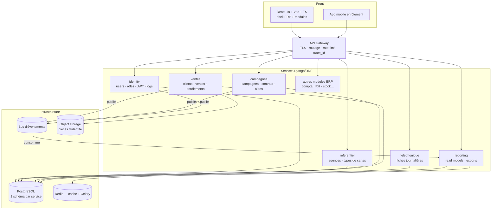
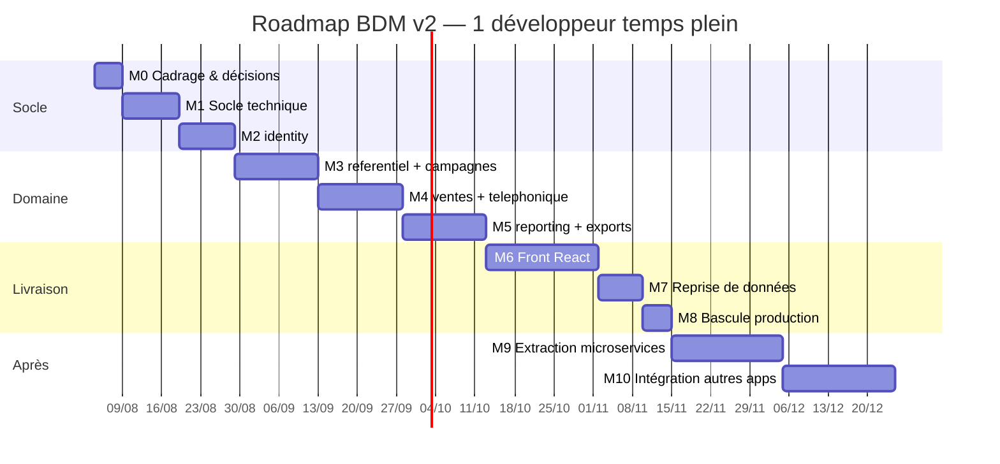

# BDM v2 — Django · microservices · React

> **Document de travail de la v2.** Il décrit la cible technique, les règles d'architecture, et surtout **la roadmap d'exécution** : quoi construire, dans quel ordre, avec quel critère de sortie à chaque étape.
> **Document source du métier** : [`bdm_v1.md`](bdm_v1.md) — c'est lui qui décrit ce que l'application fait aujourd'hui (base de données, services, patterns, historique). Ce document-ci ne redécrit pas le métier, il le porte.
> **Doc opérationnelle v1** : [`docu.md`](docu.md) · **Référentiel terrain** : [`Info.md`](Info.md)

**Stack cible** : Python 3.12 · Django 5 + DRF · PostgreSQL 16 · Celery + Redis · RabbitMQ *(à trancher)* · React 18 + Vite + TypeScript · Docker
**Point de départ** : BDM v1 en production (Laravel 12 + Inertia/React, PostgreSQL, Docker) sur https://bdm.gdamali.net
**Cible finale** : BDM devient **un module d'un ERP** composé de plusieurs apps, découpé en services par domaine
**Créé le** : 4 août 2026 · **Statut** : cadrage (M0)

---

## Table des matières

**A — Le cadre**
1. [Objectif et périmètre](#1-objectif-et-périmètre)
2. [Les 10 règles d'architecture](#2-les-10-règles-darchitecture)
3. [Invariants métier hérités de v1](#3-invariants-métier-hérités-de-v1)
4. [Architecture cible](#4-architecture-cible)
5. [Structure du code](#5-structure-du-code)

**B — La roadmap**
6. [Vue d'ensemble — jalons M0 → M10](#6-vue-densemble--jalons-m0--m10)
7. [Détail des jalons](#7-détail-des-jalons)
8. [Découpage en microservices — ordre et méthode d'extraction](#8-découpage-en-microservices--ordre-et-méthode-dextraction)
9. [Reprise de données](#9-reprise-de-données)
10. [Bascule production et rollback](#10-bascule-production-et-rollback)
11. [Recette — parité fonctionnelle v1/v2](#11-recette--parité-fonctionnelle-v1v2)
12. [Tableau de bord d'avancement](#12-tableau-de-bord-davancement)

**C — Les références**
13. [Traduction Laravel → Django](#13-traduction-laravel--django)
14. [Contrat d'API v1](#14-contrat-dapi-v1)
15. [Conventions de développement](#15-conventions-de-développement)
16. [Prompts starter](#16-prompts-starter)
17. [Décisions à trancher (journal ADR)](#17-décisions-à-trancher-journal-adr)

---

# A — Le cadre

## 1. Objectif et périmètre

### Ce qu'on fait

| # | Objectif | Pourquoi |
|---|----------|----------|
| 1 | Réécrire BDM en **Django/DRF** | Langage commun à toutes les apps de l'ERP ; admin natif, ORM, Celery, écosystème data |
| 2 | Découper par **domaine métier**, extractible en services | Chaque module de l'ERP évolue et se déploie à son rythme |
| 3 | **React** en couche de vue unique | Front autonome, réutilisable pour tous les modules de l'ERP |
| 4 | **Assembler les autres apps** dans le même socle | Un seul gateway, une seule authentification, un seul front |

### Ce qu'on ne fait pas

- Pas de nouvelle fonctionnalité métier tant que la parité v1 n'est pas atteinte (jalon M8). Toute idée nouvelle va dans un backlog `post-bascule`.
- Pas de réintroduction des prix / montants / chiffre d'affaires — retirés volontairement en avril 2026.
- Pas de reprise du module `reclamations` (legacy, jamais exposé en UI).
- Pas de Kubernetes avant que le nombre de services le justifie (Docker Compose suffit jusqu'à M9).

### Hypothèse de charge

La roadmap est chiffrée pour **1 développeur à temps plein**. À 2 développeurs, les jalons M3/M4 et M6 se parallélisent (back / front) : compter environ **-35 %** sur la durée totale, pas -50 %.

---

## 2. Les 10 règles d'architecture

Ces règles sont ce qui rend l'extraction en microservices possible **plus tard sans réécriture**. Elles s'appliquent dès la première ligne de code, y compris pendant la phase monolithe modulaire.

1. **Un domaine = une app Django = ses tables.** Personne d'autre n'écrit dans ces tables.
2. **Aucune `ForeignKey` entre deux domaines.** On stocke `<domaine>_id` + un **snapshot** des champs affichés (`user_nom`, `agence_nom`, `type_carte_code`). À l'intérieur d'un domaine, les FK sont normales.
3. **Aucun `import` d'un modèle d'un autre domaine.** On passe par `apps/<domaine>/api.py` — la seule surface publique du domaine, qui deviendra un client HTTP le jour de l'extraction.
4. **`views.py` ne contient aucune règle métier.** Il orchestre : permission → serializer → service → serializer de sortie.
5. **`services.py` ne connaît ni HTTP ni DRF.** Il est testable sans client de test.
6. **Lecture et écriture séparées** : `selectors.py` (requêtes, agrégations) / `services.py` (mutations, transactions).
7. **Tout changement d'état publie un événement**, via l'**outbox** (écrit dans la même transaction que la donnée, publié par un worker).
8. **Les consommateurs d'événements sont idempotents** — clé de déduplication = `event_id`.
9. **Pas de transaction distribuée.** Les cas multi-domaines (transfert d'agence : identity + ventes) sont des **sagas** : étapes compensables et journalisées.
10. **Toute API est versionnée** (`/api/v1/…`) et décrite par OpenAPI généré, jamais écrit à la main.

> **Pourquoi commencer en monolithe modulaire** : BDM v1 tient en ~16 modèles très joints (ventes ↔ campagne ↔ agence ↔ user). Découpé en services dès le jour 1, le moindre écran de reporting devient une cascade d'appels réseau, et le temps de développement double. Les règles ci-dessus donnent le bénéfice du découpage (frontières nettes) sans en payer le coût opérationnel tant qu'il n'est pas justifié. L'extraction devient alors mécanique — voir [section 8](#8-découpage-en-microservices--ordre-et-méthode-dextraction).

---

## 3. Invariants métier hérités de v1

**Chaque invariant = un test automatisé écrit AVANT le code du module concerné.** C'est la valeur accumulée en 18 mois de v1 ; c'est aussi ce qui se perd le plus facilement dans une réécriture.

| # | Invariant | Origine v1 | Module v2 |
|---|-----------|-----------|-----------|
| I1 | Une vente / un enrôlement exige une **campagne ouverte pour l'agence** du commercial | `VenteService`, `Campagne::estOuverteAuxVentes()` | ventes |
| I2 | Le commercial modifie/supprime sa saisie **dans les 48 h**, pas au-delà | `Client::peutEtreModifie()`, `EnrolementClient` | ventes, telephonique |
| I3 | Les stats portent sur les **campagnes en cours** ; s'il n'y en a aucune, sur la **dernière campagne** | `CampagneStatsScope` | reporting |
| I4 | **Direction = lecture seule stricte** — aucune écriture, exports autorisés | middleware `CheckRole` | tous |
| I5 | Les classements affichent **tous les commerciaux**, y compris à **0 vente**, avec gestion des **ex æquo** et part % | `PrimeService` | reporting |
| I6 | Contrat de prestation : **verrouillage après 5 jours**, désactivation auto des comptes en fin de campagne, **resynchronisation** si les dates changent | `ContratPrestationService` | campagnes + identity |
| I7 | **Multi-campagnes parallèles** via le pivot campagne ↔ agence — jamais de flag global type `toutes_agences` | pivot `campagne_agence` | campagnes |
| I8 | **Aucun prix ni montant** nulle part dans l'application | migration `remove_prix_and_montant_ventes` | tous |
| I9 | Un **compte inactif** ne peut rien faire, même avec un token valide | `EnsureCompteActif` | identity + tous |
| I10 | Le reporting téléphonique impose : total non-joignables ≤ non-joignables, 1 fiche par jour et par téléopératrice | `TelephoniqueRapport` | telephonique |
| I11 | Un **transfert d'agence** réattribue les ventes historiques et laisse une trace | `TransfertVentesAgenceService` | ventes (saga) |
| I12 | Une campagne de type **`enrolement`** ne saisit pas de vente carte, mais un enrôlement client | `EnrolementService`, `campagnes.type` | ventes |

---

## 4. Architecture cible



### Les services

| Service | Données propriétaires | Responsabilité | Vient de (v1) |
|---------|----------------------|----------------|---------------|
| `identity` | `users`, `roles`, `user_login_logs` | Auth JWT, RBAC, activation/désactivation, journal connexions | `User`, `CheckRole`, `EnsureCompteActif`, `UserLoginLog` |
| `referentiel` | `agences`, `types_cartes` | Référentiels partagés par tout l'ERP, publiés en événements | `Agence`, `TypeCarte` |
| `campagnes` | `campagnes`, pivot agences, actions, contrats, articles, aides | Cycle de vie campagne, statuts, contrats, aides hebdo | `Campagne`, `ContratPrestationService`, `CampagneDetailService` |
| `ventes` | `clients`, `ventes`, `enrolement_clients`, transferts | Saisie terrain, règles 48 h, pièces d'identité, transferts | `VenteService`, `EnrolementService`, `TransfertVentesAgenceService` |
| `telephonique` | `telephonique_rapports` | Fiches journalières téléopératrices | `TelephoniqueRapport` |
| `reporting` | read models + agrégats + `primes` | Classements, synthèses, cumuls, exports | `PrimeService`, `CampagneRapportService`, `SpreadsheetExportService`, `CampagneStatsScope` |
| `gateway` | — | Entrée unique : TLS, routage, quotas, CORS, `trace_id` | nginx v1 |

### Événements

Enveloppe standard : `{event_id, type, version, occurred_at, producer, payload}`.

| Événement | Émetteur | Consommateurs | Charge utile |
|-----------|----------|---------------|--------------|
| `campagne.demarree` / `.arretee` / `.terminee` | campagnes | ventes, reporting, identity | id, dates, agences, type |
| `campagne.dates_modifiees` | campagnes | identity (resync comptes), reporting | id, dates avant/après |
| `vente.creee` / `vente.supprimee` | ventes | reporting | ids + snapshot agence/type/commercial |
| `enrolement.cree` / `.supprime` | ventes | reporting | idem |
| `rapport_tel.saisi` / `.modifie` | telephonique | reporting | compteurs journaliers |
| `agence.creee` / `.modifiee` | referentiel | tous | objet complet |
| `type_carte.modifie` | referentiel | ventes, reporting | objet complet |
| `user.cree` / `.desactive` / `.transfere` | identity | ventes, campagnes, reporting | id, rôle, agence avant/après |

### Authentification

- `identity` émet un **JWT RS256** ; les autres services valident via la **JWKS** exposée par `identity` — aucun appel réseau par requête.
- Claims : `sub`, `role`, `agence_id`, `actif`, `exp` (15 min) + **refresh token** en cookie `httpOnly`.
- Service → service : **client credentials** (compte machine + scopes). Un token utilisateur ne circule jamais entre services internes.
- **I9** (compte inactif) est garanti par la durée de vie courte du token + le claim `actif` revérifié par chaque service.

### Données

- **Un schéma PostgreSQL par service** dans une seule instance au démarrage → une instance par service quand le besoin d'isolation apparaît. Le passage de l'un à l'autre est un `pg_dump` d'un schéma.
- Aucune jointure inter-schémas. Ce qu'un service affiche, il le stocke (snapshot alimenté par événements).

---

## 5. Structure du code

### Monorepo (recommandé au démarrage)

```
erp/
├── services/
│   ├── identity/          # projet Django autonome
│   ├── referentiel/
│   ├── campagnes/
│   ├── ventes/
│   ├── telephonique/
│   └── reporting/
├── packages/
│   └── py-common/         # enveloppe événements, outbox, permissions, pagination, erreurs FR
├── front/
│   └── erp-front/         # shell React + modules
├── gateway/               # config Traefik/Kong
├── deploy/
│   ├── docker-compose.yml         # dev complet
│   ├── docker-compose.prod.yml
│   └── k8s/                       # plus tard
├── docs/
│   ├── bdm_v1.md · bdm_v2.md
│   ├── adr/                       # 1 fichier par décision
│   └── openapi/                   # schémas figés par version
└── Makefile
```

> **Monorepo au démarrage** : un seul `docker compose up`, un seul PR pour un changement de contrat API + son consommateur, refactoring transverse trivial. On scinde en dépôts séparés seulement quand des équipes distinctes ont des cycles de release distincts.

### Un service Django

```
services/ventes/
├── config/
│   ├── settings/{base,dev,prod}.py    # django-environ
│   ├── urls.py                         # /api/v1/… + /schema/ + /healthz
│   └── celery.py
├── apps/
│   ├── common/          # depuis packages/py-common
│   └── ventes/
│       ├── models.py        # tables, contraintes, index — aucune règle métier
│       ├── selectors.py     # LECTURE
│       ├── services.py      # ÉCRITURE + publication d'événements
│       ├── serializers.py   # validation + forme de sortie
│       ├── permissions.py
│       ├── views.py         # ViewSets courts
│       ├── urls.py
│       ├── tasks.py         # Celery
│       ├── events.py        # publiés / consommés
│       ├── api.py           # surface publique du domaine (→ client HTTP après extraction)
│       ├── admin.py
│       └── tests/
├── manage.py · pyproject.toml · Dockerfile
```

### Le front

```
front/erp-front/src/
├── app/              # router, providers, layout, garde d'auth
├── shared/
│   ├── ui/           # design system repris de v1 (Button, Card, Badge, StatCard…)
│   ├── api/          # client HTTP + client TypeScript généré depuis l'OpenAPI
│   ├── auth/         # store token, refresh silencieux, <Guard role="…">
│   └── lib/          # formatage FR, dates, helpers
└── modules/
    ├── bdm/          # campagnes · ventes · performances · rapports · contrat
    ├── compta/       # autres apps de l'ERP
    └── rh/
```

**Un shell React unique, un module par domaine.** Pas de micro-frontends : le module federation ne se justifie que si des équipes distinctes déploient le front indépendamment.

---

# B — La roadmap

## 6. Vue d'ensemble — jalons M0 → M10



| Jalon | Contenu | Durée | Critère de sortie (non négociable) |
|-------|---------|-------|-----------------------------------|
| **M0** | Cadrage, décisions techniques, contrat d'API, tests des invariants écrits | 1 sem | `openapi.yaml` figé + 12 tests d'invariants écrits (et rouges) |
| **M1** | Monorepo, Docker Compose, projet Django, `py-common`, CI, `/healthz` | 2 sem | `docker compose up` → API qui répond, CI verte, pipeline d'événements testé de bout en bout |
| **M2** | Service `identity` : utilisateurs, rôles, JWT, login flexible, journal | 2 sem | Login (email/tél/nom) + `/me` + JWKS + révocation compte inactif |
| **M3** | `referentiel` + `campagnes` : CRUD, statuts, pivot agences, contrats, aides, beat | 3 sem | Campagne pilotable de bout en bout depuis l'admin Django ; I6, I7 verts |
| **M4** | `ventes` + `telephonique` : clients, ventes, enrôlements, transferts, fiches | 3 sem | I1, I2, I10, I11, I12 verts ; upload pièces d'identité en stockage privé |
| **M5** | `reporting` : classements, synthèses, cumul, exports Excel/Word/PDF en Celery | 3 sem | I3, I5 verts ; chiffres identiques à v1 sur 3 campagnes réelles |
| **M6** | Front React : shell ERP + module BDM complet, 4 rôles | 4 sem | Parcours complet des 4 rôles, mobile inclus ; I4 vérifié côté API |
| **M7** | Reprise de données v1 → v2 | 1,5 sem | Réconciliation à **écart zéro** sur tous les compteurs clés |
| **M8** | Bascule production | 1 sem | v2 en prod, v1 en lecture seule, procédure de rollback testée |
| **M9** | Extraction en microservices, vague par vague | 4 sem | `reporting` déployé et scalé séparément, contrats stables |
| **M10** | Intégration des autres apps de l'ERP | 4 sem+ | 2ᵉ module branché sur `identity` + gateway + shell React |

**Total jusqu'à la bascule (M8) : ~20 semaines** — soit une mise en production visée **fin décembre 2026**, hors aléas. M9 et M10 sont post-bascule et ne bloquent pas la mise en service.

> **Règle de conduite** : on ne démarre pas un jalon tant que le critère de sortie du précédent n'est pas atteint. Un jalon en retard se réduit en périmètre, jamais en qualité de sortie — le seul contenu déplaçable est le confort d'UI, jamais un invariant ni un test.

---

## 7. Détail des jalons

### M0 — Cadrage & décisions · 1 semaine

**Objectif** : ne plus avoir de question ouverte bloquante avant d'écrire du code.

| # | Tâche | Livrable |
|---|-------|----------|
| 0.1 | Trancher les 6 décisions de la [section 17](#17-décisions-à-trancher-journal-adr) | 6 fichiers `docs/adr/00X-*.md` |
| 0.2 | Extraire le périmètre fonctionnel figé depuis `bdm_v1.md` (sections 1, 5, 8, 12) | `docs/perimetre-v2.md` |
| 0.3 | Écrire le contrat OpenAPI cible (endpoints de la [section 14](#14-contrat-dapi-v1)) | `docs/openapi/v1.yaml` |
| 0.4 | Traduire les 12 invariants en tests pytest (rouges, sans implémentation) | `tests/invariants/test_I1..I12.py` |
| 0.5 | Inventorier les données prod à reprendre (volumétrie par table, fichiers) | `docs/reprise-inventaire.md` |
| 0.6 | Choisir l'environnement de dev (versions Python/Node, Docker, Make) | `README.md` du monorepo |

**Critère de sortie** : les 12 tests d'invariants existent et échouent proprement ; l'`openapi.yaml` couvre tous les écrans de v1.

---

### M1 — Socle technique · 2 semaines

**Objectif** : une infrastructure de développement où ajouter un domaine est un geste répétable.

| # | Tâche | Détail |
|---|-------|--------|
| 1.1 | Monorepo + `Makefile` | `make up`, `make test`, `make lint`, `make migrate`, `make new-service` |
| 1.2 | `docker-compose.yml` de dev | Postgres 16, Redis, broker, MailHog, un service Django, le front |
| 1.3 | Squelette de service Django | `config/settings/{base,dev,prod}.py` via `django-environ`, `urls.py`, `celery.py` |
| 1.4 | `packages/py-common` | Enveloppe d'événements, **outbox**, publisher/consumer idempotents, permissions de base, pagination, gestionnaire d'exceptions FR, `trace_id` |
| 1.5 | Auth côté service | Vérification JWT via JWKS (client réutilisable), permissions `RoleRequis`, `DirectionLectureSeule` |
| 1.6 | OpenAPI | `drf-spectacular` branché, schéma publié sur `/api/v1/schema/` |
| 1.7 | Observabilité | Logs JSON + `trace_id`, Sentry, `/healthz` et `/readyz` |
| 1.8 | CI | ruff → pytest → build image → push ; matrice par service |
| 1.9 | Gateway de dev | Routage `/api/v1/<service>/…`, CORS, en-têtes de trace |

**Critère de sortie** : un service `hello` généré par `make new-service`, qui publie un événement consommé par un second service, avec un test d'intégration qui le prouve, et une CI verte.

**Piège à éviter** : ne pas commencer par `identity` sans `py-common`. Tout ce qui est écrit avant l'outbox et les permissions communes sera réécrit.

---

### M2 — Service `identity` · 2 semaines

| # | Tâche | Correspondance v1 |
|---|-------|-------------------|
| 2.1 | Modèle `Utilisateur` (`AbstractBaseUser`) : `role`, `actif`, `agence_id`, `prenom`, `telephone`, `adresse_contrat` | table `users` |
| 2.2 | **Login flexible** : email, téléphone ou nom (admins) | backend d'authentification custom |
| 2.3 | JWT RS256 + refresh cookie `httpOnly` + endpoint JWKS | remplace la session Breeze |
| 2.4 | `/api/v1/me` → profil + rôle + **capacités UI** (`peut_creer_vente`, `peut_exporter`…) | remplace `@can` Blade |
| 2.5 | Journal des connexions réussies (signal `user_logged_in`) | `user_login_logs` |
| 2.6 | Activation / désactivation de compte, effet immédiat | `EnsureCompteActif` → **I9** |
| 2.7 | Consommation de `campagne.terminee` → désactivation auto des commerciaux ; `campagne.dates_modifiees` → resynchronisation | **I6** |
| 2.8 | Événements publiés : `user.cree`, `user.desactive`, `user.transfere` | |
| 2.9 | Django admin pour la gestion des comptes | remplace `Admin\UserController` |

**Critère de sortie** : I4 et I9 verts. Un compte désactivé perd l'accès en moins de 15 min (durée du token) sur **tous** les services.

---

### M3 — `referentiel` + `campagnes` · 3 semaines

**Semaine 1 — `referentiel`**

| # | Tâche |
|---|-------|
| 3.1 | Modèles `Agence` (avec `ordre`) et `TypeCarte` (table de référence, jamais un ENUM) |
| 3.2 | CRUD API + Django admin |
| 3.3 | Événements `agence.*`, `type_carte.*` |
| 3.4 | Import du référentiel réel depuis `Info.md` (29 agences Bamako + 10 intérieur) — management command |

**Semaines 2-3 — `campagnes`**

| # | Tâche | Invariant |
|---|-------|-----------|
| 3.5 | Modèle `Campagne` : `statut` et `type` en `TextChoices`, `remises` en `JSONField`, aide hebdo, prime meilleur vendeur | |
| 3.6 | Pivot M2M campagne ↔ agences | **I7** |
| 3.7 | `CampagneAction` — journal arrêt / annulation / reprogrammation avec justification obligatoire | |
| 3.8 | Transitions de statut en machine à états dans `services.py` (`programmee → en_cours → arretee/annulee/terminee`) | |
| 3.9 | Tâche Celery beat `sync_statuts_campagnes` à 01:00 | remplace le scheduler Laravel |
| 3.10 | Contrats de prestation : articles éditables, signataires, réponses, **verrouillage 5 jours**, republication | **I6** |
| 3.11 | Versements d'aide hebdomadaire + accusés | |
| 3.12 | `api.py` : `campagne_ouverte_pour_agence(campagne_id, agence_id)` — utilisée par `ventes` | **I1** |
| 3.13 | Import en masse des commerciaux d'une campagne | `CampagneCommerciauxImportService` |
| 3.14 | Événements `campagne.*` | |

**Critère de sortie** : depuis l'admin Django, créer une campagne, y rattacher des agences et des commerciaux, publier le contrat, l'arrêter, la reprogrammer — sans écrire une ligne de SQL. I6 et I7 verts.

---

### M4 — `ventes` + `telephonique` · 3 semaines

| # | Tâche | Invariant |
|---|-------|-----------|
| 4.1 | Modèles `Client`, `Vente`, `EnrolementClient` avec `DelaiModificationMixin` (48 h) | **I2** |
| 4.2 | Références cross-domaine : `user_id`, `agence_id`, `campagne_id`, `type_carte_id` + snapshots | règle 2 |
| 4.3 | `services.creer_vente()` — refus si aucune campagne ouverte pour l'agence | **I1** |
| 4.4 | `services.creer_enrolement()` — campagnes de type `enrolement` | **I12** |
| 4.5 | Upload pièce d'identité : stockage **privé** + URL signée à durée limitée | durcit v1 (`storage/app/public`) |
| 4.6 | Suppression / modification par le commercial : autorisée < 48 h, refusée au-delà | **I2** |
| 4.7 | Transfert d'agence en **saga** : `identity.user.transfere` → réattribution des ventes historiques + trace | **I11** |
| 4.8 | Consommation de `agence.*`, `type_carte.*`, `user.*` → mise à jour des snapshots | règle 8 |
| 4.9 | `telephonique` : fiche journalière, joignabilité calculée, `cartes_proposees` en `JSONField` | **I10** |
| 4.10 | Contraintes : total non-joignables ≤ non-joignables ; 1 fiche / jour / téléopératrice (contrainte d'unicité en base) | **I10** |
| 4.11 | Événements `vente.*`, `enrolement.*`, `rapport_tel.*` | |

**Critère de sortie** : I1, I2, I10, I11, I12 verts. Aucun prix ni montant dans le schéma (**I8** vérifié par un test qui inspecte les colonnes).

---

### M5 — `reporting` + exports · 3 semaines

| # | Tâche | Invariant |
|---|-------|-----------|
| 5.1 | Read models alimentés par les événements (`vente_fait`, `enrolement_fait`, `rapport_tel_fait`) | |
| 5.2 | `selectors.campagnes_pour_stats()` — campagnes en cours, fallback dernière | **I3** |
| 5.3 | Classement commerciaux : **tous**, y compris à 0, part % du volume, ex æquo | **I5** |
| 5.4 | Classements agences et types de cartes | |
| 5.5 | Synthèse de campagne : KPI + séries pour les graphiques (top 5, parts agences, mix types) | |
| 5.6 | Filtres : campagne, plage de dates, agence + **comparaison période précédente** | |
| 5.7 | Cumul multi-campagnes (`?campagnes=1,2,3`) | |
| 5.8 | Exports **openpyxl** (classeurs multi-feuilles, bordures, couleurs, UTF-8), **python-docx**, **WeasyPrint** | remplace PhpSpreadsheet/PhpWord/DomPDF |
| 5.9 | Exports en **tâche Celery** : `POST /exports` → `202 {export_id}` → polling → téléchargement | corrige les timeouts de v1 |
| 5.10 | Graphiques Office **modifiables** (pas des images) dans les exports | fonctionnalité v1 à conserver |
| 5.11 | Reconstruction complète du read model depuis les événements (`rebuild_read_models`) | filet de sécurité |

**Critère de sortie** : sur les campagnes réelles **Avril 2026, Avril 2ᵉ vague et Juin 2026**, les chiffres et classements v2 sont **identiques** à v1, ligne à ligne. I3 et I5 verts.

---

### M6 — Front React · 4 semaines

| # | Semaine | Contenu |
|---|---------|---------|
| 6.1 | S1 | Shell : Vite + TS, router, providers, layout, auth (token en mémoire + refresh silencieux), `<Guard role>`, client généré depuis l'OpenAPI |
| 6.2 | S1 | **Reprise du design system v1** : `Components/ui/` (Button, Card, Badge, StatCard), Sidebar, tokens Tailwind de la charte GDA, `lucide-react` |
| 6.3 | S2 | Module BDM — saisie : ventes, clients, enrôlements, reporting téléphonique. **Mobile-first**, utilisé sur le terrain |
| 6.4 | S2 | Contrat de prestation commercial : lecture, acceptation/refus, accusés de versement |
| 6.5 | S3 | Admin : campagnes (dont la page de pilotage complète), utilisateurs, agences, types de cartes, journal des connexions |
| 6.6 | S3 | Performances : classements, graphiques `react-chartjs-2`, filtres, drill-down commercial |
| 6.7 | S4 | Rapports : synthèse campagne, cumul, déclenchement et suivi des exports asynchrones |
| 6.8 | S4 | Dashboards par rôle, direction en lecture seule, PWA (manifest + service worker), traductions FR |

**Règles** : un hook par ressource (`useVentes(filtres)`), aucun `fetch` dans un composant, mutations optimistes + invalidation, permissions UI issues de `/me` (jamais déduites du rôle côté client — le back revérifie toujours).

**Critère de sortie** : les 4 rôles (admin, direction, commercial, commercial_telephonique) font en v2 tout ce qu'ils faisaient en v1, testé sur un vrai téléphone en conditions réseau dégradées.

---

### M7 — Reprise de données · 1,5 semaine

Voir le détail en [section 9](#9-reprise-de-données).

| # | Tâche |
|---|-------|
| 7.1 | Management command `migrer_v1` avec `--dry-run`, `--entites`, `--reconcilier` |
| 7.2 | Import dans l'ordre : agences → types de cartes → utilisateurs → campagnes → pivots → clients → ventes/enrôlements → rapports téléphoniques → contrats/aides → logs |
| 7.3 | Conservation des identifiants v1 + table `migration_map` |
| 7.4 | Copie des pièces d'identité vers le stockage objet + vérification d'empreinte |
| 7.5 | Reconstruction des read models `reporting` après import |
| 7.6 | Rapport de réconciliation (sortie non nulle si écart) |

**Critère de sortie** : `migrer_v1 --reconcilier` renvoie **zéro écart**.

---

### M8 — Bascule production · 1 semaine + 1 mois d'observation

Voir le détail en [section 10](#10-bascule-production-et-rollback).

**Critère de sortie** : v2 sert la production, v1 est en lecture seule, la procédure de rollback a été **testée** (pas seulement écrite).

---

### M9 — Extraction en microservices · 4 semaines, post-bascule

Voir la méthode en [section 8](#8-découpage-en-microservices--ordre-et-méthode-dextraction). Vague 1 : `reporting`. Vague 2 : `identity` + `referentiel`. Vague 3 : le reste, seulement si un critère objectif l'exige.

---

### M10 — Intégration des autres apps de l'ERP · 4 semaines+

| # | Tâche |
|---|-------|
| 10.1 | Inventaire des apps existantes : stack, données, utilisateurs, recouvrements fonctionnels avec BDM |
| 10.2 | Brancher chaque app sur `identity` (SSO JWT) — **première étape systématique** |
| 10.3 | Identifier le référentiel commun (agences, sites, employés) → un seul propriétaire, les autres consomment les événements |
| 10.4 | Intégrer chaque app comme **module du shell React** |
| 10.5 | Router via le gateway unique, un préfixe d'API par module |
| 10.6 | Étendre `reporting` aux données transverses (le vrai bénéfice ERP : croiser les domaines) |

**Ordre d'intégration recommandé** : l'app la plus proche du référentiel BDM d'abord (agences/employés partagés), la plus autonome ensuite. Une app par vague, jamais deux en parallèle.

---

## 8. Découpage en microservices — ordre et méthode d'extraction

### Quand extraire (et pas avant)

Un domaine sort du monolithe modulaire **quand au moins un critère objectif est rempli** :

| Critère | Exemple BDM |
|---------|-------------|
| Besoin de scaler ce domaine seul | Les exports saturent les workers pendant les pics de fin de campagne |
| Cycle de release distinct | Le reporting change chaque semaine, la saisie une fois par trimestre |
| Équipe distincte | Un développeur dédié au reporting/BI |
| Techno différente | Un service de calcul en Go, un moteur de règles existant |
| Isolation de panne requise | Un export lourd ne doit jamais dégrader la saisie terrain |
| Contrainte de conformité | Les pièces d'identité isolées dans un périmètre restreint |

**Aucun critère rempli = on n'extrait pas.** Un domaine qui reste dans le monolithe modulaire ne coûte rien ; un service extrait sans raison coûte tous les jours (déploiement, observabilité, latence, debug distribué).

### Ordre d'extraction

| Vague | Service | Pourquoi celui-là | Difficulté |
|-------|---------|-------------------|-----------|
| **1** | `reporting` | Lecture seule, charge en pics, aucune règle d'écriture, alimenté par événements — la sortie ne casse rien | Faible |
| **2** | `identity` | Frontière naturelle, partagé par tout l'ERP, contrat très stable (JWT + JWKS) | Faible |
| **2** | `referentiel` | Peu de code, publié en événements, consommé par tous les modules ERP | Faible |
| **3** | `telephonique` | Domaine autonome, peu couplé au reste | Moyenne |
| **4** | `ventes` | Cœur transactionnel, snapshots à maintenir, saga transfert d'agence | Élevée |
| **4** | `campagnes` | Très sollicité en synchrone par `ventes` (I1) — à extraire en dernier, voire jamais | Élevée |

> `ventes` et `campagnes` peuvent parfaitement rester ensemble **définitivement**. L'invariant I1 exige une vérification synchrone à chaque saisie : les séparer, c'est mettre un appel réseau sur le chemin critique de la saisie terrain, en réseau mobile malien. À faire uniquement si un critère objectif l'impose.

### Méthode d'extraction (strangler, 7 étapes)

Pour chaque domaine, dans cet ordre :

1. **Isoler le schéma** — déplacer les tables du domaine dans leur propre schéma PostgreSQL ; vérifier qu'aucune requête inter-schémas ne subsiste (une requête ratée se voit immédiatement, c'est le but).
2. **Vérifier les frontières** — aucun import de modèle externe, tous les accès passent par `api.py`, toutes les références cross-domaine sont des `id` + snapshot. Test automatisé d'architecture (`import-linter`).
3. **Extraire le code** — déplacer l'app dans `services/<domaine>/`, avec son `config/`, son `Dockerfile`, sa CI. Le code métier ne change pas.
4. **Déployer en shadow** — le nouveau service tourne, consomme les événements, remplit ses données, mais **personne ne l'appelle**. On compare ses réponses à celles du monolithe (double lecture, écarts loggés).
5. **Basculer le trafic par le gateway** — route par route, en commençant par la moins critique. `api.py` devient un client HTTP typé, généré depuis l'OpenAPI du nouveau service.
6. **Couper l'accès direct** — supprimer les tables du domaine dans l'ancienne base, révoquer les droits. Le point de non-retour.
7. **Observer 2 semaines** — latence, taux d'erreur, coût. Documenter dans un ADR ce que l'extraction a apporté (et ce qu'elle a coûté).

**Ne jamais faire les étapes 3 et 5 dans le même déploiement.**

### Checklist « prêt à extraire »

- [ ] Le domaine possède ses tables, dans son propre schéma
- [ ] Aucune FK ni jointure vers un autre domaine
- [ ] Toute la surface publique passe par `api.py`
- [ ] Les événements publiés couvrent tout ce dont les autres domaines ont besoin
- [ ] Les consommateurs sont idempotents et rejouables
- [ ] Couverture de tests du domaine ≥ 80 % sur `services.py` et `selectors.py`
- [ ] OpenAPI complet et à jour
- [ ] `/healthz` et `/readyz`, logs JSON avec `trace_id`, alertes définies
- [ ] Procédure de rollback écrite **et testée**
- [ ] Au moins un critère objectif d'extraction est rempli

---

## 9. Reprise de données

**Avantage décisif** : la v1 tourne déjà sur **PostgreSQL** (schéma consolidé du 30/07/2026). La reprise est un transfert Postgres → Postgres, pas une conversion de moteur.

### Principes

1. **Conserver les identifiants v1** — les ids v1 deviennent les ids v2 (`ALTER SEQUENCE` après import). Exports, PDF et échanges existants y font référence.
2. **Table `migration_map(entite, id_v1, id_v2, importe_le)`** même quand les ids sont conservés : c'est le filet pour rejouer et auditer.
3. **Ordre d'import** : agences → types de cartes → utilisateurs → campagnes → pivots → clients → ventes / enrôlements → rapports téléphoniques → contrats / aides → logs.
4. **Idempotence** : script rejouable (`upsert` sur `id_v1`), exécuté d'abord en `--dry-run`.
5. **Fichiers** : copie des pièces d'identité vers le stockage objet + vérification d'empreinte, **avant** la bascule.
6. **Non repris, documenté** : `reclamations`, résidus stocks/prix, sessions.

### Réconciliation — écart attendu : zéro

- Nombre de ventes par campagne et par agence
- Nombre de clients par commercial
- Classement top 10 des commerciaux, campagne par campagne
- Totaux du reporting téléphonique par jour
- Nombre de contrats acceptés / refusés / en attente
- Nombre d'enrôlements par campagne
- Nombre de fichiers (pièces d'identité) et somme des empreintes

```bash
python manage.py migrer_v1 --source postgres://…/bdm_v1 --dry-run
python manage.py migrer_v1 --source postgres://…/bdm_v1 --entites agences,types_cartes,users
python manage.py migrer_v1 --source postgres://…/bdm_v1            # tout
python manage.py rebuild_read_models                                # reporting
python manage.py migrer_v1 --reconcilier                            # exit code ≠ 0 si écart
```

---

## 10. Bascule production et rollback

### Déroulé

| J | Étape |
|---|-------|
| J-14 | v2 déployée en préproduction avec une copie de la prod ; import complet + réconciliation |
| J-7 | **Double run en lecture** : v2 reçoit une copie du trafic de lecture, on compare les réponses ; aucune écriture côté v2 |
| J-3 | Gel des évolutions ; communication aux utilisateurs (commerciaux, direction) ; formation courte si l'UI a bougé |
| J-1 | Import différentiel de la journée + réconciliation |
| **J** | Fenêtre de bascule : v1 en **lecture seule** → import différentiel final → réconciliation → bascule DNS/gateway → tests de fumée par rôle |
| J+1 → J+7 | Observation renforcée : erreurs, latence, tickets. v1 reste accessible en lecture |
| J+30 | Arrêt de v1 ; conservation d'une sauvegarde et d'un dump SQL |

**Choisir la fenêtre hors campagne active.** Les campagnes durent quelques jours (ex. Juin 2026 : 15→17/06) : basculer entre deux campagnes rend le gel des écritures indolore.

### Rollback

| Scénario | Action | Délai visé |
|----------|--------|------------|
| Anomalie bloquante < 24 h après la bascule, peu d'écritures v2 | Repointer le gateway vers v1, rejouer manuellement les écritures v2 (extraites par requête sur `created_at`) | < 1 h |
| Anomalie bloquante > 24 h, volume d'écritures important | Correctif en avant (pas de retour arrière) — d'où l'exigence d'écart zéro avant bascule | — |
| Anomalie sur un écran isolé | Route rebasculée vers v1 au niveau du gateway, écran par écran | < 15 min |

La procédure de rollback est **exécutée pour de vrai en préproduction** avant J. Une procédure jamais testée n'est pas une procédure.

---

## 11. Recette — parité fonctionnelle v1/v2

### Par rôle

- [ ] **Admin** — référentiels, campagnes (création, arrêt, annulation, reprogrammation, dates), utilisateurs, transferts d'agence, contrats et articles, versements d'aide, journal des connexions, tous les exports
- [ ] **Direction** — dashboards, rapports, performances, clients, exports ; **zéro écriture possible** (test automatisé sur toutes les routes d'écriture)
- [ ] **Commercial** — saisie mobile (vente / enrôlement), mes clients, modification et suppression < 48 h, mon contrat, mes performances
- [ ] **Commercial téléphonique** — fiche journalière, historique, contrat, performances de l'agence

### Par invariant

- [ ] I1 vente hors campagne ouverte refusée · [ ] I2 délai 48 h · [ ] I3 périmètre des stats · [ ] I4 direction en lecture seule
- [ ] I5 classements (tous, ex æquo, part %) · [ ] I6 contrat 5 jours + resync · [ ] I7 multi-campagnes · [ ] I8 aucun montant
- [ ] I9 compte inactif · [ ] I10 contraintes reporting téléphonique · [ ] I11 transfert d'agence · [ ] I12 campagne d'enrôlement

### Transverse

- [ ] Classements **identiques** à v1 sur Avril 2026, Avril 2ᵉ vague, Juin 2026
- [ ] Exports Excel / Word / PDF : mêmes colonnes, mêmes totaux, accents corrects, graphiques modifiables
- [ ] Statuts de campagne synchronisés automatiquement à 01:00
- [ ] Saisie utilisable sur téléphone en réseau dégradé
- [ ] PWA installable, service worker actif
- [ ] Tous les messages d'erreur en français

---

## 12. Tableau de bord d'avancement

| Jalon | Statut | Démarré | Terminé | Critère de sortie atteint |
|-------|--------|---------|---------|---------------------------|
| M0 Cadrage | ⬜ à faire | | | |
| M1 Socle | ⬜ | | | |
| M2 identity | ⬜ | | | |
| M3 referentiel + campagnes | ⬜ | | | |
| M4 ventes + telephonique | ⬜ | | | |
| M5 reporting | ⬜ | | | |
| M6 Front React | ⬜ | | | |
| M7 Reprise de données | ⬜ | | | |
| M8 Bascule | ⬜ | | | |
| M9 Extraction services | ⬜ | | | |
| M10 Autres apps ERP | ⬜ | | | |

Légende : ⬜ à faire · 🟨 en cours · ✅ terminé · 🟥 bloqué

### Suivi des invariants

| I1 | I2 | I3 | I4 | I5 | I6 | I7 | I8 | I9 | I10 | I11 | I12 |
|----|----|----|----|----|----|----|----|----|-----|-----|-----|
| ⬜ | ⬜ | ⬜ | ⬜ | ⬜ | ⬜ | ⬜ | ⬜ | ⬜ | ⬜ | ⬜ | ⬜ |

---

# C — Les références

## 13. Traduction Laravel → Django

| Laravel v1 | Django v2 | Remarque |
|-----------|-----------|----------|
| Modèle Eloquent | `models.Model` | `belongsTo` → `ForeignKey`, `belongsToMany` → `ManyToManyField` |
| Migration écrite main | `makemigrations` / `migrate` | Générées depuis les modèles |
| Contrôleur | `ViewSet` DRF | Une action = une méthode courte |
| Form Request | `Serializer` | Validation + messages FR |
| `$this->authorize()` / Policy | `permission_classes` + `has_object_permission` | |
| Middleware `CheckRole` | Permission `RoleRequis` | |
| Middleware `EnsureCompteActif` | Claim `actif` dans le JWT + permission | Token court = révocation rapide |
| Service métier (`app/Services`) | `services.py` (écriture) + `selectors.py` (lecture) | Le portage le plus direct |
| `CampagneStatsScope` | `reporting/selectors.campagnes_pour_stats()` | **I3** |
| Scope Eloquent | `QuerySet` custom / `Manager` | |
| Accesseur / `$appends` | `@property` + `SerializerMethodField` | |
| Scheduler `bootstrap/app.php` | Celery beat | |
| Commande artisan | `management/commands/*.py` | |
| Seeder | Data migration / fixture / management command | |
| Factory | `factory-boy` | |
| Breeze / session | SimpleJWT (access court + refresh httpOnly) | |
| Inertia (props serveur) | DRF JSON + TanStack Query | Le front devient autonome |
| Ziggy `route()` | Client TypeScript généré depuis l'OpenAPI | |
| Blade `@can` | Capacités renvoyées par `/me` | |
| PhpSpreadsheet | `openpyxl` | Styles, bordures, couleurs équivalents |
| PhpWord | `python-docx` | |
| DomPDF | `WeasyPrint` | Meilleur rendu |
| `storage/app/public` | `django-storages` (S3/MinIO) | Stockage **privé** + URL signée |
| `.env` + `config()` | `django-environ` + `settings/` | |
| PHPUnit / Pest | `pytest` + `pytest-django` | |
| Laravel Pint | `ruff` | |

### Correspondance des tables

| Table v1 | Service | Modèle v2 | Notes |
|----------|---------|-----------|-------|
| `users` | identity | `Utilisateur` | `role` en `TextChoices`, login flexible |
| `user_login_logs` | identity | `JournalConnexion` | Signal `user_logged_in` |
| `agences` | referentiel | `Agence` | `ordre` conservé |
| `types_cartes` | referentiel | `TypeCarte` | Table de référence, jamais un ENUM |
| `campagnes` | campagnes | `Campagne` | `statut` + `type` en `TextChoices`, `remises` en `JSONField` |
| `campagne_agence` | campagnes | M2M `Campagne.agences` | **I7** |
| `campagne_actions` | campagnes | `CampagneAction` | |
| `campagne_contrat_articles` | campagnes | `ContratArticle` | |
| `campagne_aide_versements` | campagnes | `AideVersement` | |
| `contrat_prestation_reponses` | campagnes | `ContratReponse` | Verrouillage 5 jours en `services.py` |
| `clients` | ventes | `Client` | Pièce d'identité en stockage privé |
| `ventes` | ventes | `Vente` | Snapshots agence / commercial / type |
| `enrolement_clients` | ventes | `EnrolementClient` | **I12** |
| `commercial_agence_transferts` | ventes | `TransfertAgence` | Saga avec identity — **I11** |
| `telephonique_rapports` | telephonique | `RapportTelephonique` | `cartes_proposees` en `JSONField` |
| `primes` | reporting | `Prime` | Dérivé, recalculable |
| `reclamations` | — | **abandonné** | Legacy jamais exposé |

---

## 14. Contrat d'API v1

```
POST   /api/v1/auth/login                  → access + refresh
POST   /api/v1/auth/refresh
POST   /api/v1/auth/logout
GET    /api/v1/me                          → profil + rôle + capacités UI
GET    /api/v1/.well-known/jwks.json       (identity)

GET    /api/v1/agences · /types-cartes                          (referentiel)
POST   /api/v1/agences · PATCH · DELETE

GET    /api/v1/campagnes ?statut=&agence=&type=                 (campagnes)
POST   /api/v1/campagnes · PATCH /api/v1/campagnes/{id}
POST   /api/v1/campagnes/{id}/arreter · /annuler · /reprogrammer
POST   /api/v1/campagnes/{id}/resynchroniser-comptes
GET    /api/v1/campagnes/{id}/contrat · POST /api/v1/campagnes/{id}/contrat/reponse
GET    /api/v1/campagnes/{id}/aides · POST /api/v1/campagnes/{id}/aides/{id}/accuser

GET    /api/v1/ventes ?campagne=&agence=&commercial=&du=&au=    (ventes)
POST   /api/v1/ventes · DELETE /api/v1/ventes/{id}              (I1, I2)
GET    /api/v1/clients · POST · PATCH · DELETE                  (I2)
POST   /api/v1/enrolements · DELETE /api/v1/enrolements/{id}    (I12)
POST   /api/v1/transferts-agence                                (I11)

GET    /api/v1/rapports-telephoniques ?du=&au= · POST · PATCH   (telephonique)

GET    /api/v1/performances ?campagne=&agence=&du=&au=          (reporting)
GET    /api/v1/performances/commerciaux/{id}
GET    /api/v1/rapports/campagnes/{id}/synthese
GET    /api/v1/rapports/cumul ?campagnes=1,2,3
POST   /api/v1/exports  → 202 {export_id}
GET    /api/v1/exports/{id}  → statut · GET /api/v1/exports/{id}/fichier
```

**Conventions** : pagination par curseur sur les listes volumineuses, filtres via `django-filter`, erreurs au format `{detail, code, champs:{}}` en français, `trace_id` dans chaque réponse.

---

## 15. Conventions de développement

| Sujet | Règle |
|-------|-------|
| Nommage | Code et modèles en **français** (cohérent avec v1 : `Campagne`, `Vente`, `creer_vente`) ; mots-clés techniques en anglais |
| Branches | `main` protégée, une branche par tâche, PR obligatoire même en solo (trace des décisions) |
| Commits | Messages en français, une intention par commit |
| Tests | Invariant = test dédié et nommé `test_I3_stats_campagnes_en_cours` ; ≥ 80 % sur `services.py` et `selectors.py` |
| Erreurs | Toutes les erreurs utilisateur en français, jamais de trace technique exposée |
| Migrations | Une migration par PR max ; jamais de migration de données dans la même que le schéma |
| Événements | Versionnés (`vente.creee` v1, v2…) ; on n'enlève jamais un champ, on en ajoute |
| API | Rupture = nouvelle version d'URL, jamais de modification en place |
| Secrets | Hors dépôt, injectés par l'environnement |
| Dépendances | Versions figées (`uv.lock` / `package-lock.json`), mise à jour groupée mensuelle |
| Documentation | Toute décision structurante = un ADR dans `docs/adr/` |

---

## 16. Prompts starter

### 16.1 — Nouveau service Django de l'ERP

```
Tu es un développeur Django/DRF senior. Crée le service [NOM_SERVICE] de notre ERP.

## Stack imposée
- Python 3.12, Django 5, DRF, PostgreSQL 16, Celery + Redis
- Auth : JWT validé via la JWKS du service identity (pas de table users locale)
- Structure par app : models / selectors / services / serializers / permissions /
  views / urls / tasks / events / api / admin / tests
- OpenAPI via drf-spectacular, tests pytest, lint ruff
- Langue FR (messages de validation et d'erreur en français)

## Frontières (non négociable)
- Aucune ForeignKey vers un autre service : id + snapshot des champs affichés
- views.py sans règle métier ; services.py sans HTTP
- Écriture uniquement dans les tables du service
- Tout changement d'état publie un événement via l'outbox
  (enveloppe : event_id, type, version, occurred_at, producer, payload)
- Toute la surface publique du domaine passe par api.py

## Domaine
[Entités, champs, relations internes, références externes]

## Règles métier
[Lister les invariants — chacun aura un test dédié]

## Phases
Phase 1 : models + migrations + admin + factories
Phase 2 : tests des invariants (rouges) puis selectors + services
Phase 3 : serializers + viewsets + permissions + OpenAPI
Phase 4 : événements publiés/consommés + tasks Celery
Phase 5 : Dockerfile + compose + healthz + CI

Commence par la Phase 1 et attends ma validation avant la suivante.
```

### 16.2 — Portage d'un module BDM v1 vers Django

```
Contexte : je porte l'application BDM (Laravel 12) vers Django. Deux documents :
- bdm_v1.md : l'existant (section 5 base de données, section 8 services métier,
  section 12 patterns, section 17 table de traduction)
- bdm_v2.md : la cible (section 2 règles d'architecture, section 3 invariants,
  section 5 structure du code, section 15 conventions)

Tâche : porte le module [campagnes | ventes | telephonique | reporting].

Contraintes :
- Respecter à la lettre les invariants concernés (section 3 de bdm_v2.md) ;
  un test par invariant, écrit AVANT le code
- Reprendre la logique des services v1 cités en section 8 de bdm_v1.md,
  pas les contrôleurs
- Aucune FK cross-domaine ; id + snapshot
- Conserver les identifiants v1 (reprise de données à venir)
- Messages en français

Livre dans cet ordre : models → tests des invariants → selectors/services →
serializers/views → OpenAPI. Montre-moi les modèles avant d'écrire le reste.
```

### 16.3 — Extraction d'un domaine en service autonome

```
Contexte : le domaine [DOMAINE] est aujourd'hui une app du monolithe modulaire
Django. Je veux l'extraire en service autonome, méthode strangler en 7 étapes
(section 8 de bdm_v2.md).

Étape demandée : [1 à 7].

Contraintes :
- Ne jamais combiner l'étape 3 (extraction du code) et l'étape 5 (bascule du trafic)
- Le code métier ne change pas pendant l'extraction
- api.py devient un client HTTP typé généré depuis l'OpenAPI du nouveau service
- Rollback possible à chaque étape

Avant de commencer, vérifie la checklist « prêt à extraire » et dis-moi
explicitement ce qui n'est pas encore satisfait.
```

---

## 17. Décisions à trancher (journal ADR)

| # | Décision | Options | Recommandation | Statut |
|---|----------|---------|----------------|--------|
| ADR-001 | Broker d'événements | RabbitMQ (routage riche, DLQ natives) · Redis Streams (déjà présent pour Celery) | **Redis Streams** au démarrage — une brique de moins à opérer ; RabbitMQ si le routage devient complexe | ⬜ |
| ADR-002 | Gateway | Traefik (léger, labels Docker) · Kong (plugins, quotas) | **Traefik** — suffisant jusqu'à M9 | ⬜ |
| ADR-003 | Stockage fichiers | MinIO auto-hébergé · S3 | **MinIO** sur le VPS existant, compatible S3 donc migrable | ⬜ |
| ADR-004 | Isolation base | Un schéma par service · Une instance par service | **Schémas** d'abord, instances à M9 si besoin | ⬜ |
| ADR-005 | Dépôt | Monorepo · Un dépôt par service | **Monorepo** tant qu'il n'y a pas d'équipes distinctes | ⬜ |
| ADR-006 | Front | Shell React unique · Micro-frontends | **Shell unique**, modules par domaine | ⬜ |
| ADR-007 | Hébergement | VPS actuel (Docker Compose) · Kubernetes managé | **VPS + Compose** jusqu'à M9 | ⬜ |
| ADR-008 | App mobile enrôlement | PWA · natif | **PWA** — déjà en place en v1, une base de code en moins | ⬜ |

Chaque décision tranchée devient un fichier `docs/adr/00X-titre.md` : contexte, options étudiées, décision, conséquences, date.

---

*BDM v2 — document de travail. Le métier de référence reste [`bdm_v1.md`](bdm_v1.md). Mettre à jour la [section 12](#12-tableau-de-bord-davancement) à chaque fin de jalon, et le [journal ADR](#17-décisions-à-trancher-journal-adr) à chaque décision structurante.*
